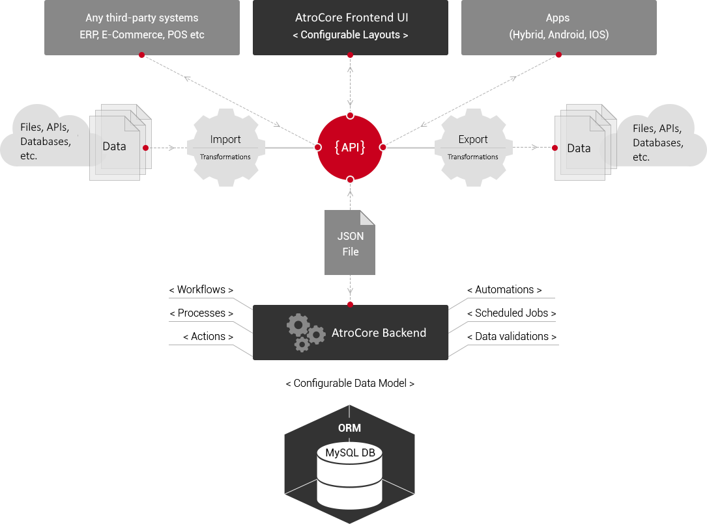

## What Is AtroPIM?

AtroPIM is an [open-source product information management system (PIM)](https://atropim.com), which is based on [AtroCore](https://github.com/atrocore/atrocore) software platform. AtroPIM (as well as AtroCore) is distributed under GPLv3 License and is free. It has a lot of features right out-of-the-box and thus is an excellent tool for cost-effective and timely application development.

AtroPIM is a single page application (SPA) with an API-centric and service-oriented architecture (SOA). It has a flexible data model based on entities, entity attributes and relations of all kinds among them. AtroPIM allows you to gather and store all your product content in one place, enrich it and spread it to several channels like own online shop, amazon, eBay, online shops of your distributors, on a tablet or mobile application. AtroPIM will help you to structure and organize all your flexible data and get rid of excel mess. 

## What Are the Advantages of AtroPIM?

- Many out-of-the-box features;
- Free – 100% open source, licensed under GPLv3;
- REST API;
- Service-oriented architecture (SOA);
- Responsive and user friendly UI;
- Configurable (entities, relations, layouts, labels, navigation, dashboards);
- Extensible with modules;
- Includes the advantages of [AtroCore](https://github.com/atrocore/atrocore).

## How Does It Work?

AtroPIM is an effective solution for storing, processing and managing your product information. All product data are extracted from different sources, classified, translated and enriched. AtroPIM helps you publish the relevant data on different sales channels with minimum efforts. 

## Features

AtroPIM comes with a lot of features directly out of the box, including:

- associations;
- measuring units;
- channels;
- catalogs;
- category trees and categories;
- product families;
- product series;
- products;
- attribute groups and attributes;
- product and category images (available only when the [AtroDAM module](https://atrodam.com) is also installed to your AtroPIM system);
- assets (available only when the [AtroDAM module](https://atrodam.com) is also installed to your AtroPIM system);  
- portals;
- and much more.

Want to know more about AtroPIM functions and its advantages for you? Please, visit [our website](http://atropim.com). Find out more about the AtroDAM module [here](https://atrodam.com).

## Technology

AtroPIM is based on EspoCRM and uses PHP7, backbone.js, composer and some Zend Framework 3 libraries.

Want to know more about AtroPIM technology? Please, visit [our website](http://atropim.com/technology)!

## Integrations

AtroPIM has a REST API and can be integrated with any third-party system, channel or marketplace. 

We offer following integrations:

- Data synchronisation with over 1000 Channels via channable.com
- ODOO
- SAP Business One,
- Microsoft Dynamics NAV
- Magento 2
- Magento 1
- Shopware 5
- OXID eShop 6
- and others.

Please [contact us](https://atropim.com/contact), if you want to know more.

## Documentation

- Please visit our Help Center: https://help.atrocore.com/

### Requirements

* Dedicated (virtual) Linux-based server with root permissions. 
* Ubuntu as Operating System is recommended but not required.
* PHP 7.4 or above.
* MySQL 5.5.3 or above **(not MariaDB)**.

> Please note, system will definitely NOT work on a usual hosting, a managed server hosting should be checked on a case-by-case basis – with a high probability it will NOT work.

### Installation

Installation Guide is available [here](https://github.com/atrocore/docs/blob/master/atrocore/admin-guide/installation.md).

### Demo
- URL: https://demo.atropim.com/
- Login: admin
- Password: admin
     
## License

AtroPIM is published under the GNU GPLv3 [license](LICENSE.txt).

## Support

- Explanatory Videos - https://www.youtube.com/channel/UCUwliSmn5XC0CMKcI_W46Hg/videos
- Report a Bug - https://github.com/atrocore/atrocore/issues/new
- Ask the Community - https://github.com/atrocore/atrocore/discussions
- Сontact us - https://atrocore.com/contact
