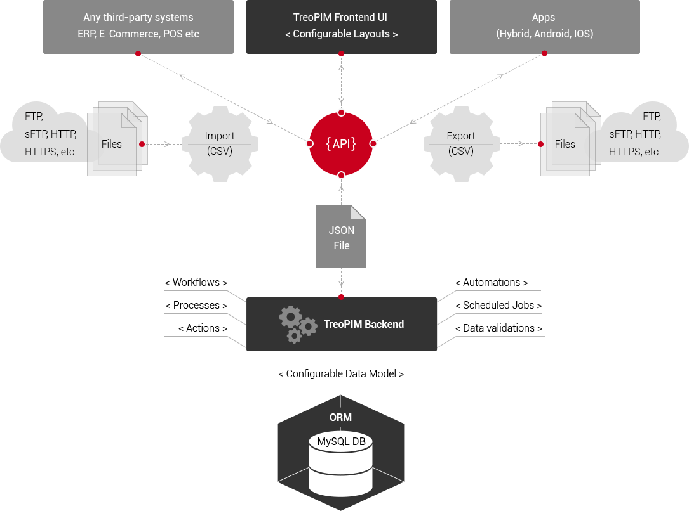

## What Is TreoPIM?


TreoPIM is an open-source product information management system (PIM), developed by [TreoLabs GmbH](https://treolabs.com/), which is based on [TreoCore](https://github.com/treolabs/treocore) software platform and is developed by TreoLabs GmbH. TreoPIM (as well as TreoCore) is distributed under GPLv3 License and is free. It has a lot of features right out-of-the-box and thus is an excellent tool for cost-effective and timely application development.

TreoPIM is a single page application (SPA) with an API-centric and service-oriented architecture (SOA). It has a flexible data model based on entities, entity attributes and relations of all kinds among them. TreoPIM allows you to gather and store all your product content in one place, enrich it and spread it to several channels like own online shop, amazon, eBay, online shops of your distributors, on a tablet or mobile application. TreoPIM will help you to structure and organize all your flexible data and get rid of excel mess. 

## What Are the Advantages of TreoPIM?

- Many out-of-the-box features;
- Free – 100% open source, licensed under GPLv3;
- REST API;
- Service-oriented architecture (SOA);
- Responsive and user friendly UI;
- Configurable (entities, relations, layouts, labels, navigation, dashboards);
- Extensible with modules;
- Includes the advantages of [TreoCore](https://github.com/treolabs/treocore).

## How Does It Work?

TreoPIM is an effective solution for storing, processing and managing your product information. All product data are extracted from different sources, classified, translated and enriched. TreoPIM helps you publish the relevant data on different sales channels with minimum efforts. 


## Features

TreoPIM comes with a lot of features directly out of the box, including:

- associations;
- measuring units;
- channels;
- catalogs;
- category trees and categories;
- product families;
- product series;
- products;
- attribute groups and attributes;
- product and category images (available only when the [TreoDAM module](https://treodam.com) is also installed to your TreoPIM system);
- assets (available only when the [TreoDAM module](https://treodam.com) is also installed to your TreoPIM system);  
- portals;
- and much more.

Want to know more about TreoPIM functions and its advantages for you? Please, visit [our website](http://treopim.com). Find out more about the TreoDAM module [here](https://treodam.com).

## Technology

TreoPIM is based on EspoCRM and uses PHP7, backbone.js, composer and some Zend Framework 3 libraries.



Want to know more about TreoPIM technology? Please, visit [our website](http://treopim.com/technology)!

## Integrations

TreoPIM has a REST API and can be integrated with any third-party system, channel or marketplace. 

We offer following integrations:

- Data synchronisation with over 1000 Channels via channable.com
- ODOO
- SAP Business One,
- Microsoft Dynamics NAV
- Magento 2
- Magento 1
- Shopware 5
- OXID eShop 6
- and others.

Please, [ask](https://treopim.com/contact), if you want to know more.

## Documentation

- Documentation for users is available [here](docs/en/user-guide).
- Documentation for administrators is available [here](docs/en/administration/).
- Documentation for developers is available [here](docs/).

### Requirements

* Unix-based system. Linux Mint is recommended.
* PHP 7.1 or above (with pdo_mysql, openssl, json, zip, gd, mbstring, xml, curl, exif extensions).
* MySQL 5.5.3 or above.

### Configuration Instructions Based on Your Server

* [Apache server configuration](https://github.com/treolabs/treocore/blob/master/docs/en/administration/apache-server-configuration.md)
* [Nginx server configuration](https://github.com/treolabs/treocore/blob/master/docs/en/administration/nginx-server-configuration.md)

### Installation

> The Installation guide is based on **Linux Mint OS**. Of course, you can use any Unix-based system, but make sure that your OS supports the following commands.<br/>

To create your new TreoPIM application, first make sure you are using PHP 7.1 or above and have [Composer](https://getcomposer.org/) installed.

1. Create your new project by running one of the following commands.

   If you don't need the demo data, run:
   ```
   composer create-project treolabs/skeleton-pim my-treopim-project
   ```
   If you need the demo data, run:
    ```
   composer create-project treolabs/skeleton-pim-demo my-treopim-project
   ```   

2. Change recursively the user and group ownership for project files: 
   ```
   chown -R webserver_user:webserver_user my-treopim-project/
   ```
   >**webserver_user** – depends on your webserver and can be one of the following: www, www-data, apache, etc.

3. Configure the crontab as described below.

   3.1. Run the following command:
      ```
      crontab -e -u webserver_user
      ```
   3.2. Add the following configuration:
      ```
      * * * * * /usr/bin/php /var/www/my-treopim-project/index.php cron
      ```      

4. Install TreoPIM following the installation wizard in the web interface. Go to http://YOUR_PROJECT/
     
## License

TreoPIM is published under the GNU GPLv3 [license](LICENSE.txt).

## Support

- TreoPIM is developed and supported by [TreoLabs GmbH](https://treolabs.com/).
- Feel free to joing our [Community](https://community.treolabs.com/).
- To contact us, please visit [TreoPIM Website](http://treopim.com).
