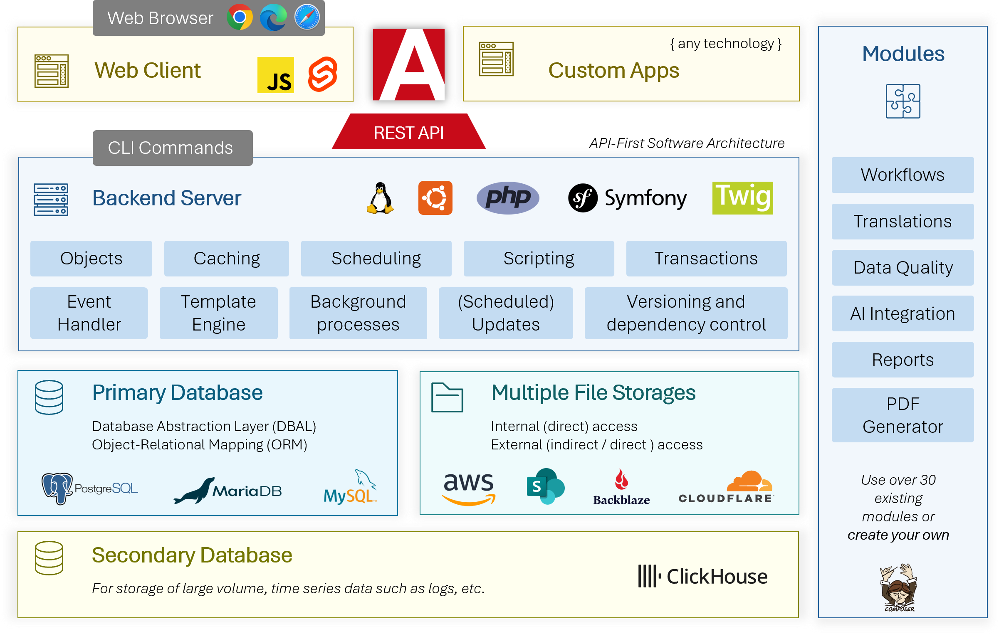
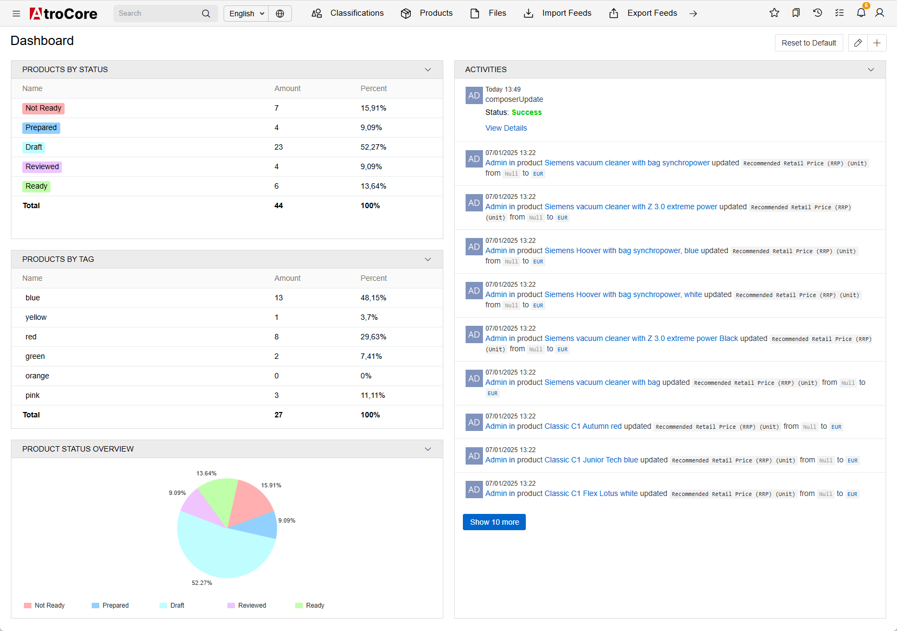
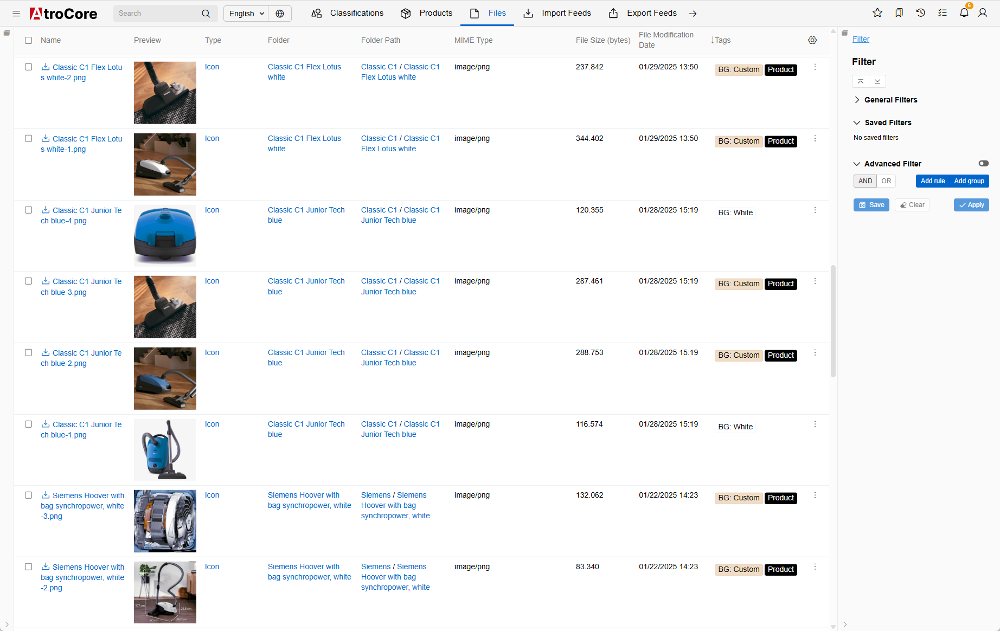
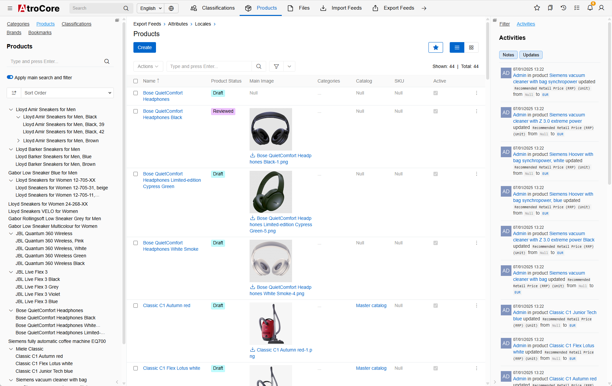
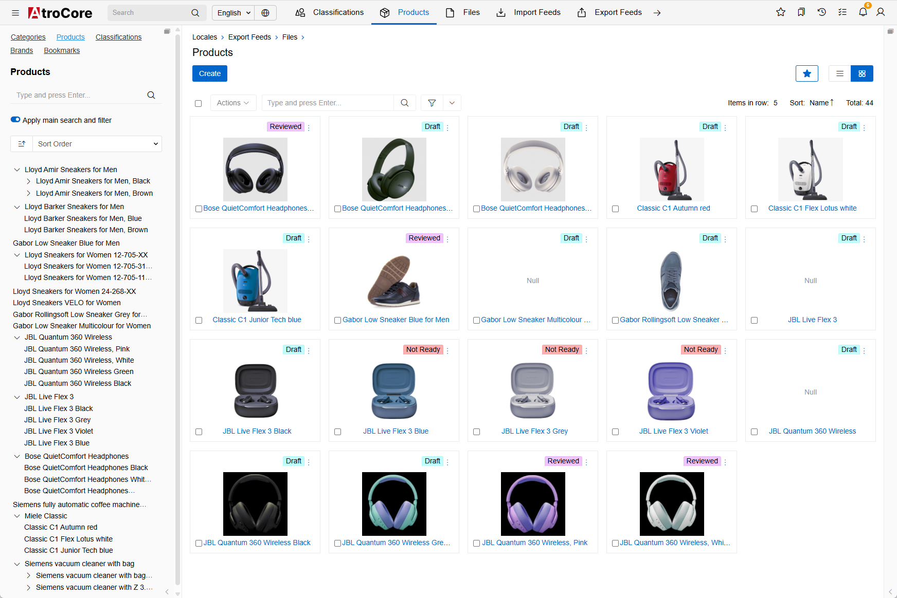
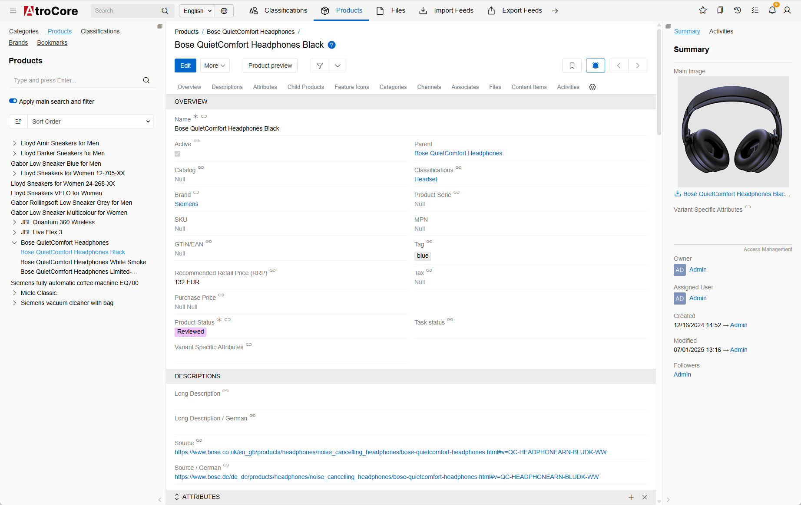
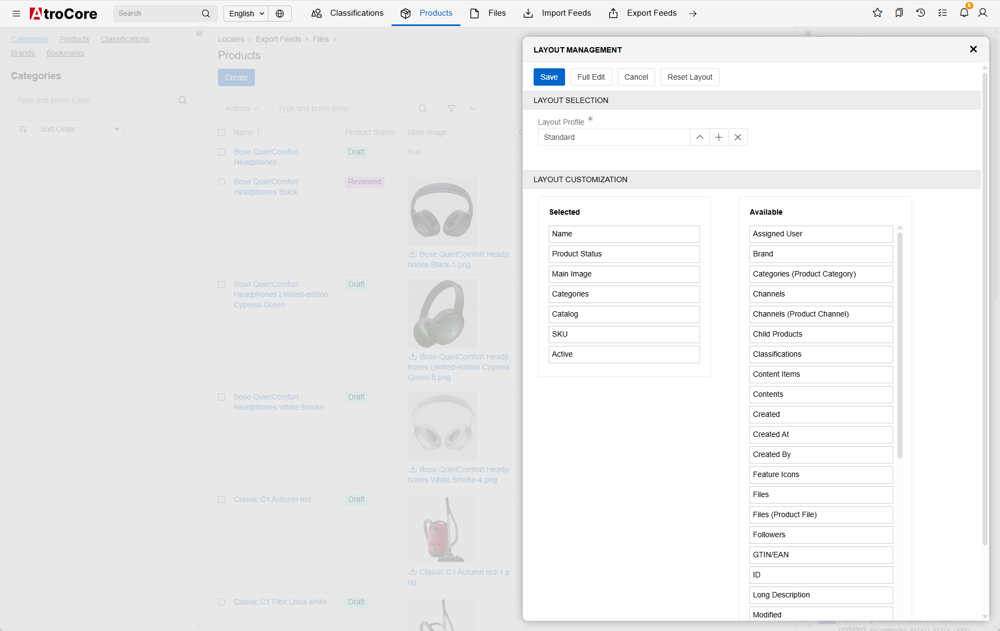
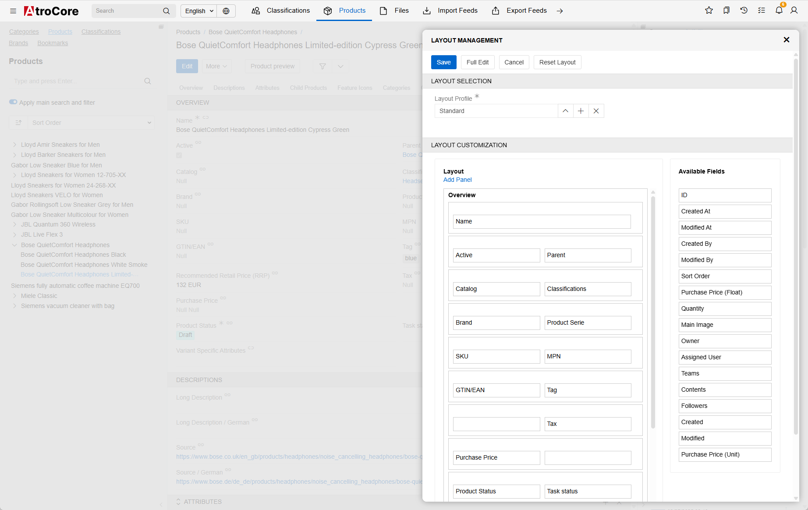

AtroPIM is a highly flexible, configurable, and modular [open-source product information management system (PIM)](https://www.atropim.com). 
It enables manufacturers, brands, and retailers to efficiently centralize, manage, and distribute product data across multiple channels – making it ideal for scalable eCommerce and digital product management.
<!--
| Host            | URL                                          |
| --------------- | -------------------------------------------- |
| Main Repository | https://gitlab.atrocore.com/atrocore/atropim |
| Mirror (GitHub) | https://github.com/atrocore/atropim          |
-->

This repository contains source code for a PIM module for the AtroCore Data Platform. AtroPIM is technically an instance of [AtroCore](https://github.com/atrocore/atrocore) which has a PIM module installed on it.

## History
Our software has been in active development since 2018. It all began with a simple idea: to create a better open-source PIM solution for our customers.
Now we have much more :)

## What Are the Advantages of AtroPIM?

- Scalable
- Highly configurable (entities, relations, fields, layouts, attributes, notifications, labels, navigation, dashboards, etc.)
- REST API for everything incl. your custom configurations
- Mobile-friendly UI
- Extensible with modules
- Also check other advantages of [AtroCore](https://github.com/atrocore/atrocore).

## Features

AtroPIM comes with a lot of features:

- All AtroCore's features plus management of:
- Products
- Associated Products
- Channels
- Category Trees
- Classifications
- Product Series
- Products
- Product and Category Images
- and much more.

Visit [this page](https://www.atropim.com/en/features) to see all the features of AtroPIM.

### Free vs Paid

Every user, from small businesses to large enterprises, uses the same free core: AtroCore. This core can be extended with additional free and premium modules as needed.
We also offer SaaS Editions, hosted in the cloud, which include some or all premium modules depending on the edition.

- The core modules, including AtroCore, PIM, Import, Export, and several others, are open-source and freely available. These free modules are more than enough for the needs of most users.
- Selected enterprise-level features, such as AI integration, advanced reporting, and automated data quality management, are offered through paid modules.

## Technology

## Integrations

AtroPIM has a REST API and can be integrated with any third-party system, channel or marketplace. 

We offer the following native paid integrations:

- Multichannel tools: Channable, ChannelPilot, ChannelAdvisor and others
- ERPs: Odoo, SAP, SAP Business One, Business Central, Xentral, Infor and others
- Marketplaces: Amazon, Otto
- E-Commerce Platforms: Adobe Commerce (Magento 2), Shopware, Prestashop, WooCommerce, Shopify, Sylius and others.

Read [this article](https://store.atrocore.com/en/atrocore-integrations-for-erp-ecommerce-marketplaces) to better understand how our integrations work.

You can **build your own fully automated integration** with any third-party system via its REST / GraphQL API using our free modules: 
- Import: HTTP Requests and/or 
- Export: HTTP Requests.

Please [contact us](https://www.atropim.com/contact), if you want to know more.

## Requirements

* Dedicated (virtual) Linux-based server with root permissions. 
* Ubuntu as Operating System is recommended but not required.
* PHP 8.1 - 8.4
* MySQL 5.5.3 (or above) or PostgreSQL 14.9 (or above).

> Please note, system will definitely NOT work on a usual hosting, a managed server hosting should be checked on a case-by-case basis – with a high probability it will NOT work.

## Installation (Getting Started)

To install AtroPIM you need to install Atrocore and a PIM module for it.

Installation Guide is [here](https://help.atrocore.com/installation-and-maintenance/installation).

### Docker Installation

Installation Guide for Docker is [here](https://help.atrocore.com/installation-and-maintenance/installation/docker-configuration).
Docker Image is [here](https://gitlab.atrocore.com/atrocore/docker).

If you want to test AtroCore without PIM, simply uninstall the PIM module after installing the Docker Image.

> We recommend to use Docker Image to play with the system, and standard installation for production environment.

## Screenshots
|                                                                                          |                                                                                          |
| ---------------------------------------------------------------------------------------- | ---------------------------------------------------------------------------------------- |
|                              |                                          |
|                     |                  |
|        |        |
|  |  |

## Public Demo Instance

- URL: https://demo.atropim.com/
- Login: admin
- Password: admin
     

## Contributing

- **Report bugs:** please [report bugs](https://github.com/atrocore/atrocore/issues/new).
- **Fix bugs:** please create a pull request in the affected repository including a step by step description to reproduce the problem.
- **Contribute features:** You are encouraged to create new features. Please contact us before you start.

## Localization

Would you like to help us translate UIs into your language, or improve existing translations?
- https://translate.atrocore.com/

## Documentation
- Please visit our Help Center (Documentation) - https://help.atrocore.com/

## Other Resources

- Report a Bug - https://github.com/atrocore/atrocore/issues/new
- Read our Release Notes - https://help.atrocore.com/release-notes/pim
- Please visit our Community - https://community.atrocore.com
- Сontact us - https://www.atrocore.com/contact

## 📌Help Us Grow

If you find AtroCore useful:

- ⭐ Star the repo
- 🗣️ Share it with your network
- 🛠️ Contribute to the project

## License

AtroPIM is published under the GNU GPLv3 [license](LICENSE.txt).