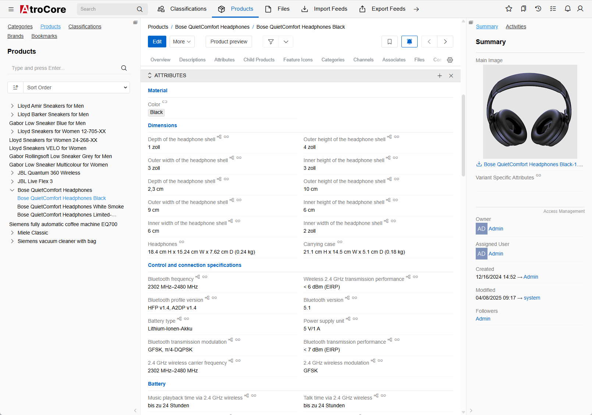
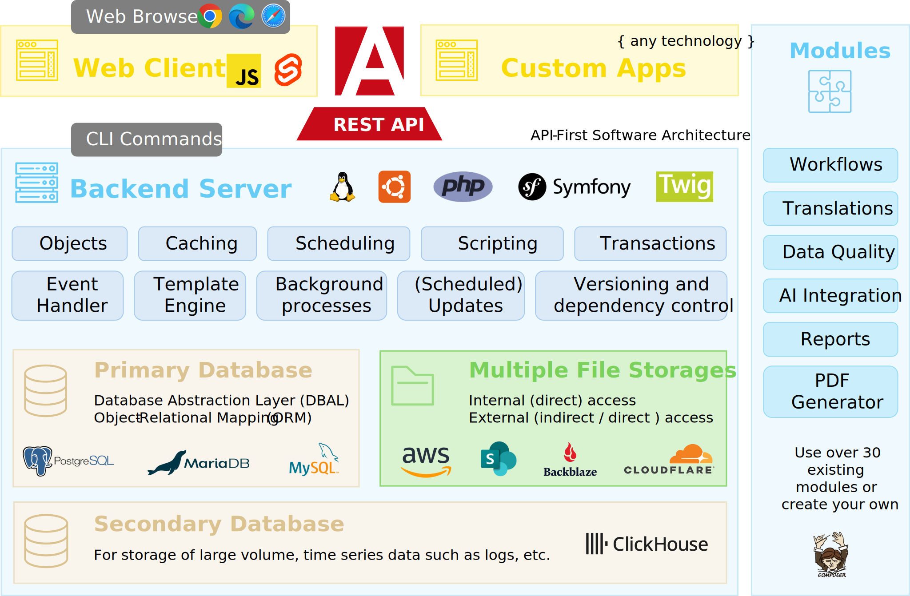

  

This repository is hosted on: https://gitlab.atrocore.com/atrocore/atropim

GitHub mirror: https://github.com/atrocore/atropim

> This repository is hosted by GitLab, we use GitHub to host its mirror. 

This repository contains source code for a PIM module for the AtroCore Data Platform.

## What Is AtroPIM?

AtroPIM is an [open-source product information management system (PIM)](https://www.atropim.com).
AtroPIM is technically an instance of [AtroCore](https://github.com/atrocore/atrocore) which has a PIM module installed on it.

### History
Our software has been in active development since 2018. It all began with a simple idea: to create a better open-source PIM solution for our customers.
Now we have much more :)

## What Are the Advantages of AtroPIM?

- Scalable
- Highly configurable (entities, relations, fields, layouts, attributes, notifications, labels, navigation, dashboards, etc.)
- REST API for everything incl. your custom configurations
- Mobile-friendly UI
- Extensible with modules
- Also check other advantages of [AtroCore](https://github.com/atrocore/atrocore).

## How Does It Work?

AtroPIM is an effective solution for storing, processing and managing your product information. All product data are extracted from different sources, classified, translated and enriched. AtroPIM helps you publish the relevant data on different sales channels with minimum efforts. 

## Features

AtroPIM comes with a lot of features:

- All AtroCore's features plus management of:
- Products
- Associated Products
- Channels
- Category Trees
- Classifications
- Product Series
- Products
- Product and Category Images
- and much more.

Visit [this page](https://www.atropim.com/en/features) to see all the features of AtroPIM.

### Enterprise Edition?

There is no Enterprise Edition, only the Core, free modules and paid modules.

### Free vs Paid

- The core modules, including AtroCore, PIM, Import, Export, and several others, are open-source and freely available.
- These free modules are sufficient to meet the needs of the vast majority of users.
- Only selected enterprise-level features, such as AI integration, advanced reporting, and automated data quality management, are offered through paid modules.

## Technology

## Integrations

AtroPIM has a REST API and can be integrated with any third-party system, channel or marketplace. 

We offer the following native paid integrations:

- Multichannel tools: Channable, ChannelPilot, ChannelAdvisor and others
- ERPs: Odoo, SAP, SAP Business One, Business Central, Xentral, Infor and others
- Marketplaces: Amazon, Otto
- E-Commerce Platforms: Adobe Commerce (Magento 2), Shopware, Prestashop, WooCommerce, Shopify, Sylius and others.

Read [this article](https://store.atrocore.com/en/atrocore-integrations-for-erp-ecommerce-marketplaces) to better understand how our integrations work.

You can **build your own fully automated integration** with any third-party system via its REST / GraphQL API using our free modules: 
- Import: HTTP Requests and/or 
- Export: HTTP Requests.

Please [contact us](https://www.atropim.com/contact), if you want to know more.

### Requirements

* Dedicated (virtual) Linux-based server with root permissions. 
* Ubuntu as Operating System is recommended but not required.
* PHP 8.1 - 8.4
* MySQL 5.5.3 (or above) or PostgreSQL 14.9 (or above).

> Please note, system will definitely NOT work on a usual hosting, a managed server hosting should be checked on a case-by-case basis – with a high probability it will NOT work.

### Installation (Getting Started)

To install AtroPIM you need to install Atrocore and a PIM module for it.

Installation Guide is [here](https://help.atrocore.com/installation-and-maintenance/installation).

Installation Guide for Docker is [here](https://help.atrocore.com/installation-and-maintenance/installation/docker-configuration).

### Demo

- URL: https://demo.atropim.com/
- Login: admin
- Password: admin
     
## License

AtroPIM is published under the GNU GPLv3 [license](LICENSE.txt).

## Resources

- Report a Bug - https://github.com/atrocore/atrocore/issues/new
- Please visit our Help Center (Documentation) - https://help.atrocore.com/
- Read our Release Notes - https://help.atrocore.com/release-notes/pim
- Please visit our Community - https://community.atrocore.com
- Сontact us - https://www.atrocore.com/contact
