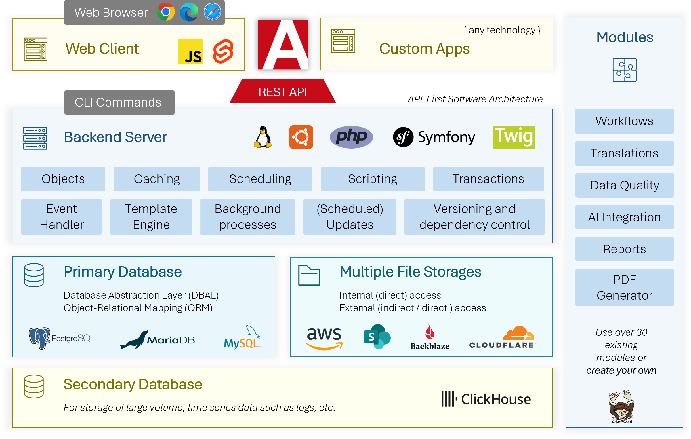
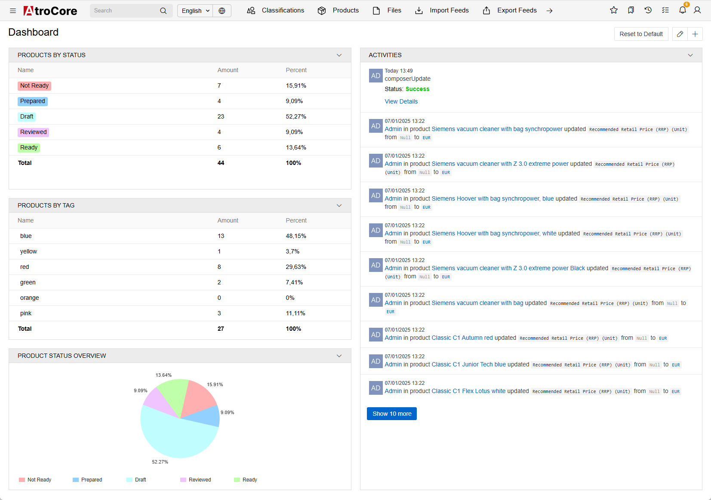
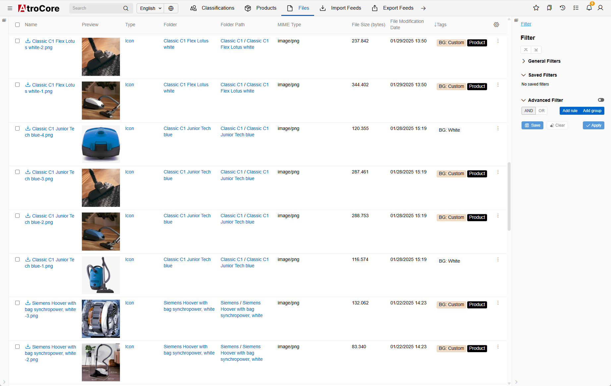
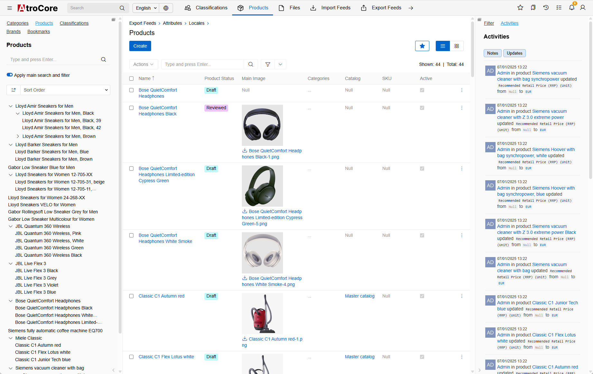
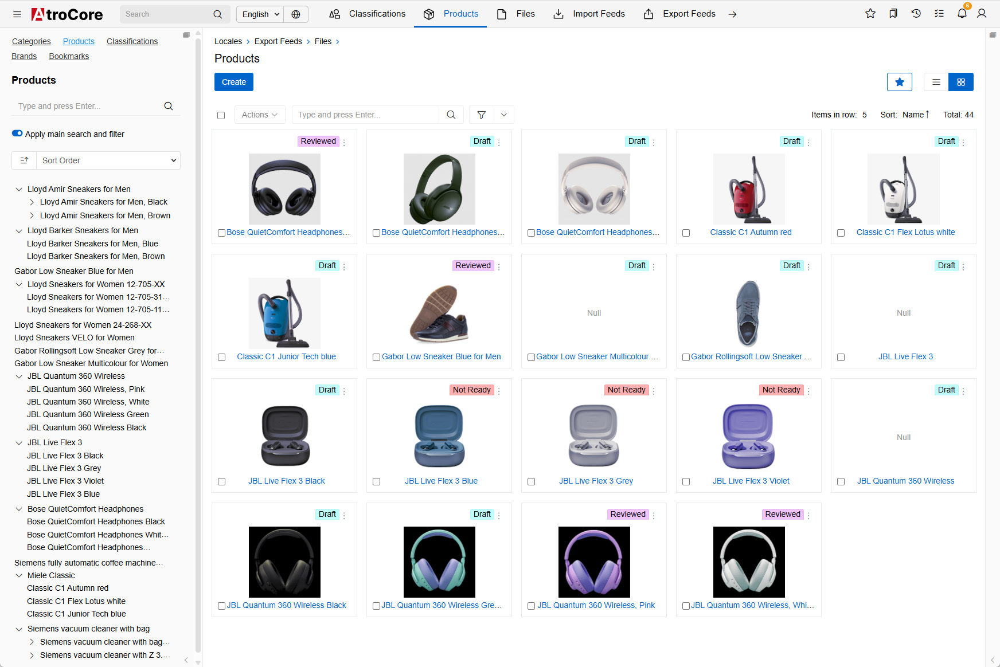
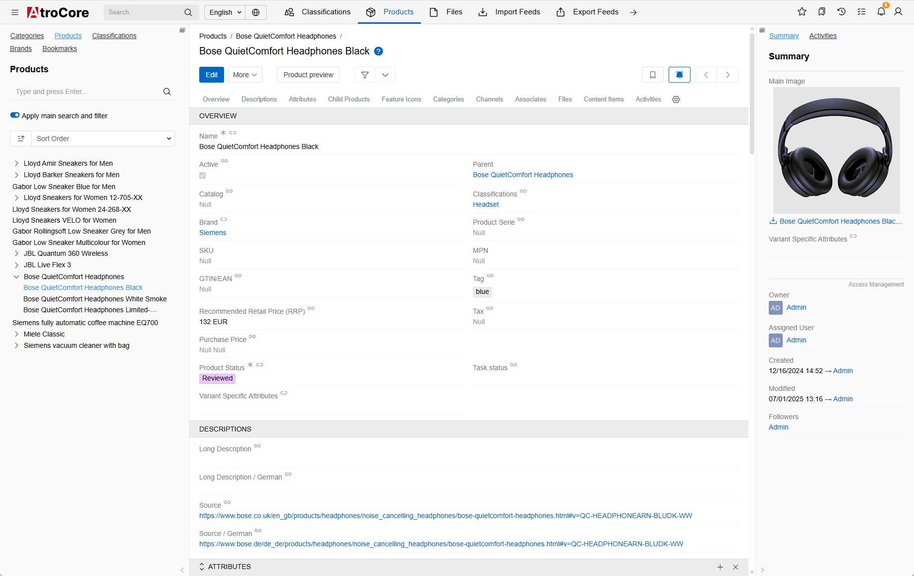
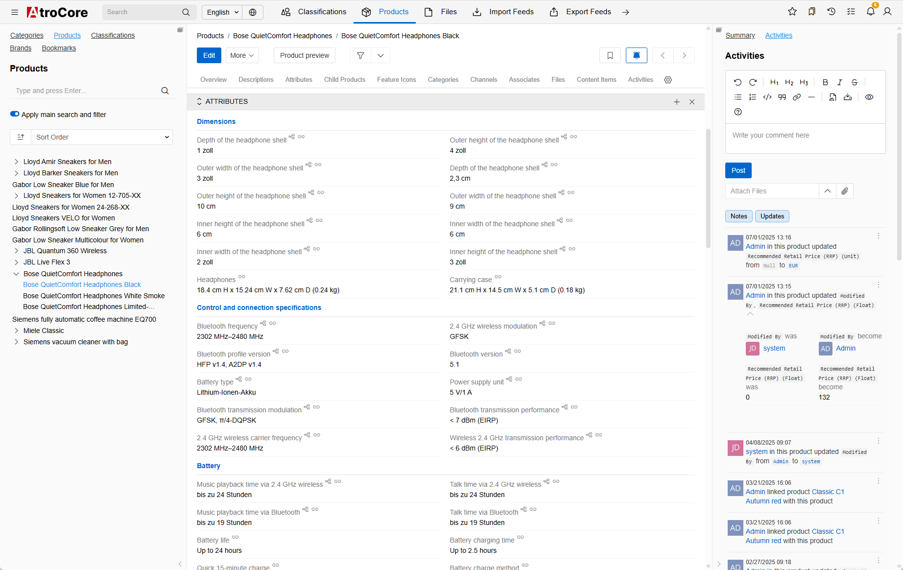
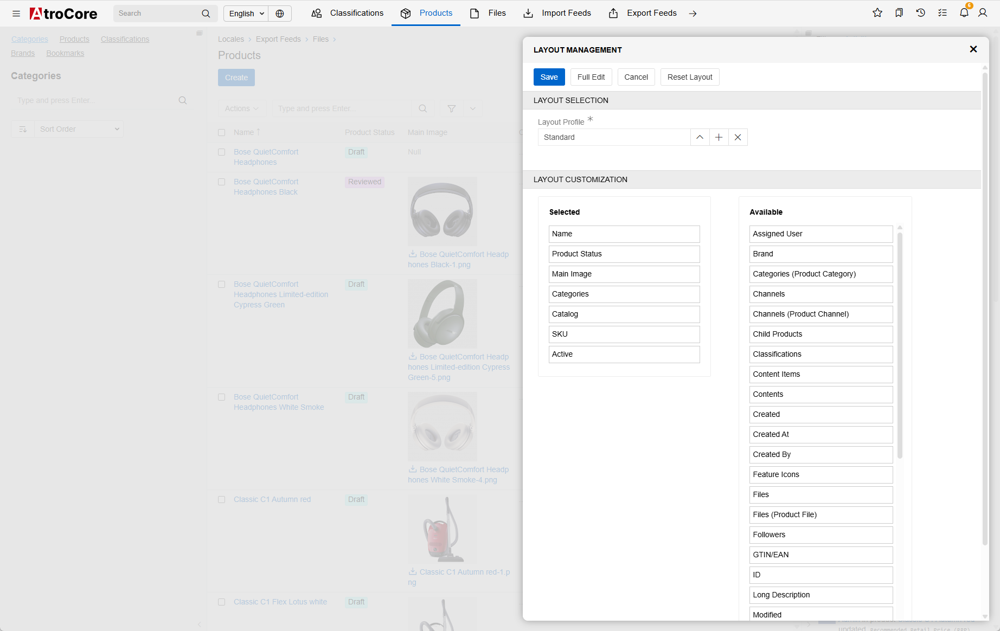

AtroPIM is a highly-configurable, modular, API-first open-source [Product Information Management (PIM) system](https://www.atropim.com). A lightweight alternative to Akeneo & Pimcore built on PHP & Svelte, ideal for eCommerce, ERP integrations, and B2B catalogs.

It enables manufacturers, brands, and retailers to efficiently centralize, manage, and distribute product data across multiple channels – making it ideal for scalable eCommerce and digital product management.
<!--
| Host            | URL                                          |
| --------------- | -------------------------------------------- |
| Main Repository | https://gitlab.atrocore.com/atrocore/atropim |
| Mirror (GitHub) | https://github.com/atrocore/atropim          |
-->

This repository contains source code for a PIM module for the AtroCore Data Platform. AtroPIM is technically an instance of [AtroCore](https://github.com/atrocore/atrocore) which has a PIM module installed on it.

## History

Our software has been in active development since 2018. It all began with a simple idea: to create a better open-source PIM solution for our customers.

## Our Customers

Our primary client base consists of manufacturers, wholesalers, and distributors managing highly complex product portfolios with intricate technical specifications and variant structures.

We are proud to partner with leading global brands and enterprise market leaders, including: Acer, Bridgestone and Adam Hall.

## Why Choose AtroPIM? (At a Glance)

AtroPIM is a modern, developer-friendly alternative to enterprise PIMs. 

* **API-First & Headless:** Generates a fully-featured REST API automatically for all your custom configurations.
* **Highly Configurable:** Create custom entities, layouts, fields, attributes, and relations directly from the UI (low-code/no-code).
* **Lightweight & Fast:** Uses Svelte and PHP to deliver high performance with a fraction of the resource footprint of Symfony-heavy alternatives.
* **Fully Extensible:** Features a GPLv3 open-source core with a modular ecosystem designed for effortless scaling.
* **Mobile-Friendly UI:** Experience a fully functional, responsive interface optimized for any device.
* **Highly Scalable:** Scale your data volume, user base, and channels seamlessly as your business grows.

### Use AtroPIM if:

* **You need to manage non-standard or complex product data models:** Easily configure custom entities, attributes, and multi-parent, multi-level relations directly from the UI without writing a single line of backend code.
* **You want to keep hosting and infrastructure costs low:** Run a blazing-fast PIM on standard virtual private servers (VPS) without the heavy system requirements, complex Elasticsearch setups, or massive RAM overhead demanded by Java- or Symfony-heavy alternatives.
* **You are building a headless eCommerce stack:** Leverage a native, auto-generated, and ultra-flexible REST API that exposes 100% of your custom data models, layouts, and configurations out of the box.
* **You need deep, automated ERP integration:** Seamlessly synchronize product data with systems like SAP, Microsoft Dynamics, Odoo, etc. using native connectors or powerful, built-in HTTP import/export engines.
* **You manage multi-lingual, multi-currency, or multi-channel catalogs:** Effortlessly localize product descriptions, manage channel-specific pricing, and distribute tailored feeds to platforms like Shopware, Magento, Shopify, and Amazon from a single source of truth.
* **You require absolute data ownership and control:** Benefit from a fully self-hosted, GPLv3 open-source core that guarantees your data remains on your own servers with no vendor lock-in or artificial seat limits.

## How does AtroPIM differ from AtroCore?

**AtroCore** is the open-source framework and core ecosystem. It provides the foundational architecture, user management, API, data model configuration, and low-code capabilities. By itself, it is an abstract entity-relationship system used to build custom business software.

**AtroPIM** consists of the underlying AtroCore platform with a specialized PIM module pre-installed on top of it. This combination provides a complete Product Information Management system, adding all the specific features required to manage complex product data, catalogs, and channels.

## Features

AtroPIM comes with a lot of features:

- All AtroCore's features plus management of:
- Products
- Associated Products
- Channels
- Category Trees
- Classifications
- Product Series
- Products
- Product and Category Images
- and much more.

Visit [this page](https://www.atropim.com/en/features) to see all the features of AtroPIM.

### Free vs Paid

Every user, from small businesses to large enterprises, uses the same free core: AtroCore. This core can be extended with additional free and premium modules as needed.
We also offer SaaS Editions, hosted in the cloud, which include some or all premium modules depending on the edition.

- The core modules, including AtroCore, PIM, Import, Export, and several others, are open-source and freely available. These free modules are more than enough for the needs of most users.
- Selected enterprise-level features, such as AI integration, advanced reporting, and automated data quality management, are offered through paid modules.

## Technology

## Integrations

AtroPIM has a REST API and can be integrated with any third-party system, channel or marketplace. 

We offer the following native paid integrations:

- Multichannel tools: Channable, ChannelPilot, ChannelAdvisor and others
- ERPs: Odoo, SAP, SAP Business One, Business Central, Xentral, Infor and others
- Marketplaces: Amazon, Otto
- E-Commerce Platforms: Adobe Commerce (Magento 2), Shopware, Prestashop, WooCommerce, Shopify, Sylius and others.

Read [this article](https://store.atrocore.com/en/atrocore-integrations-for-erp-ecommerce-marketplaces) to better understand how our integrations work.

You can **build your own fully automated integration** with any third-party system via its REST / GraphQL API using our free modules: 
- Import: HTTP Requests and/or 
- Export: HTTP Requests.

Please [contact us](https://www.atropim.com/contact), if you want to know more.

## Requirements

* Dedicated (virtual) Linux-based server with root permissions. 
* Ubuntu as Operating System is recommended but not required.
* PHP 8.1 - 8.4
* MySQL 5.5.3 (or above) or PostgreSQL 14.9 (or above).

> Please note, system will definitely NOT work on a usual hosting, a managed server hosting should be checked on a case-by-case basis – with a high probability it will NOT work.

## Installation (Getting Started)

To install AtroPIM you need to install Atrocore and a PIM module for it.

Installation Guide is [here](https://help.atrocore.com/installation-and-maintenance/installation).

### Docker Installation

Installation Guide for Docker is [here](https://help.atrocore.com/installation-and-maintenance/installation/docker-configuration).

Docker Image is [here](https://github.com/atrocore/docker).

> We recommend to use Docker Image to play with the system, and standard installation for production environment.

## Screenshots
|                                                                                          |                                                                                          |
| ---------------------------------------------------------------------------------------- | ---------------------------------------------------------------------------------------- |
|                              |                                          |
|                     |                  |
|        |        |
|  |  |

## Public Demo Instance

- URL: https://demo.atropim.com/
- Login: admin
- Password: admin
     

## Contributing

- **Report bugs:** please [report bugs](https://github.com/atrocore/atrocore/issues/new).
- **Fix bugs:** please create a pull request in the affected repository including a step by step description to reproduce the problem.
- **Contribute features:** You are encouraged to create new features. Please contact us before you start.

## Localization

Would you like to help us translate UIs into your language, or improve existing translations?
- https://translate.atrocore.com/

## Documentation
- Please visit our Help Center (Documentation) - https://help.atrocore.com/

## Other Resources

- Report a Bug - https://github.com/atrocore/atrocore/issues/new
- Read our Release Notes - https://help.atrocore.com/release-notes/pim
- Please visit our Community - https://community.atrocore.com
- Сontact us - https://www.atrocore.com/contact

## 📌Help Us Grow

If you find AtroCore useful:

- ⭐ Star the repo
- 🗣️ Share it with your network
- 🛠️ Contribute to the project

## License

AtroPIM is published under the GNU GPLv3 [license](LICENSE.txt).