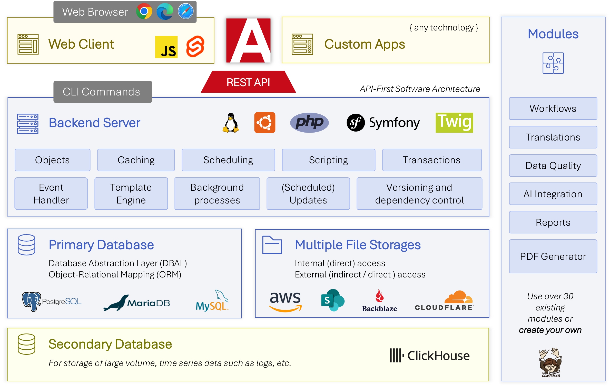
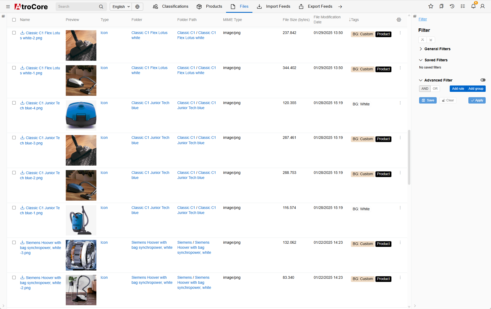
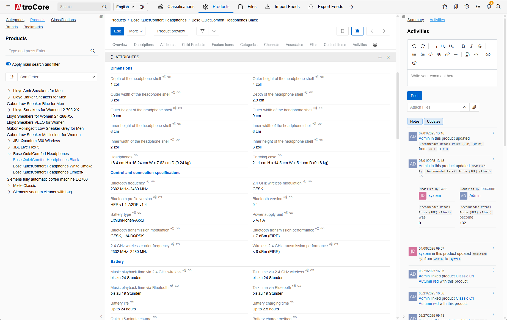
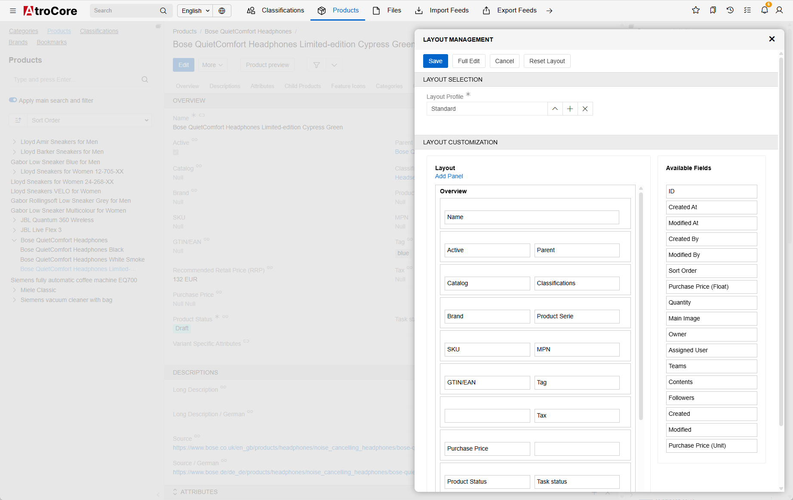

    

    

**[AtroPIM](https://www.atropim.com) is an open-source Product Information Management (PIM) system for companies with complex product data.** It is API-first, modular, and configurable through the user interface. AtroPIM is built with PHP and Svelte and published under the GNU GPLv3 license.

Manufacturers, wholesalers, and distributors use AtroPIM to consolidate product information in one system and distribute it to online shops, marketplaces, print catalogs, ERP systems, and partner portals.

> This repository contains the source code of the PIM module for the AtroCore Business Application Platform. AtroPIM is an instance of [AtroCore](https://github.com/atrocore/atrocore) with the PIM module installed on top of it.

 

## Who Uses AtroPIM

Our customers are manufacturers, wholesalers, and distributors that manage business-critical data across products, assets, and processes. They rely on AtroCore for large data models, extensive product portfolios, and demanding variant, classification, and integration requirements.

From mid-market companies to global enterprises, organizations choose AtroPIM when their requirements go beyond standard software and when flexibility, scalability, and integration with an existing system landscape are essential.

Companies working with AtroCore include Acer, Bridgestone, and Adam Hall.

 

## AtroPIM and AtroCore

**AtroCore** is the open-source Business Application Platform underneath. It provides the architecture, user and rights management, REST API, configurable data model, and low-code capabilities. On its own it is an abstract entity-relationship system used to build custom business applications. Master Data Management and Digital Asset Management are supported directly on the platform.

**AtroPIM** is the AtroCore platform with the PIM module pre-installed. The module adds everything required to manage product data: product-centric entities, variants, categories, classifications, channels, and catalog structures.

In practice this means you are never limited to product data. If a project later requires suppliers, contracts, spare parts, or any other business object, you model it in the same system instead of adding another tool.

 

## Why AtroPIM

Most PIM systems ship with a fixed data model and a defined process. Adapting them to your product structure turns into a development project. AtroPIM takes the opposite approach: entities, attributes, relations, and layouts are configuration, not code.

* **The data model follows your business.** Create custom entities, attributes, relations, classifications, layouts, and workflows through the user interface, without touching the core system and without a development project for every structural change.
* **Built for product data that does not fit a template.** Hierarchical variants, technical specifications, classification systems, channel-specific values, and multi-level product relationships are part of the standard functionality rather than paid add-ons.
* **API-first and headless.** Every standard and custom entity automatically gets a REST API, so shop systems, ERP, marketplaces, portals, and mobile applications can be connected without additional development on the PIM side.
* **More than a PIM.** The same platform holds supplier data, digital assets, and any other business object, so master data does not end up spread across several systems.
* **Open source with no revenue threshold.** GPLv3, self-hosted, no user limits, no feature paywall on the core, and full ownership of your data and infrastructure.
* **Scales with the catalog.** AtroPIM runs on modest hardware in small installations and handles very large datasets without loss of performance. This [demo video](https://vimeo.com/1215540661) shows an instance with more than 50 million products and over 1 billion attribute values at 20 attributes per product.

### AtroPIM Compared to Akeneo and Pimcore

AtroPIM, Akeneo, and Pimcore are all PHP-based and all address product data, but they solve different problems. The table summarizes where they differ.

| | **AtroPIM** | **Akeneo** | **Pimcore** |
| --- | --- | --- | --- |
| **License of the free version** | GNU GPLv3, no revenue limit | Open-source Community Edition | Pimcore Open Core License since Platform Version 2025.1. Free use limited to non-production, non-profit, and companies below EUR/USD 5 million annual revenue |
| **Data model** | Any entity, attribute, and relation created in the user interface | Product-centric and predefined: products, product models, families, attributes, categories | Fully custom, defined by developers in class definitions |
| **Non-product entities** | Standard functionality | Reference Entities are not part of the Community Edition | Standard functionality |
| **Who makes structural changes** | Business users and administrators, through configuration | Administrators within the predefined model, developers beyond it | Developers |
| **Scope** | PIM, MDM, DAM, and custom business applications on one platform | PIM | PIM, MDM, DAM, CMS, and DXP |
| **Typical fit** | Complex and non-standard data models, deep system integration, in-house control | Marketing-driven product enrichment with a standard catalog structure | Large platform projects with a dedicated development team |

The practical difference to Akeneo is where the limit sits. Akeneo is built around a product-centric model, and requirements that fall outside it, such as managing suppliers, certificates, or spare parts as first-class objects, need either a paid edition or custom development. In AtroPIM, those are entities you create in the interface.

The practical difference to Pimcore is who does the work and under which license. Pimcore is a development framework: the data model is powerful, and defining it is a developer task. AtroPIM aims to keep structural changes in the hands of the people who own the data. On licensing, Pimcore moved its Community Edition from GPLv3 to the Pimcore Open Core License with Platform Version 2025.1, and free use is now tied to a revenue threshold. AtroCore and AtroPIM remain under GPLv3 with no such threshold.

Where the others are stronger: Akeneo has a larger partner and app ecosystem and more brand recognition in enterprise procurement, and Pimcore covers content management and digital experience use cases that AtroPIM does not address. Compare against your own requirements rather than against a table, and use the [demo instance](https://demo.atropim.com) to check whether your data model fits.

 

## Features

AtroPIM adds the following to the AtroCore platform. Everything the platform provides, including import and export, rights management, workflows, and asset management, is included as well. See the [AtroCore feature list](https://github.com/atrocore/atrocore/blob/master/README.md#feature-list).

* **Product-centric data management.** Products are first-class entities with configurable attributes, relations, and layouts, extendable with your own fields and entities at any time.
* **Hierarchical product variants.** Model variant structures over several levels, with values inherited from the parent product and overridden where a variant differs.
* **Channels and channel-specific attributes.** Maintain different values of the same attribute per sales channel, so one product record serves several shops, marketplaces, and catalogs.
* **Product category trees.** Organize the catalog in multiple category trees for different channels or markets.
* **Product classifications.** Group products into classifications that carry their own attribute sets, so a class of products shares a consistent structure.
* **Bidirectional product associations.** Define upsell, cross-sell, accessory, and other relationships, maintained from either side.
* **Product listings.** Assemble curated product collections for specific purposes and channels.
* **Custom text blocks.** Reuse standardized text fragments across products instead of duplicating them per record.
* **PIM dashboard widgets.** Give each role a starting view of the data it is responsible for.

The complete feature list is available on the [AtroPIM website](https://www.atropim.com/en/features).

### Product Development Roadmap

- Check out our [roadmap](https://community.atrocore.com/t/product-roadmap/237).

 

## Architecture and Technology

AtroCore is built as a platform with a modular architecture. The platform provides the data model engine, the REST API, and the user interface framework. Everything on top of it, including the PIM functionality itself, is delivered as a module. Modules are managed with Composer and can be installed, updated, and removed independently of the core, which keeps upgrades of the platform separate from the extensions running on it.

### Technology Stack

| Layer | Technology |
| --- | --- |
| Backend | PHP with Symfony and Laminas components |
| Frontend | JavaScript, migrating from legacy Backbone.js to a reactive Svelte architecture |
| Database | PostgreSQL, MySQL, or MariaDB via the Doctrine DBAL abstraction layer |
| API | REST, standardized with OpenAPI (Swagger) specifications |
| Updates | Composer for dependency and version handling |

### Modules

A module extends the system with entities, fields, business logic, REST API endpoints, user interface elements, or integrations. There are three types:

- **Free modules.** Published as open source under GNU GPLv3 in the [AtroCore GitHub organization](https://github.com/orgs/atrocore/repositories). AtroPIM, Import, and Export belong to this group. They are free of charge with no user limits and no feature restrictions, and they cover the requirements of most projects. Many companies run AtroPIM in production without a single paid module.
- **Premium modules.** Developed and maintained by AtroCore under a commercial license, mainly the native integrations and specialized enterprise functionality.
- **Custom modules.** Developed by your own team, by an implementation partner, or by anyone else in the community.

Every installation, from a small team to a global enterprise, runs on the same open-source core. For teams that prefer a managed environment, hosted SaaS plans are available.

### Developing Your Own Modules

The module system is open. Anything AtroCore builds as a module, you can build yourself, using the same extension points and the same APIs. No part of the module system is reserved for the vendor.

A module is a Composer package that can add:

- entities, fields, and relations
- business logic and validation rules
- REST API endpoints
- user interface views and layouts
- translations
- scheduled jobs and background processes

Because a module lives in its own package and does not modify the core, custom code survives platform updates. Modules are installed, updated, and removed independently, so a project-specific extension can follow its own release cycle.

Two practical starting points: the developer documentation in the [Help Center](https://help.atrocore.com), and the free modules themselves. AtroPIM, Import, and Export are complete, production-grade modules published under GPLv3, so their source code serves as a reference implementation for your own work.

For most requirements you will not need a module at all. Entities, attributes, relations, layouts, and workflows are configured through the user interface. Write code only where configuration reaches its limits.

 

## Integrations

The REST API covers the full functionality of the system, so AtroPIM can be connected to any external system, sales channel, or marketplace.

You can build your own automated integration with any third-party REST or GraphQL API without writing code, using the free **Import: HTTP Requests** and **Export: HTTP Requests** modules.

The following native integrations are available as paid modules:

| Category | Systems |
| --- | --- |
| ERP | SAP S/4HANA, SAP Business One, Microsoft Dynamics 365 Business Central, Oracle Fusion, Oracle NetSuite, Odoo, Acumatica, Infor, Epicor, Xentral, work4all, and others |
| E-commerce | Adobe Commerce (Magento 2), Shopware, Shopify, BigCommerce, commercetools, Saleor, SAP Commerce Cloud, Salesforce Commerce Cloud, PrestaShop, WooCommerce, Sylius, Vendure, and others |
| Multichannel | Channable, ChannelPilot, Lengow, Feedonomics, Productsup, ChannelEngine, ChannelAdvisor, and others |
| Marketplaces | Amazon, OTTO |
| DAM | Cloudinary, Bynder, Canto, CELUM, and others |
| CMS and DXP | Contentful, TYPO3, Strapi, Adobe Experience Manager, Drupal, Acquia, Optimizely, Sitecore, Sanity, Storyblok, and others |
| PLM and PDM | Autodesk Fusion Manage, Autodesk Vault, Aras Innovator, SOLIDWORKS PDM, OpenBOM, Propel PLM, Teamcenter, Windchill, and others |

[Contact us](https://www.atropim.com/contact) for details on a specific integration.

 

## Installation

To install AtroPIM, install AtroCore and add the PIM module to it.

- [Installation guide](https://help.atrocore.com/installation-and-maintenance/installation)

### Docker

- [Docker installation guide](https://help.atrocore.com/installation-and-maintenance/installation/docker-configuration)
- [Docker image](https://github.com/atrocore/docker)

> Use the Docker image to evaluate the system and a standard installation for production environments.

 

## System Requirements

- Linux-based **root or managed server** (recommended: Ubuntu LTS). 
- **Minimum Ressources:**
  - 2 vCPU
  - 4 GB RAM
  - 80 GB SSD Storage
- **Software**:
  - Apache Web Server or Nginx
  - PHP 8.4 - 8.5.
  - PostgreSQL 14.9+ (recommended) or MySQL 5.5+ or MariaDB 5.5+.

> AtroCore and AtroPIM do not run on standard shared hosting because of their technical requirements and resource needs. Managed server hosting can work, but each provider and configuration should be evaluated individually.

 

## Screenshots
|                                                                                          |                                                                                          |
| ---------------------------------------------------------------------------------------- | ---------------------------------------------------------------------------------------- |
|                              |                                          |
|                     |                  |
|        |        |
|  |  |

 

## Public Demo Instance

- URL: https://demo.atropim.com/
- Login: admin
- Password: admin

 

## Contributing

- **Report bugs:** please [report bugs](https://github.com/atrocore/atrocore/issues/new).
- **Fix bugs:** please create a pull request in the affected repository including a step by step description to reproduce the problem.
- **Contribute features:** You are encouraged to create new features. Please contact us before you start.

 

## Localization

Would you like to help us translate UIs into your language, or improve existing translations?
- https://translate.atrocore.com/

 

## Documentation

- Please visit our Help Center (Documentation) - https://help.atrocore.com/
- Developer Documentation: https://help.atrocore.com/latest/developer-guide

 

## Other Resources

- Report a Bug - https://github.com/atrocore/atrocore/issues/new
- Read our Release Notes - https://help.atrocore.com/release-notes/core
- Please visit our Community - https://community.atrocore.com (use github account to login)
- Сontact us - https://www.atrocore.com/contact

 

## Help Us Grow

If you find AtroCore useful:

- ⭐ Star the repo
- 🗣️ Share it with your network
- 🛠️ Contribute to the project

 

## License

AtroCore is published under the GNU GPLv3 [license](LICENSE.txt).
