# Attribute Groups

**Attribute Group** – a collection of [attributes](./attributes.md) of a certain kind combined together to make it easier for the customer to understand the product and its features better. As an example, the "screen" attribute group for smartphones may combine such attributes as "screen diagonal", "resolution", "type of matrix", "number of touch points", etc. Each attribute may belong to only one attribute group, which is optional.

## Attribute Group Fields

The attribute group entity comes with the following preconfigured fields; mandatory are marked with *:

| **Field Name**           | **Description**                            |
|--------------------------|--------------------------------------------|
| Group name (multi-lang)* | Name of the attribute group (e.g. technical) |
| Code *                   | Unique value used to identify the attribute group. It can only consist of lowercase letters, digits and underscore symbols                   |
| Sort order               | Sorting order of the attribute group. With this parameter, attribute groups will be arranged in the appropriate order on the product [detail view](./views-and-panels.md#detail-view) page                   |
| Description (multi-lang) | Description of the attribute group purpose   |

If you want to make changes to the attribute group entity (e.g. add new fields, or modify attribute group views), please contact your administrator.

## Creating

To create a new attribute group record, click `Attribute Groups` in the navigation menu to get to the attribute groups [list view](#listing), and then click the `Create Attribute Group` button. The common creation window will open:

Here enter the desired name for the attribute group record being created and its sort order number. its code is automatically generated based on the entered name, but you can change it via the keyboard. The attribute group description is an optional field and can be left empty. Click the `Save` button to finish the attribute group creation or `Cancel` to abort the process.

If the attribute group code is not unique, the error message will appear notifying you about it.

Alternatively, use the [quick create](./user-interface.md#quick-create) button on any TreoPIM page and fill in the required fields in the attribute group creation pop-up that appears:

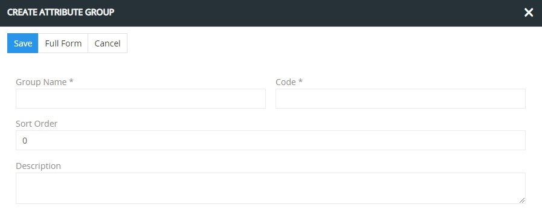

## Listing

To open the list of attribute group records available in the system, click the `Attribute groups` option in the navigation menu:

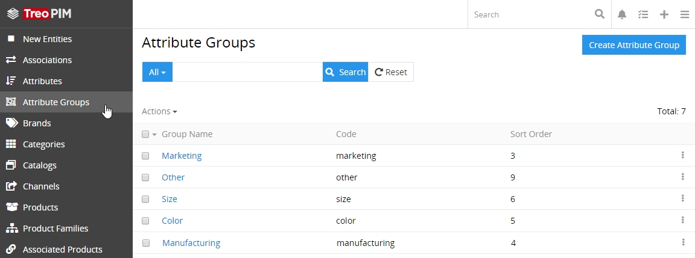

By default, the following fields are displayed on the [list view](./views-and-panels.md#list-view) page for attribute group records:
- Group name
- Code
- Sort order

To change the attribute group records order in the list, click any sortable column title; this will sort the column either ascending or descending. 

Attribute group records can be searched and filtered according to your needs. For details on the search and filtering options,  refer to the [**Search and Filtering**](./search-and-filtering.md) article in this user guide.

To view some attribute group record details, click the name field value of the corresponding record in the list of attribute groups; the [detail view](./views-and-panels.md#detail-view) page will open. Alternatively, use the `View` option from the single record actions menu to open the [quick detail](./views-and-panels.md#quick-detail-view-small-detail-view) pop-up.

### Mass Actions

The following mass actions are available for attribute group records:
- Remove
- Mass update
- Export
- Add relation
- Remove relation

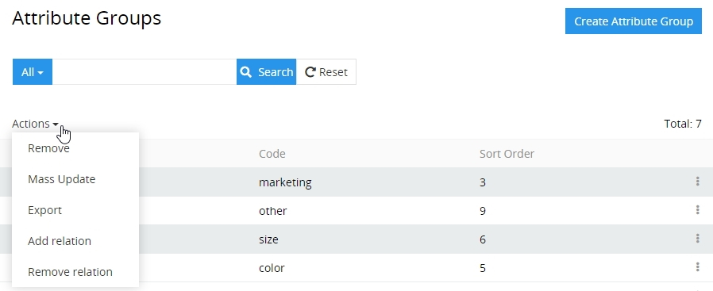

For details on these actions, please, see the [**Mass Actions**](./views-and-panels.md#mass-actions) section of the **Views and Panels** article in this user guide.

### Single Record Actions

The following single record actions are available for attribute group records:
- View
- Edit
- Remove

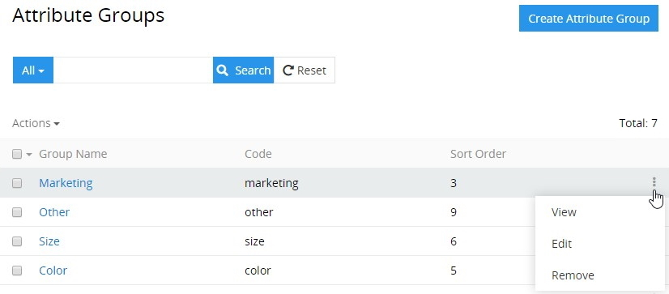

For details on these actions, please, refer to the [**Single Record Actions**](./views-and-panels.md#single-record-actions) section of the **Views and Panels** article in this user guide.

## Editing

To edit the attribute group, click the `Edit` button on the [detail view](./views-and-panels.md#detail-view) page of the currently open attribute group record; the following editing window will open:

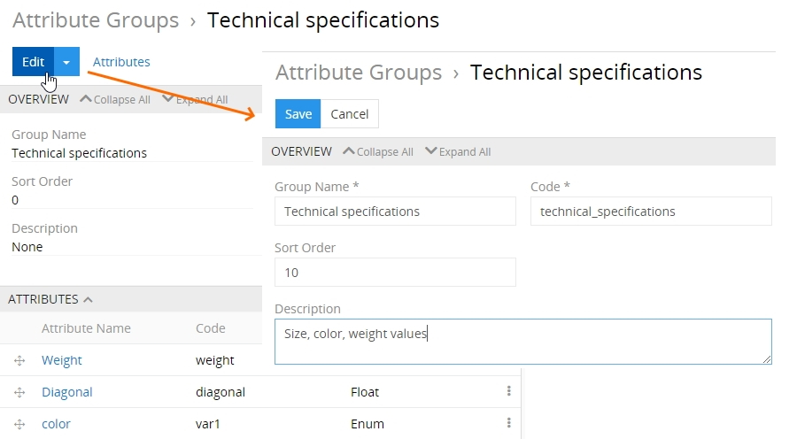

Here edit the desired fields and click the `Save` button to apply your changes.

Besides, you can make changes in the attribute group record via [in-line editing](./views-and-panels.md#in-line-editing) on its detail view page.

Alternatively, make changes to the desired attribute group record in the [quick edit](./views-and-panels.md#quick-edit-view) pop-up that appears when you select the `Edit` option from the single record actions menu on the attribute groups list view page:

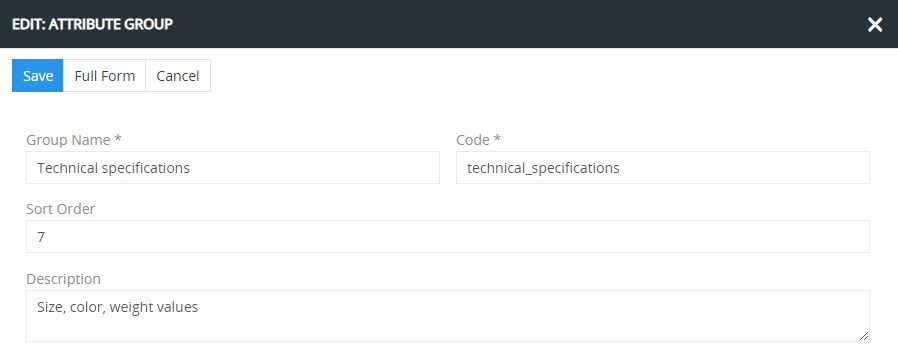

## Removing

To remove the attribute group record, use the `Remove` option from the actions menu on its detail view page

or from the single record actions menu on the attribute groups list view page:

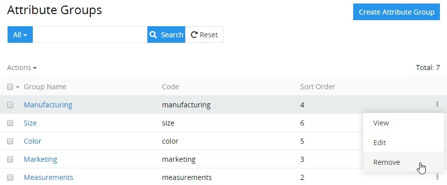

If you are removing the attribute group that contains related attributes, these attributes will be unlinked from this attribute group.

## Duplicating

Use the `Duplicate` option from the actions menu to go to the attribute group creation page and get all the values of the last chosen attribute group record copied in the empty fields of the new attribute group record to be created. Modifying the attribute group code is required, as this value has to be unique.

## Working With Attributes Related to the Attribute Group

Attributes that are linked to the attribute group record are displayed on its [detail view](./views-and-panels.md#detail-view) page on the `ATTRIBUTES` panel and include the following table columns:
- Attribute name
- Code
- Attribute type

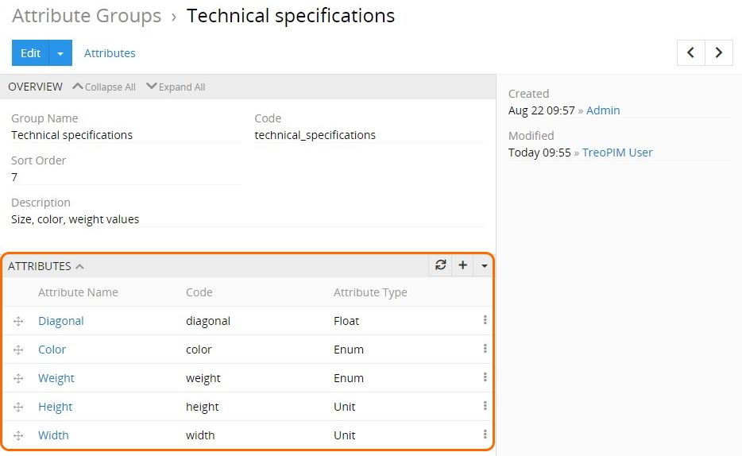

If this panel is missing, please, contact your administrator as to your access rights configuration. Also, to be able to relate more entities to attribute groups, please, contact your administrator.

To create a new [attribute](./attributes.md) record, сlick the `+` button  located on the `ATTRIBUTES` panel and fill in the fields in the attribute creation pop-up that appears:

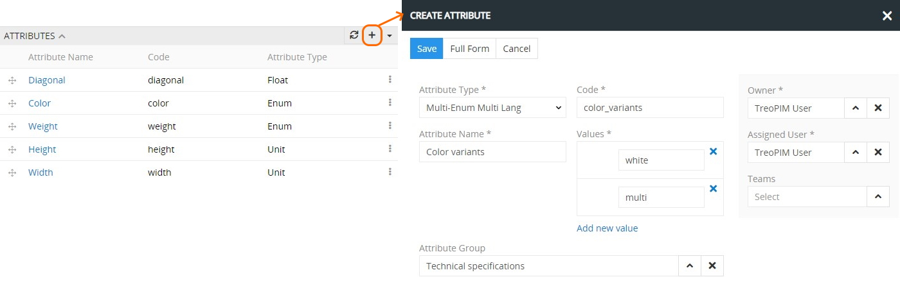

To link the already existing attribute(s) with the open attribute group record, use the `Select` option:

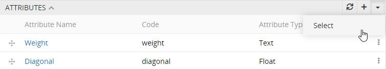

In the "Attributes" pop-up window that appears, select one or several attributes you would like to assign to this attribute group and click the `Select` button to complete the action.

*Please consider, if the attribute has already been related to other attribute group(s), it will be reassigned to the currently open attribute group.*

Attributes linked to the given attribute group record can be viewed, edited, unlinked, or removed via the corresponding options from the single record actions menu on the `ATTRIBUTES` panel:

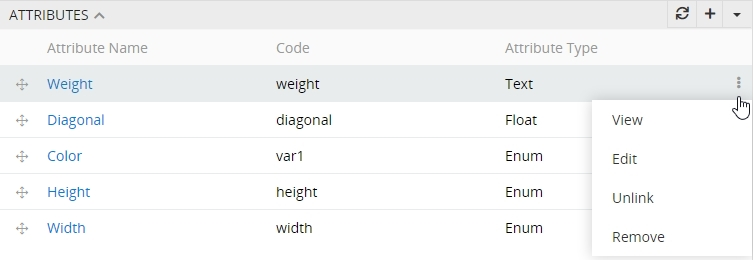 

On this panel, you can also define attribute records order within the given attribute group record via their drag-and-drop:

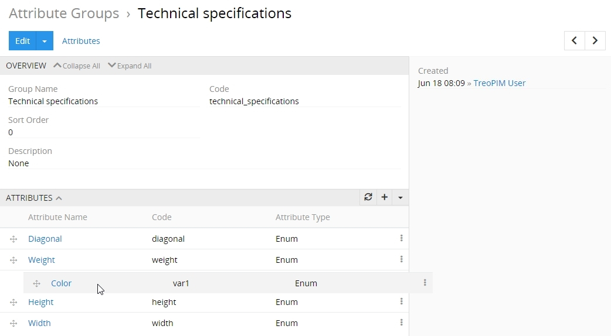

The changes are saved on the fly.

To view the attribute record from the `ATTRIBUTES` panel, click its name in the attributes list. The [detail view](./views-and-panels.md#detail-view) page of the given attribute will open, where you can perform further actions according to your access rights, configured by the administrator. 
