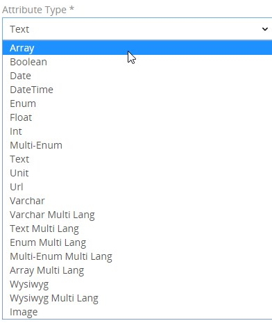
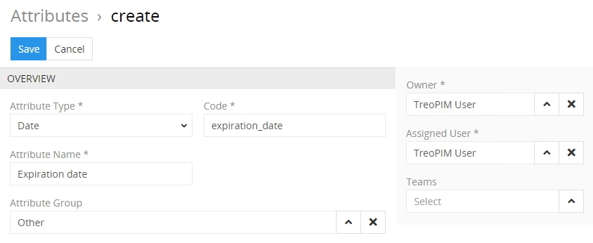
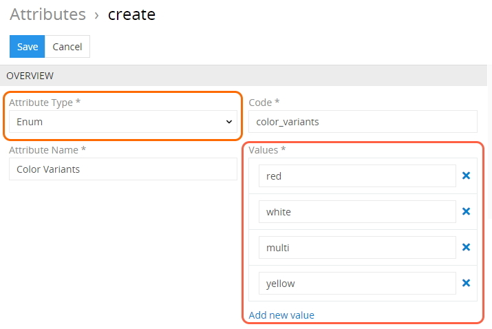
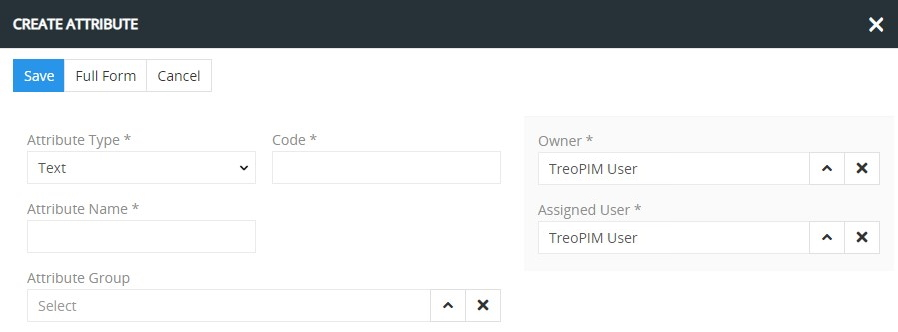
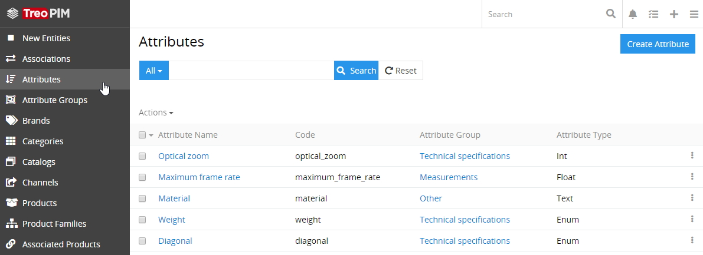
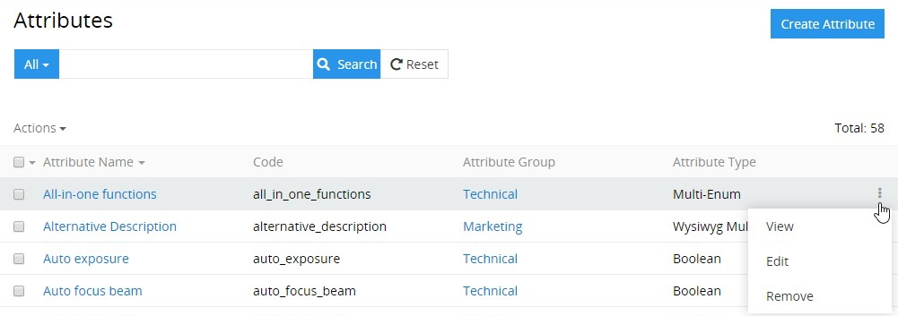
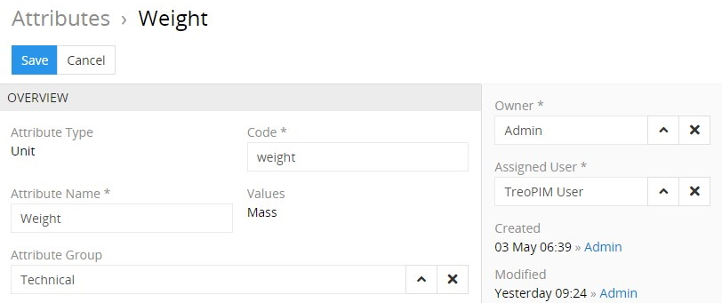
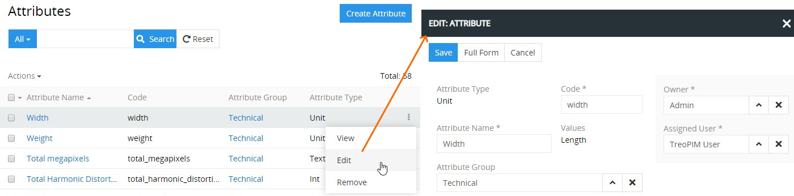
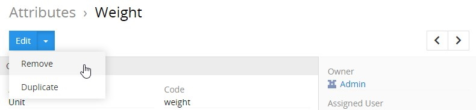
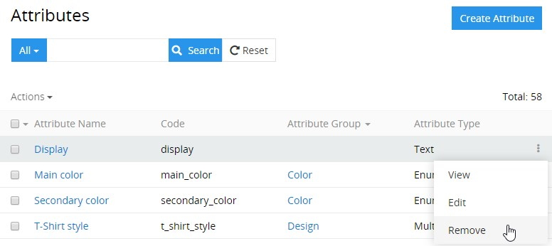

# Attributes

**Attributes** – characteristics of a certain [product](./products.md) that distinguish it from other products, e.g. size, color, functionality, components and features that affect the product's attractiveness or acceptance in the market. 

An attribute can be assigned to only one [attribute group](./attribute-groups.md). Value of a certain attribute set for a certain product is called *product attribute value*. It is possible to define the same product attribute different values for each channel. 

Attributes can be assigned to several [product families](./product-families.md), so if the product for that product family is created, the selected attribute will be added to the product attributes automatically.

Attributes can be activated or deactivated. Deactivated attributes cannot be used in the system, e.g. no values can be set to them or transferred via any channel. All the values of the deactivated attributes are hidden and will be shown again after the attribute is activated again.

## Attribute Fields

The attribute entity comes with the following preconfigured fields; mandatory are marked with *:

| **Field Name**           | **Description**                   |
|--------------------------|-----------------------------------|
| Type					   | Attribute types are predefined in the system and can be defined via the drop-down menu                |
| Code *                   | Unique attribute code              |
| Name (multi-lang) *      | Attribute name                     |
| Attribute group          | Attribute group name               |

If you want to make changes to the attribute entity (e.g. add new fields, or modify attribute views), please contact your administrator.

## Available Attribute Types

Attributes are automatically validated according to their type. The following attribute types are available in the TreoPIM system:

| **Attribute Type**           | **Description**                   |
|------------------------------|-----------------------------------|
| Array                        | Data array, where each product attribute can get more than one value. No array values can be set upon the attribute creation or editing.|
| Boolean                      | Checkbox for the product attribute				|
| Date                         | Date picker with the calender and option to set up the date manually |
| DateTime                     | Date and time picker						|
| Enum                         | List of possible values, which is set up upon the attribute creation or editing; a single value can be set for the product attribute. |
| Float                        | Number with a decimal part		|
| Int                          | Integer attribute					|
| Multi-Enum                   | List of possible values, which is set up upon attribute creation or editing; multiple values can be set for the product attribute. |
| Text                         | Text area, for long multiline texts		|
| Unit                         | Number with a measurement value selection  |
| Url                          | URL with a hyperlink, which is automatically created |
| Varchar                      | Short text attribute				|
| Varchar Multilang            | Short text attribute with separate values for each locale	|
| Text Multilang               | Text area for long multiline texts with separate values for each locale   |
| Enum Multilang               | Multilingual list of possible values, which is set up upon the attribute creation or editing; a single value can be set for the product attribute separately for each locale.  |
| Multi-Enum Multilang         | Multilingual list of possible values, which is set up upon the attribute creation or editing, multiple values can be set for the product attribute separately for each locale. |
| Array Multilang              | Multilingual data array, where each product attribute can get more than one value separately for each locale. No array values can be set upon the attribute creation or editing.   |
| Wysiwyg                      | Text area for long multiline texts that contains a built-in text editor   |
| Wysiwyg Multilang            | Text area for long multiline texts that contains a built-in text editor with separate values for each locale  |
| Image				           | Image file attachment  |

## Creating

To create a new attribute record, click `Attributes` in the navigation menu to get to the attribute [list view](#listing) and then click the `Create Attribute` button. The common creation pop-up window will appear:

Here enter the attribute name and code and select its type from the `Attribute Type` drop-down list. Define its attribute group using the corresponding select button, if needed. Your username is loaded to the `Owner` and `Assigned user` fields by default. You can change them via the corresponding select buttons, as well as define the team, if needed. Click the `Save` button to finish the attribute record creation or `Cancel` to abort the process.

If the attribute code is not unique, the error message will appear notifying you about it.

Please, note that attribute type cannot be changed after the attribute is created. 

When creating attribute records of the `Enum`, `Multi-Enum`, `Enum Multilang`, and `Multi-Enum Multilang` types, their attribute values should also be defined:

Alternatively, use the [quick create](./user-interface.md#quick-create) button on any TreoPIM page and fill in the required fields in the attribute creation pop-up that appears:

## Listing

To open the list of attribute records available in the system, click the `Attributes` option in the navigation menu:

By default, the following fields are displayed on the list view page for attribute records:
- Attribute name
- Code
- Attribute group
- Attribute type

To sort attribute records order in the list, click any sortable column title; this will sort the column either ascending or descending. 

Attribute records can be searched and filtered according to your needs.  For details on the search and filtering options, refer to the [**Search and Filtering**](./search-and-filtering.md) article in this user guide.

To view some attribute record details, click the name field value of the corresponding record in the list of attributes; the [detail view](./views-and-panels.md#detail-view) page will open showing the attribute records. Alternatively, use the `View` option from the single record actions menu to open the [quick detail](./views-and-panels.md#quick-detail-view-small-detail-view) pop-up.

### Mass Actions

The following mass actions are available for attribute records:
- Remove
- Mass update
- Export
- Add relation
- Remove relation

For details on these actions, please, see the [**Mass Actions**](./views-and-panels.md#mass-actions) section of the **Views and Panels** article in this user guide.

### Single Record Actions

The following single record actions are available for attribute records:
- View
- Edit
- Remove
 

 
For details on these actions, please, refer to the [**Single Record Actions**](./views-and-panels.md#single-record-actions) section of the **Views and Panels** article in this user guide.

## Editing

To edit the attribute, click the `Edit` button on the [detail view](./views-and-panels.md#detail-view) page of the currently open attribute record; the following editing window will open:

Here edit the desired fields and click the `Save` button to apply your changes.

Besides, you can make changes in the attribute record via [in-line editing](./views-and-panels.md#in-line-editing) on its detail view page.

Alternatively, make changes to the desired attribute record in the [quick edit](./views-and-panels.md#quick-edit-view) pop-up that appears when you select the `Edit` option from the single record actions menu on the attributes list view page:

## Removing

To remove the attribute record, use the `Remove` option from the actions menu on its detail view page

or from the single record actions menu on the attributes list view page:

By default, it is not possible to remove the attribute if there is any product or product family linked with this attribute. The following confirmation pop-up appears:

Select the checkbox to unlink the attribute record from other entities and click `Remove` to complete the operation. Click `Cancel` to abort the process. 

## Duplicating

Use the `Duplicate` option from the actions drop-down menu to go to the attribute creation page and get all the values of the last chosen attribute record copied in the empty fields of the new attribute record to be created. Modifying the attribute code is required, as this value has to be unique.

 

