# Categories

**Category** – an efficient way to organize the [products](./products.md) by their type, which helps target consumer find the desired products faster. 

Categories make up a powerful tool that can be used not only to sort your content, but also to develop a proper, i.e. meaningful and semantic, structure of your product [catalog](./catalogs.md). Categories have a hierarchical taxonomy, meaning that there are parent and child categories. 

[**Category tree**](#category-tree) – the aggregate of all categories and parent–child relations among them. Category tree starts with a *root category* – a category, which has no parent category, and ends with many branches of categories without subcategories (i.e. *child categories*).

**Parent Category** – a category to which the category is assigned. If "Berlin" is a category, "Germany" may be its parent category.

**Subcategories** – all child categories, assigned to a certain category. Subcategories for category "Germany" may be "Berlin", "Munich", "Hannover" and so on.

There can be many category trees in TreoPIM. Each category can have only one parent category. Each category may have a lot of subcategories. One category can be used in several category trees. Also many products can be assigned to one category, and each product can be assigned to more than one category in accordance with the catalog content.

## One Category Tree vs Multiple Category Trees

Each adopter of [TreoPIM](./what-is-treopim.md) may decide for himself what works better for him – setting up and supporting multiple category trees or just one. Irregardless of the choice, it is still possible to synchronize different content for products you want to supply. 

## Product Categories in Multiple Languages

Even if you want to manage your product content in different languages, there is no need in maintaining multiple category trees. 

Please, note that multilingual functionality is available after the "Multi-Languages" module is installed (along with the TreoPIM system installation) and set up. Go to our store to learn more about the ["Multi-Languages" module](https://treopim.com/store/multi-languages).

There are two ways to set up your product catalog if you carry product information in different languages:

1. Create a separate category tree for each language / locale.
2. Create just one category tree using multi-language fields for the category name.

The first approach is preferable, if you want to provide different channels with different product catalogs, e.g. some product should be transferred to channel 1, but not to channel 2. The second one is a better choice if you want to deliver the product information about all your products to all channels.

## Category Fields

The category entity comes with the following preconfigured fields; mandatory are marked with *:

| **Field Name**           | **Description**                            |
|--------------------------|--------------------------------------------|
| Active                   | Activity state of the category record      |
| Name (multi-lang) *      | The category name							|
| Parent Category		   | The category to be used as a parent for this category |
| Code *                   | Unique value used to identify the category. It can only consist of lowercase letters, digits and underscore symbols				      |
| Description (multi-lang) | Description of the category usage                  |

If you want to make changes to the category entity, e.g. add new fields, or modify category views, please contact your administrator.

## Creating

To create a new category record, click `Categories` in the navigation menu to get to the category records [list view](#listing), and then click the `Create Category` button. The common creation window will open:

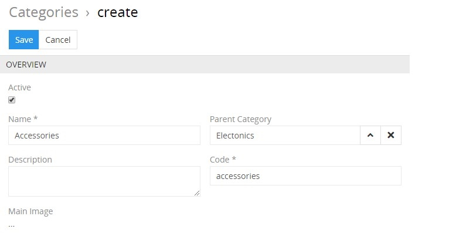

Here enter the desired name for the category record being created and activate it, if needed. Its code is automatically generated based on the entered name, but you can change it via the keyboard. Click the select button in the `Parent category` field to assign one to the given category, if needed. The category description is an optional field and can be left empty.

Click the `Save` button to finish the category record creation or `Cancel` to abort the process.

If the category code is not unique, the error message will appear notifying you about it.

The new record will be added to the categories list. You can configure it right away on the [detail view](./views-and-panels.md#detail-view) page that opens or return to it later.

Alternatively, use the [quick create](./user-interface.md#quick-create)  button on any TreoPIM page and fill in the required fields in the category creation pop-up that appears:

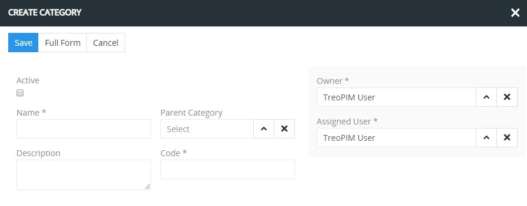

## Listing

To open the list of category records available in the system, click the `Categories` option in the navigation menu:

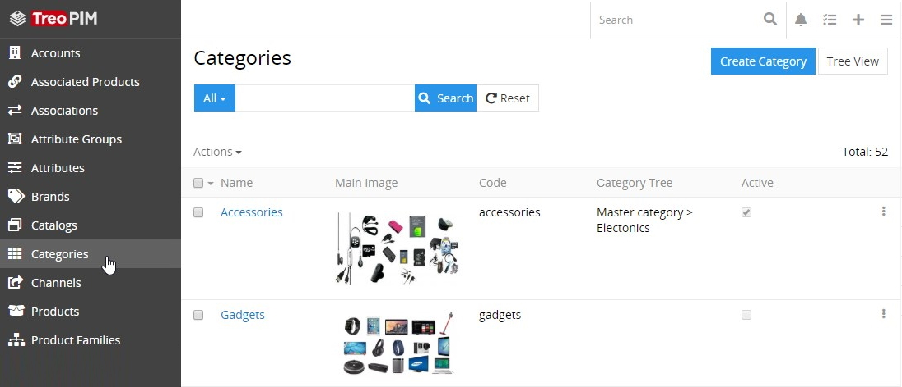

By default, the following fields are displayed on the [list view](./views-and-panels.md#list-view) page for category records:
 - Name
 - Main image
 - Code 
 - Category tree 
 - Active

To change the category records order in the list, click any sortable column title; this will sort the column either ascending or descending. 

Category records can be searched and filtered according to your needs. For details on the search and filtering options, refer to the [**Search and Filtering**](./search-and-filtering.md) article in this user guide.

To view some category record details, click the name field value of the corresponding record in the list of categories; the [detail view](./views-and-panels.md#detail-view) page will open showing the category records and the records of the related entities. Alternatively, use the `View` option from the single record actions menu to open the [quick detail](./views-and-panels.md#quick-detail-view-small-detail-view) pop-up.

### Mass Actions

The following mass actions are available for category records on the list view page:

- Remove
- Mass update
- Export
- Add relation
- Remove relation

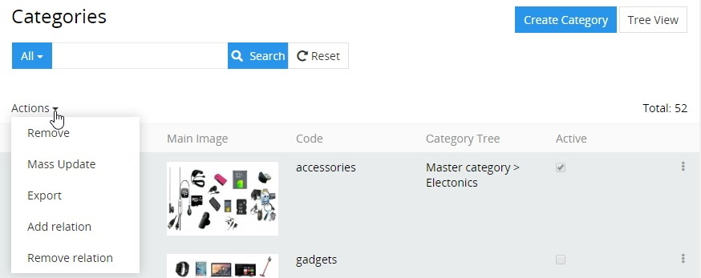

For details on these actions, refer to the [**Mass Actions**](./views-and-panels.md#mass-actions) section of the **Views and Panels** article in this user guide.

### Single Record Actions

The following single record actions are available for category records on the list view page:

- View
- Edit
- Remove

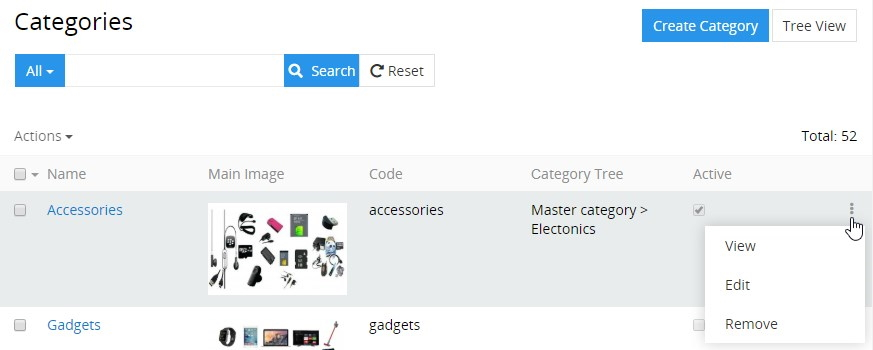

For details on these actions, please, refer to the [**Single Record Actions**](./views-and-panels.md#single-record-actions) section of the **Views and Panels** article in this user guide.

## Editing

To edit the category, click the `Edit` button on the detail view page of the currently open category record; the following editing window will open:

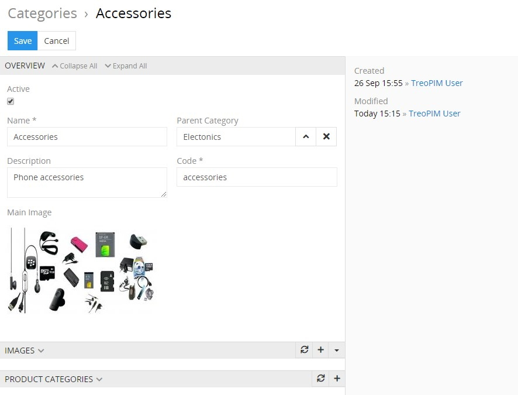

Here edit the desired fields and click the `Save` button to apply your changes.

Besides, you can make changes in the category record via [in-line editing](./views-and-panels.md#in-line-editing) on its detail view page.

Alternatively, make changes to the desired category record in the [quick edit](./views-and-panels.md#quick-edit-view) pop-up that appears when you select the `Edit` option from the single record actions menu on the categories list view page:

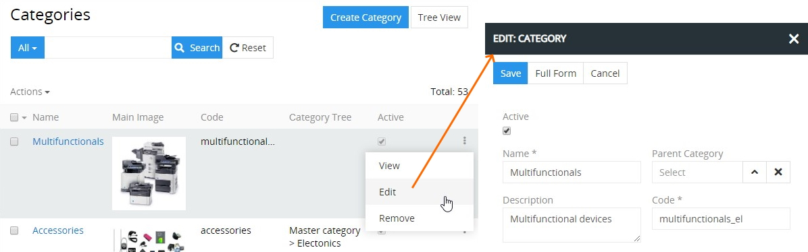

## Removing

To remove the category record, use the `Remove` option from the actions menu on its detail view page

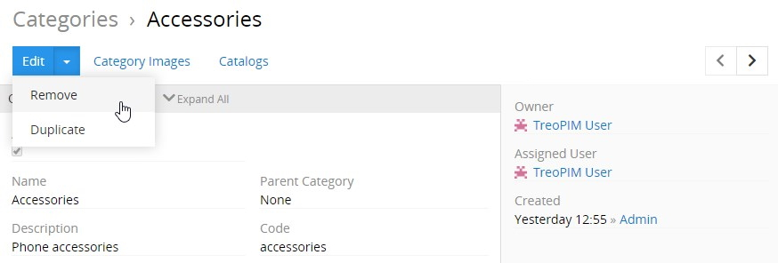

or from the single record actions menu on the categories list view page:

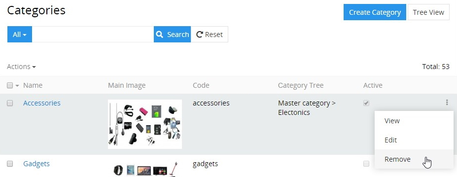

By default, it is not possible to remove the category, if it has child categories in any [product](./products.md#product-categories) associated with it.

## Duplicating

Use the `Duplicate` option from the actions menu to go to the category creation page and get all the values of the last chosen category record copied in the empty fields of the new category record to be created. Modifying the category code is required, as this value has to be unique.

## Category Tree

TreoPIM offers you a dynamic display of all categories available in the system in a tree view. To see this, click the `Tree View` button on the categories list view:              
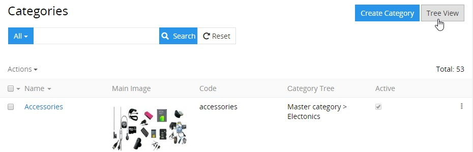

In this view, parent–child relations are more explicit, and category trees are built (modified) via simple drag-and-drop of categories:

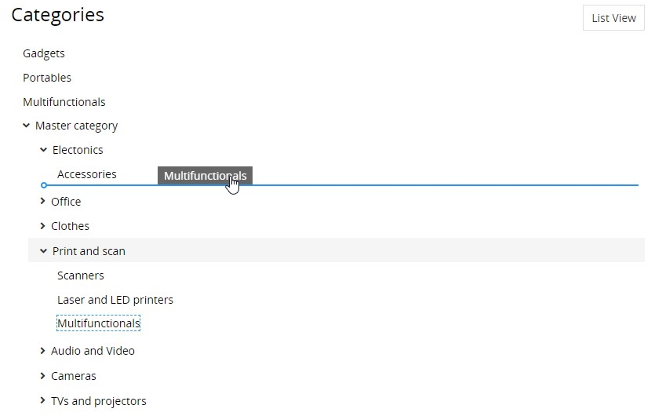

## Working With Entities Related to Categories

Relations to images and [product categories](./products.md#product-categories) are available for all categories by default. These related entities records are displayed on the corresponding panels on the category [detail view](./views-and-panels.md#detail-view) page. If any panel is missing, please, contact your administrator as to your access rights configuration.

To be able to relate more entities to categories, please, contact your administrator.

### Images

Images that are linked to the currently open category record are displayed on its [detail view](./views-and-panels.md#detail-view) page on the `IMAGES` panel and include the following table columns:
- Image
- Name
- Scope
- Channels

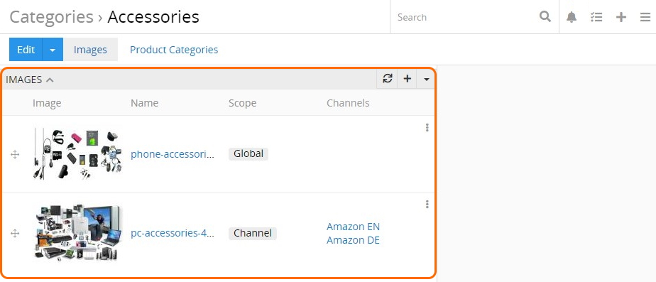

On this panel, you can link images to the given category record by selecting the existing ones or creating new image records.

To create new image records to be linked to the currently open category record, click the `+` button located in the upper right corner of the `IMAGES` panel and enter the necessary data in the image creation pop-up that appears:

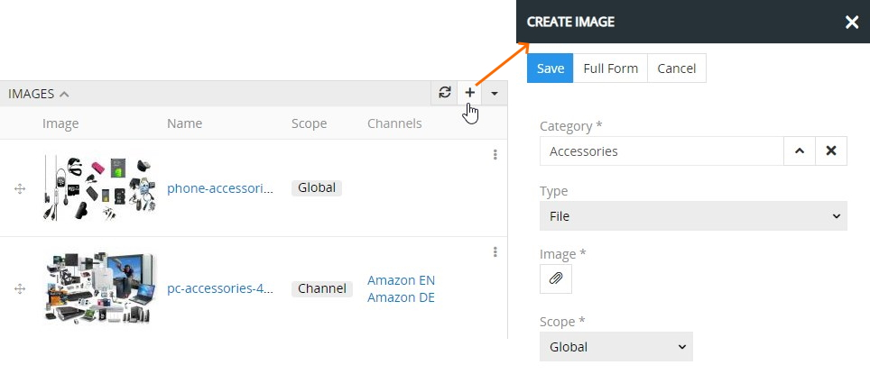

The following *image uploading types* are available in the TreoPIM system by default:
- **File** / **Files** – image files that are stored locally (on your PC or other device). When the `File` type is selected on the image creation step, the desired image file is  uploaded as an attachment. To attach several image files at the same time, the `Files` type is to be defined accordingly.
- **Link** – the URL to the image file, which is stored on the external server. When this type is selected on the image creation step, the image link must be entered in the corresponding field:

	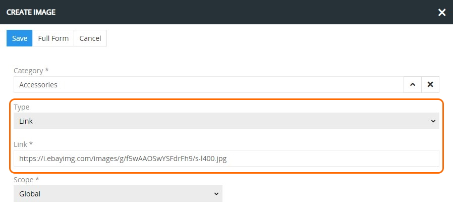

By default, the defined image has the `Global` scope, but you can change it to `Channel` and select the desired channel (or channels) in the added field:

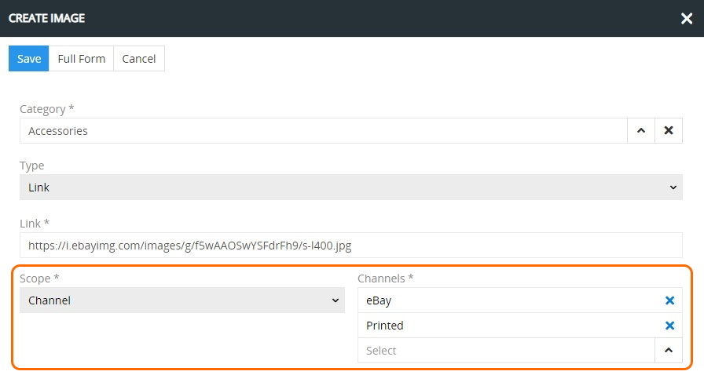

Click the `Save` button to complete the image record creation process or `Cancel` to abort it.

Please, note that once the image record is created within the product, it is displayed on the `IMAGES` panel as a common image file (irregardless of its uploading type). 

To assign an image (or several images) to the category record, use the `Select` option from the actions menu located in the upper right corner of the `IMAGES` panel:

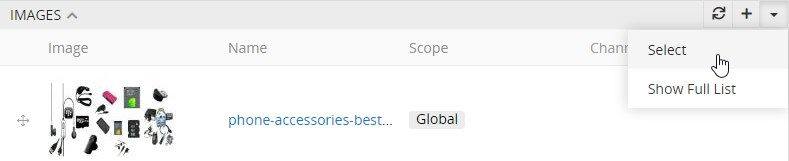

In the "Images" pop-up that appears, choose the desired image (or images) from the list and press the `Select` button to link the item(s) to the category record.

To see all image records linked to the given category, use the `Show full list` option:

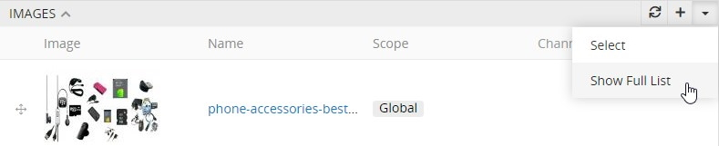

Then the "Images" page opens, where all image records [filtered](./search-and-filtering.md) by the given category are displayed:

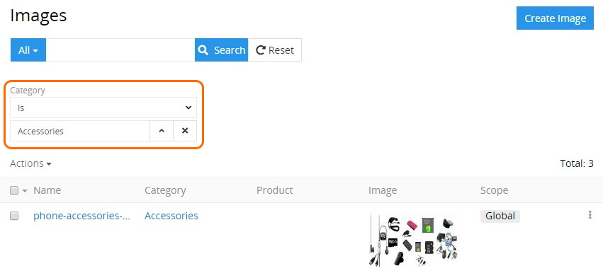

To open the pop-up with the preview of the images that are listed on the `IMAGES` panel, click the desired one in the `Image` column in the image records list.

Images linked to the given category record can be viewed, edited, or removed via the corresponding options from the single record actions menu on the `IMAGES` panel:

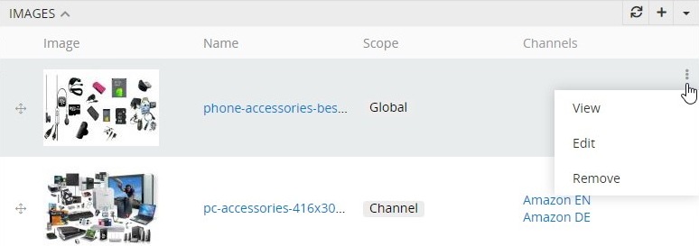

On the `IMAGES` panel you can also define image records order within the given category record via their drag-and-drop:

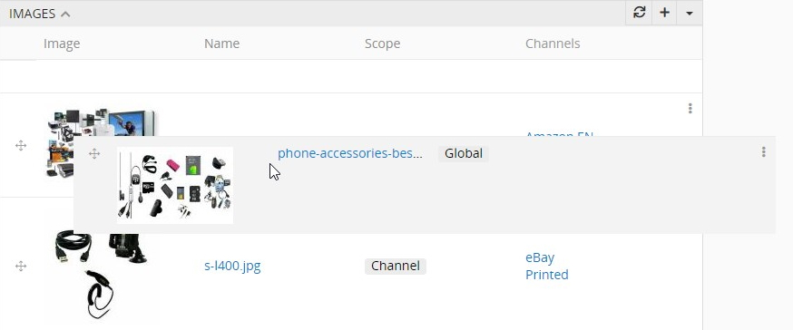

The changes are saved on the fly.

Please, note that the first image record in the list is automatically considered as the main category image.

To view the category related image record from the `IMAGES` panel, click its name in the images list. The [detail view](./views-and-panels.md#detail-view) page of the given image will open, where you can perform further actions according to your access rights, configured by the administrator. 

### Product Categories

[Products](./products.md) that are linked to the category record are shown on the `PRODUCT CATEGORIES` panel within the category [detail view](./views-and-panels.md#detail-view) page and include the following table columns:
 - Product
 - Scope
 - Channels

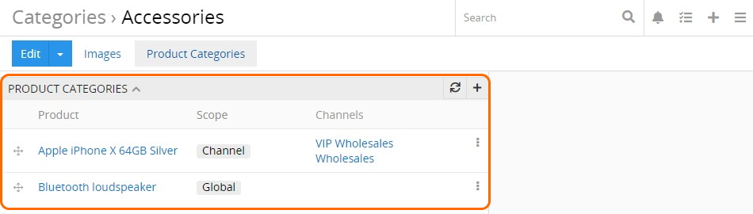

It is possible to link products to a category by creating new product categories. To do this for the currently open category, click the `+` button located in the upper right corner of the `PRODUCT CATEGORIES` panel and enter the necessary data in the product category creation pop-up that appears:

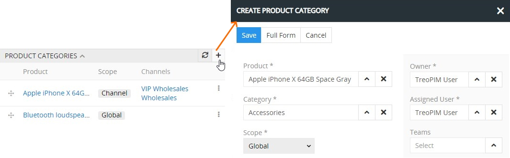

By default, the defined category has the `Global` scope, but you can change it to `Channel` and select the desired channel (or channels) in the added field:

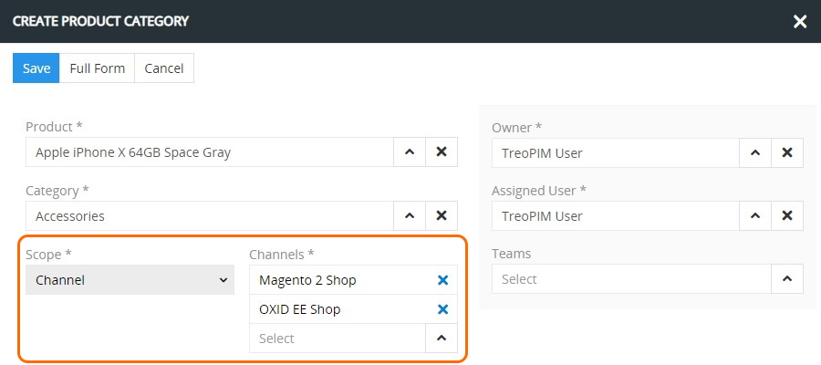

Click the `Save` button to complete the category creation process or `Cancel` to abort it.

Please, note that you can link the same product category twice, but with different scopes – `Global` or `Channel`.

Please, note that you can link both root and child product categories. The only condition is that their root category should be linked to the [catalog](./catalogs.md) to which the given product belongs.

Product categories can be viewed, edited, or removed via the corresponding options from the single record actions menu on the `PRODUCT CATEGORIES` panel:

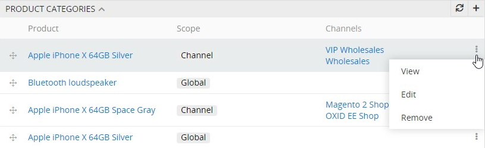

