# Channels

**Channel** – a destination point for your product data, which can be synced with third-party systems as well as exported in certain formats. Generally, a channel is a place, where your product information should appear; for example, your online shop, mobile app or print catalog.

Using channels allows you to implement your multichannel or omni-channel strategy in a more efficient way.

## Channel Fields

The channel entity comes with the following preconfigured fields; mandatory are marked with *:

| **Field Name**           | **Description**                            |
|--------------------------|--------------------------------------------|
| Active				   | Activity state of the channel record                 |
| Name (multi-lang) *	   | Channel name                   |
| Code *                   | Unique value used to identify the channel. It can only consist of lowercase letters, digits and underscore symbols     |
| Currencies *			   | Multiselect-list of currencies. The prices in the defined currency (or currencies) will be transferred via the given channel  |
| Description			   | Description of the channel usage    |

If you want to make changes to the channel entity, e.g. add new fields, or modify channel views, please contact your administrator.

## Creating

To create a new channel record, click `Channels` in the navigation menu to get to the channel [list view](#listing), and then click the `Create Channel` button. The common creation window will open:

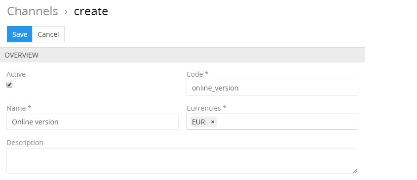

Here enter the desired name for the channel record being created and activate it, if needed. Its code is automatically generated based on the entered name, but you can change it via the keyboard. Define the currencies to be used in prices for the given channel using the corresponding drop-down list. The channel description is an optional field and can be left empty.

*Please, note that the `Currencies` list is set up by the administrator.*

Click the `Save` button to finish the channel record creation or `Cancel` to abort the process.

If the channel code is not unique, the error message will appear notifying you about it.

Alternatively, use the [quick create](./user-interface.md#quick-create) button on any TreoPIM page and fill in the required fields in the channel creation pop-up that appears:

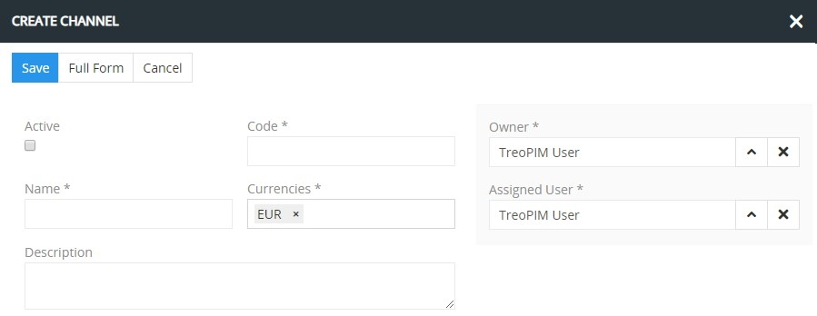

## Listing

To open the list of channel records available in the system, click the `Channels` option in the navigation menu:

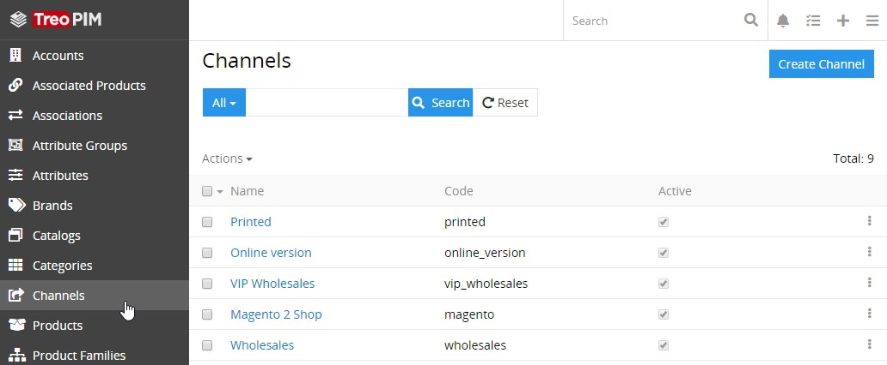

By default, the following fields are displayed on the [list view](./views-and-panels.md#list-view) page for channel records:
 - Name
 - Code
 - Active

To change the channel records order in the list, click any sortable column title; this will sort the column either ascending or descending. 

Channel records can be searched and filtered according to your needs. For details on the search and filtering options, refer to the [**Search and Filtering**](./search-and-filtering.md) article in this user guide.

To view some channel record details, click the name field value of the corresponding record in the list of channels; the [detail view](./views-and-panels.md#detail-view) page will open showing the channel records and the records of the related entities. Alternatively, use the `View` option from the single record actions menu to open the [quick detail](./views-and-panels.md#quick-detail-view-small-detail-view) pop-up.

### Mass Actions

The following mass actions are available for channel records on the list view page:

- Remove
- Mass update
- Export
- Add relation
- Remove relation

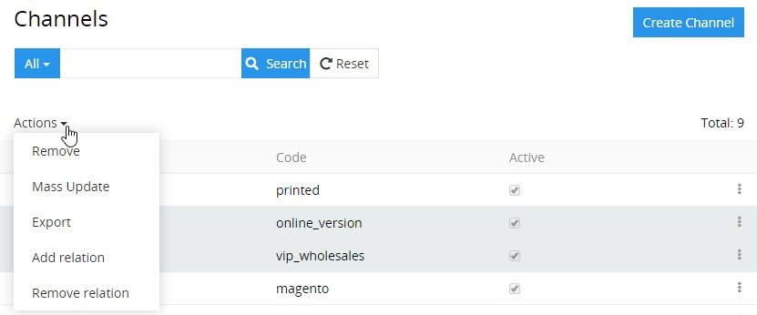

For details on these actions, refer to the [**Mass Actions**](./views-and-panels.md#mass-actions) section of the **Views and Panels** article in this user guide.

### Single Record Actions

The following single record actions are available for channel records on the list view page:

- View
- Edit
- Remove

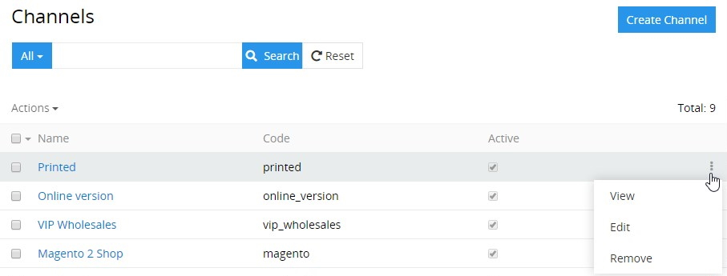

For details on these actions, please, refer to the [**Single Record Actions**](./views-and-panels.md#single-record-actions) section of the **Views and Panels** article in this user guide.

## Editing

To edit the channel, click the `Edit` button on the [detail view](./views-and-panels.md#detail-view) page of the currently open channel record; the following editing window will open:

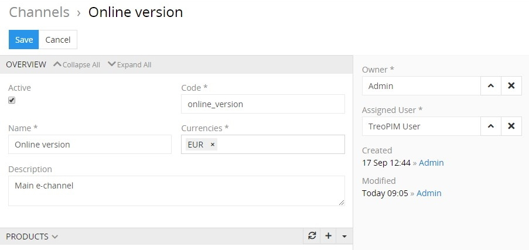

Here edit the desired fields and click the `Save` button to apply your changes.

Besides, you can make changes in the channel record via [in-line editing](./views-and-panels.md#in-line-editing) on its detail view page.

Alternatively, make changes to the desired channel record in the [quick edit](./views-and-panels.md#quick-edit-view) pop-up that appears when you select the `Edit` option from the single record actions menu on the channels list view page:

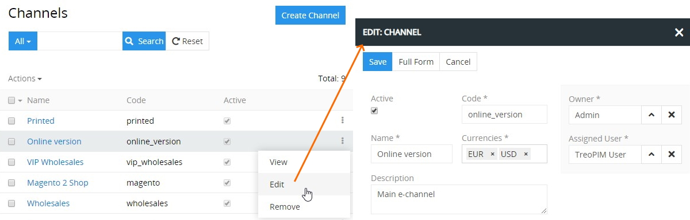

## Removing

To remove the channel record, use the `Remove` option from the actions menu on its detail view page

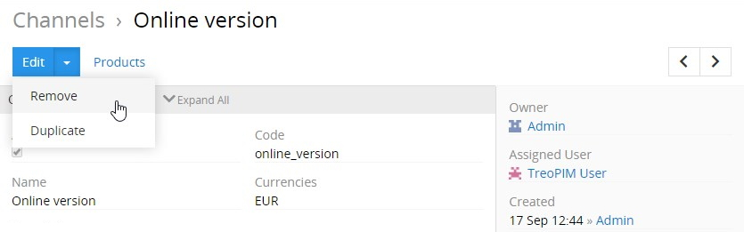

or from the single record actions menu on the channels list view page:

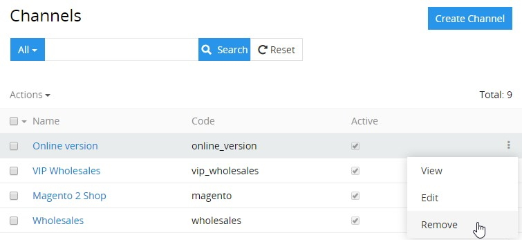

## Duplicating

Use the `Duplicate` option from the actions menu to go to the channel creation page and get all the values of the last chosen channel record copied in the empty fields of the new channel record to be created. Modifying the channel code is required, as this value has to be unique.

## Working With Products Related to Channels

Products that are linked to the channel are displayed on its [detail view](./views-and-panels.md#detail-view) page on the `PRODUCTS` panel and include the following table columns:
 - Name
 - SKU
 - Type
 - Active

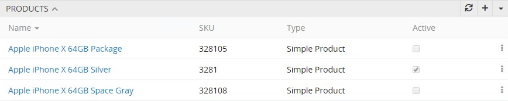

If this panel is missing, please, contact your administrator as to your access rights configuration. Also, to be able to relate more entities to product families, please, contact your administrator.

To create a new product record for the given channel, use the `+` button located on the `PRODUCTS` panel and enter the necessary data in the product creation pop-up that appears:

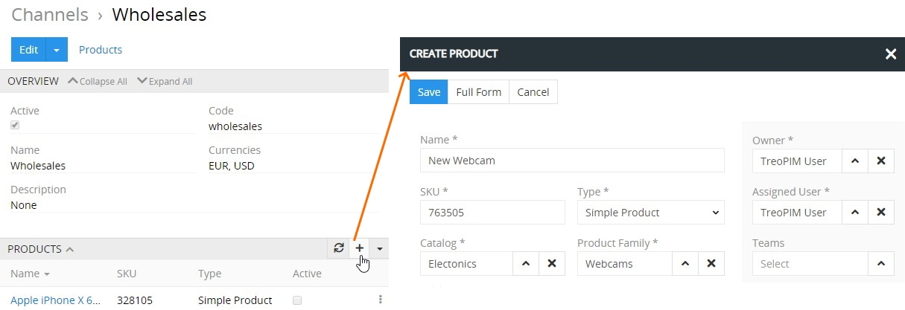

To link the already existing product records with the given channel, use the `Select` option from the actions menu located in the upper right corner of the `PRODUCTS` panel. Then in the "Products" pop-up window choose one or several products you would like to assign to this channel and click the `Select` button.

To see all product records linked to the given channel, use the `Show full list` option:

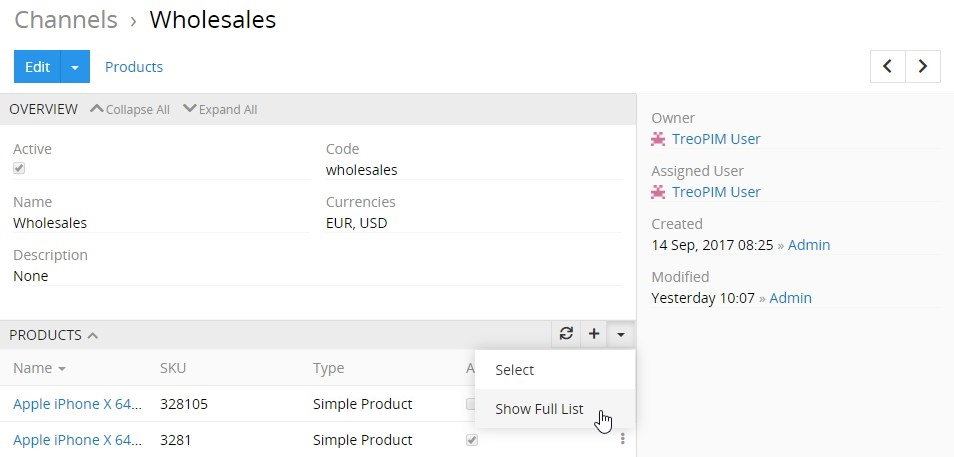

Then the "Products" page opens, where all product records [filtered](./search-and-filtering.md) by the given channel are displayed:

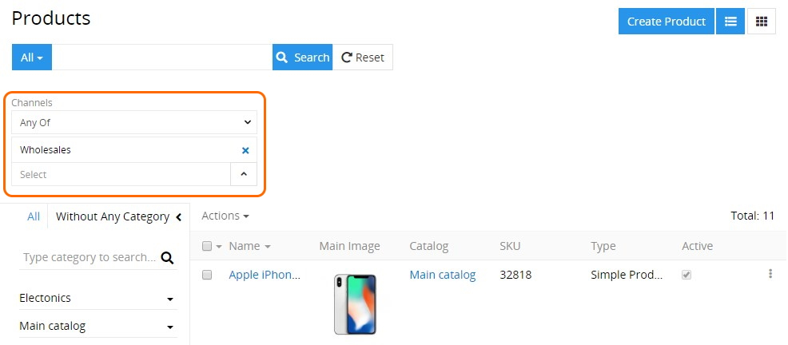

To view the channel related product record, click its name in the products list or select the `View` option from the single record actions menu for the appropriate record:

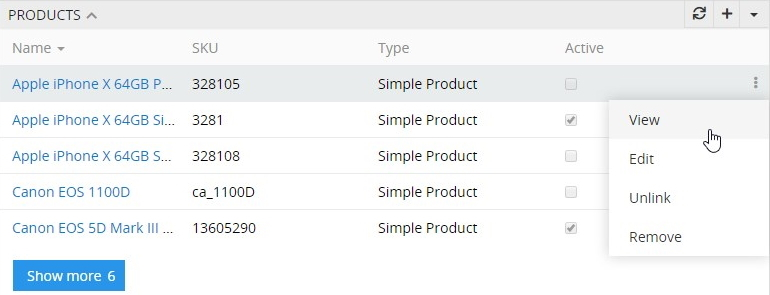

To edit the product, use the `Edit` option from the single record actions menu for the appropriate record. In the editing pop-up window that appears make changes in the desired fields, where possible. Click the `Save` button to apply your changes.

Use the `Unlink` option from the single record actions menu to unlink the desired record from the channel and confirm your decision in the pop-up that appears:

To remove the product, select the `Remove` option from the single record actions drop-down list for the appropriate record.

To view the channel related product record from the `PRODUCTS` panel, click its name in the products list. The [detail view](./views-and-panels.md#detail-view) page of the given product will open, where you can perform further actions according to your access rights, configured by the administrator. 

*Please, note that the **"Pricing"** module greatly extends the channels functionality. To learn more about the module and its features, please, visit our [store](https://treopim.com/store/pricing).*
