# Dashboards and Dashlets

Dashboards are designed for quick navigation within the TreoPIM entities data displayed on separate dashlets. The dashboard is the starting page of TreoPIM that can be reached any time via clicking the `TreoPIM` logo located in the upper left corner of the TreoPIM pages:

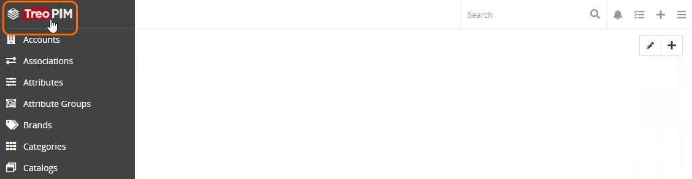

Both dashboards and dashlets are [user customizable](./user-interface.md#user-interface-settings), i.e. you can add, rename and delete dashboards, as well as modify the dashlets layout.

## Dashboards

The `My TreoCore` dashboard comes out-of-the-box and is displayed on the TreoPIM starting page by default. It can be customized by adding the desired [dashlets](#dashlets) and configuring them. 

### Creating a Dashboard

It is also possible to create custom boards. To do this, click the pencil icon on the TreoPIM starting page and enter the desired dashboard name in the editing pop-up that appears and hit `Enter`:

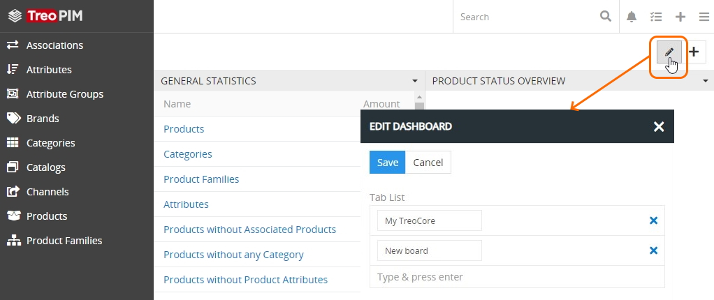

Click the `Save` button to complete the operation or `Cancel` to abort the process.

Please, note that in the given editing pop-up you can create as many dashboards as needed, but their customization is performed separately for each dashboard. 

Creating new dashboards is useful if you wish to group a different set of dashlets, consisting of certain information of the same nature or type, to help you make the right decision.

### Editing a Dashboard

To change the dashboard name, click the pencil icon and make necessary changes in the corresponding dashboard name field in the editing pop-up that appears:

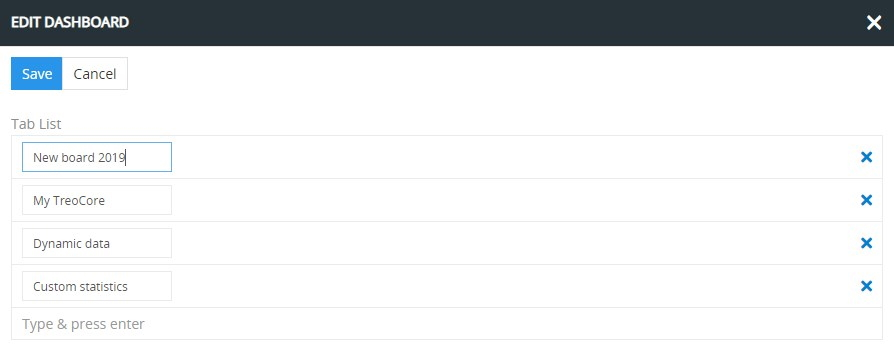

In the given pop-up you can also remove the desired dashboard (or dashboards) by clicking the corresponding `x` button:

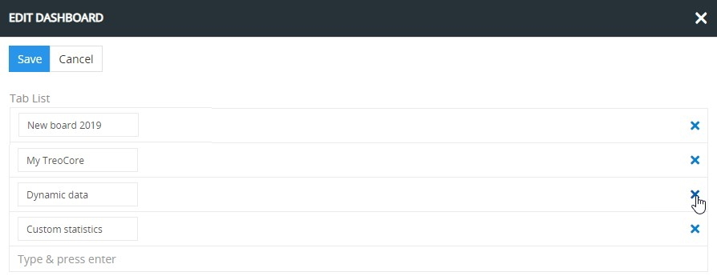

### Switching between Dashboards

In order to switch between dashboards available in the system, click the button with the desired dashboard name located in the upper right corner of the TreoPIM starting page:

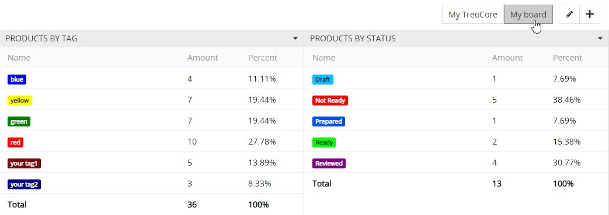

## Dashlets

Dashlets are [user-configurable](./user-interface.md#user-interface-settings) blocks, which can be placed via drag-and-drop anywhere on the dashboard, giving you a quick overview of your records and activity. 

Dashlets provide you with valuable information regarding records of specific entities.

### Adding a Dashlet

Use the `+` button to add as many dashlets as needed:

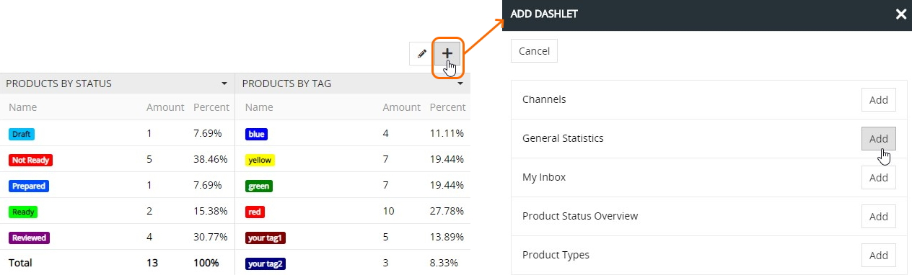

The added dashlets can be resized using the double-headed arrow in the bottom right corner of each block:

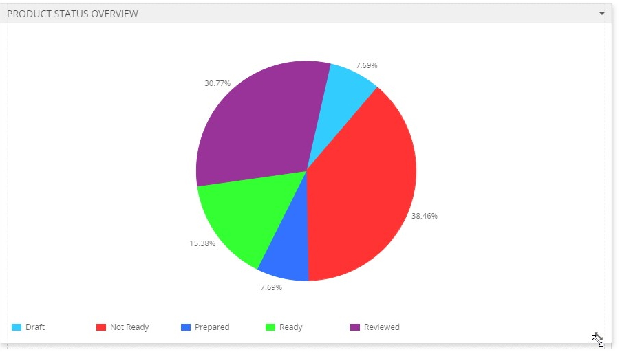

### Available Dashlets

The following dashlets are available in TreoPIM out-of-the-box:
- Channels
- General Statistics
- My Inbox
- Product Status Overview
- Product Types
- Products by Status
- Products by Tag
- Record List
- Stream

### Dashlet Actions 

To make changes in the dashlet on the dashboard, click `Options` in the given dashlet actions menu:

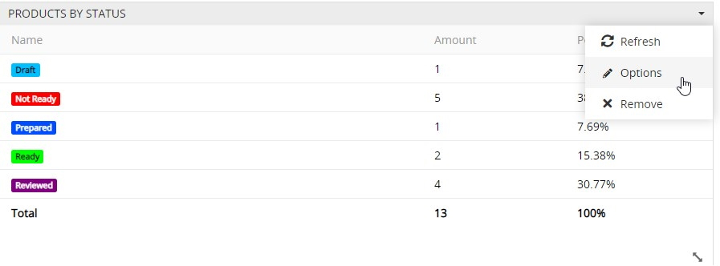

In the editing pop-up that appears you can modify the dashlet title, if needed, and define a different auto-refresh interval by choosing the desired value from the drop-down list:

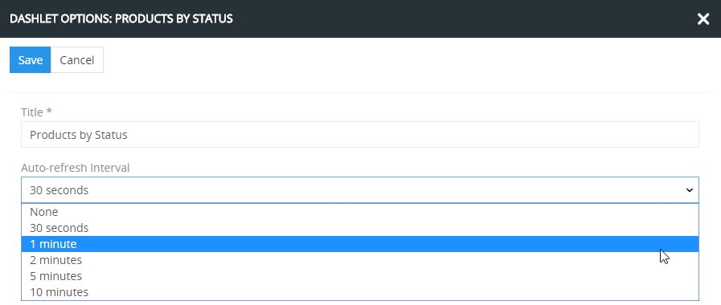

Click the `Save` button to apply the changes or `Cancel` to abort them.

To manually refresh the dashlet, use the `Refresh` option from the given dashlet actions menu:

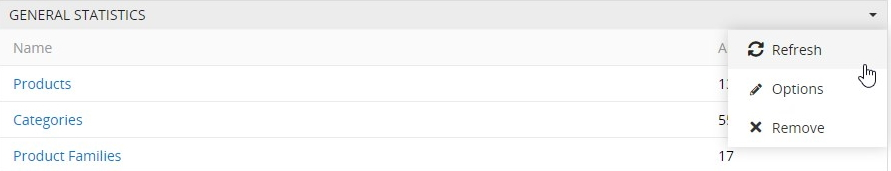

To remove the dashlet from the dashboard, select the `Remove` option in the given dashlet actions menu and confirm your decision in the pop-up that appears:

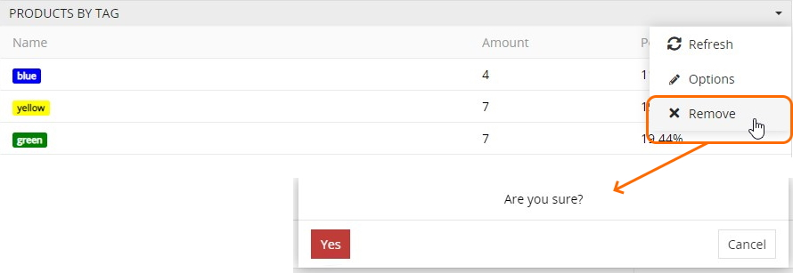