# Product Families

**Product Family** – a grouping of similar [products](./products.md), which use similar or same production processes, have similar physical characteristics, and may share customer segments, distribution channels, pricing methods, promotional campaigns, and other elements of the marketing mix. 

In TreoPIM product families are used in order to define a set of [attributes](./attributes.md) that are shared by products belonging to a certain family, and to describe the characteristics of these products. For each product family you can define, which attributes are mandatory and which are optional, so the system can calculate the completeness of your product content.

*Please, note that completeness calculation is possible only when a separate **"Completeness"** module is installed in your system. Please, visit our [store](https://treopim.com/store/completeness) to learn more about the module and its features.*

Creating a product family is a required step prior to arranging the assortment of your products. The product can belong only to one product family.

One attribute can be used in several product families and product family can have many attributes assigned. Each product can be assigned to only one product family.

Product families can be seen as "templates" for creating products with certain attributes quickly. When creating a new product, a product family is to be chosen and thus, all the attributes to describe this certain product will be automatically linked to the product so the user should decide to fill them or not.

The attributes linked to the product via the product family can be unlinked from the product only if the product is unlinked from the family or this attribute is removed from the product family directly.

Product families can be activated or deactivated. 

## Product Family Fields

The product family entity comes with the following preconfigured fields; mandatory are marked with *:

| **Field Name**           | **Description**                            |
|--------------------------|--------------------------------------------|
| Active                   | Activity state of the product family record         |
| Name (multi-lang) *      | Product family name					|
| Code *                   | Unique value used to identify the product family. It can only consist of lowercase letters, digits and underscore symbols     |
| Description (multi-lang) | Description of the product family usage                   |

If you want to make changes to the product family entity, e.g. add new fields, or modify product family views, please contact your administrator.

## Creating

To create a new product family record, click `Product Families` in the navigation menu to get to the product family [list view](#listing), and then click the `Create Product Family` button. The common creation window will open:

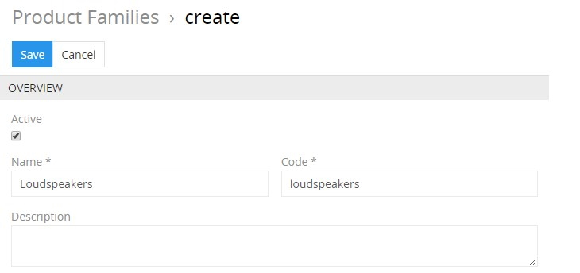

Here enter the desired name for the product family record being created and activate it, if needed. Its code is automatically generated based on the entered name, but you can change it via the keyboard. The product family description is an optional field and can be left empty.

Click the `Save` button to finish the product family record creation or `Cancel` to abort the process.

If the product family code is not unique, the error message will appear notifying you about it.

Alternatively, use the [quick create](./user-interface.md#quick-create) button on any TreoPIM page and fill in the required fields in the product family creation pop-up that appears:

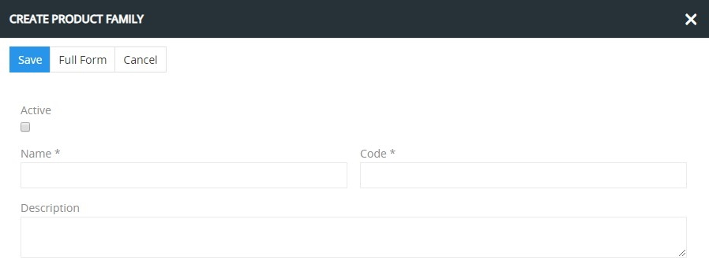

## Listing

To open the list of product family records available in the system, click the `Product Families` option in the navigation menu:

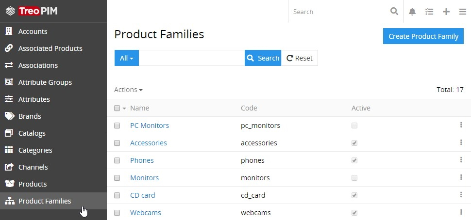

By default, the following fields are displayed on the [list view](./views-and-panels.md#list-view) page for product family records:
 - Name
 - Code 
 - Active

To change the product family records order in the list, click any sortable column title; this will sort the column either ascending or descending. 

Product family records can be searched and filtered according to your needs. For details on the search and filtering options, refer to the [**Search and Filtering**](./search-and-filtering.md) article in this user guide.

To view some product family record details, click the name field value of the corresponding record in the list of product families; the [detail view](./views-and-panels.md#detail-view) page will open showing the product family records and the records of the related entities. Alternatively, use the `View` option from the single record actions menu to open the [quick detail](./views-and-panels.md#quick-detail-view-small-detail-view) pop-up.

### Mass Actions

The following mass actions are available for product family records on the list view page:

- Remove
- Mass update
- Export
- Add relation
- Remove relation

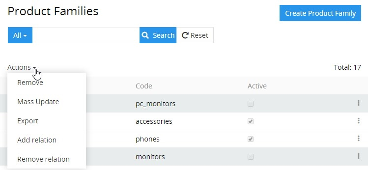

For details on these actions, refer to the [**Mass Actions**](./views-and-panels.md#mass-actions) section of the **Views and Panels** article in this user guide.

### Single Record Actions

The following single record actions are available for product family records on the list view page:

- View
- Edit
- Remove

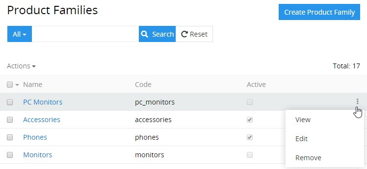

For details on these actions, please, refer to the [**Single Record Actions**](./views-and-panels.md#single-record-actions) section of the **Views and Panels** article in this user guide.

## Editing

To edit the product family, click the `Edit` button on the [detail view](./views-and-panels.md#detail-view) page of the currently open product family record; the following editing window will open:

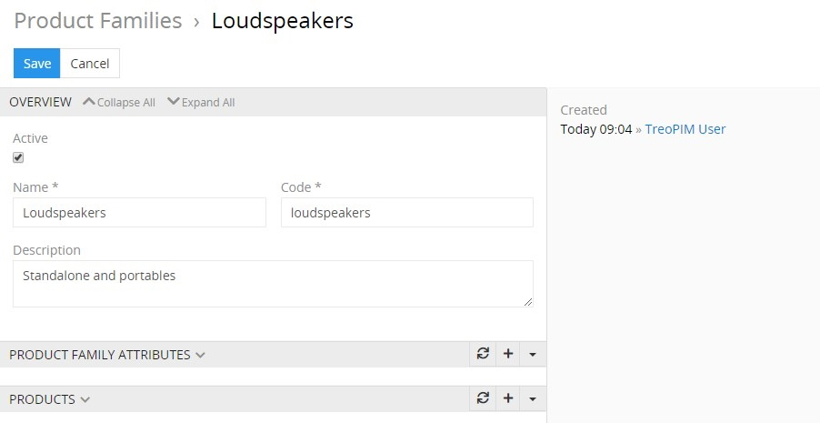

Here edit the desired fields and click the `Save` button to apply your changes.

Besides, you can make changes in the product family record via [in-line editing](./views-and-panels.md#in-line-editing) on its detail view page.

Alternatively, make changes to the desired product family record in the [quick edit](./views-and-panels.md#quick-edit-view) pop-up that appears when you select the `Edit` option from the single record actions menu on the product families list view page:

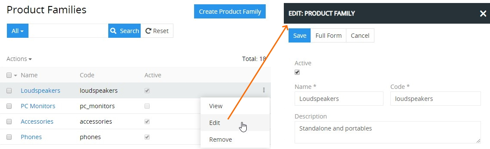

## Removing

To remove the product family record, use the `Remove` option from the actions menu on its detail view page

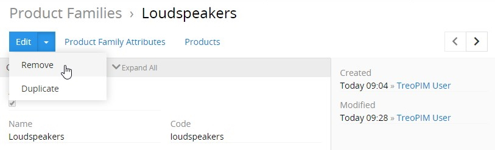

or from the single record actions menu on the product families list view page:

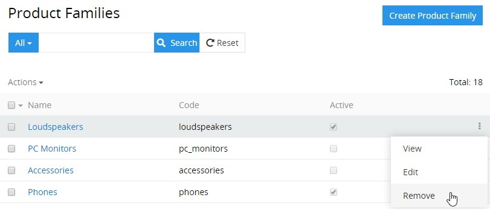

By default, it is not possible to remove the product family, if it is used in products.

## Duplicating

Use the `Duplicate` option from the actions menu to go to the product family creation page and get all the values of the last chosen product family record copied in the empty fields of the new product family record to be created. Modifying the product family code is required, as this value has to be unique.

## Working With Entities Related to Product Families

Relations to [attributes](./attributes.md) and [products](./products.md) are available for all product families by default. The related entities records are displayed on the corresponding panels on the product family [detail view](./views-and-panels.md#detail-view) page. If any panel is missing, please, contact your administrator as to your access rights configuration.

To be able to relate more entities to product families, please, contact your administrator.

### Attributes

Attributes that are linked to the product family record are shown on the `PRODUCT FAMILY ATTRIBUTES` panel within the product family detail view page and include the following table columns:
 - Attribute
 - Is required
 - Scope
 - Channels

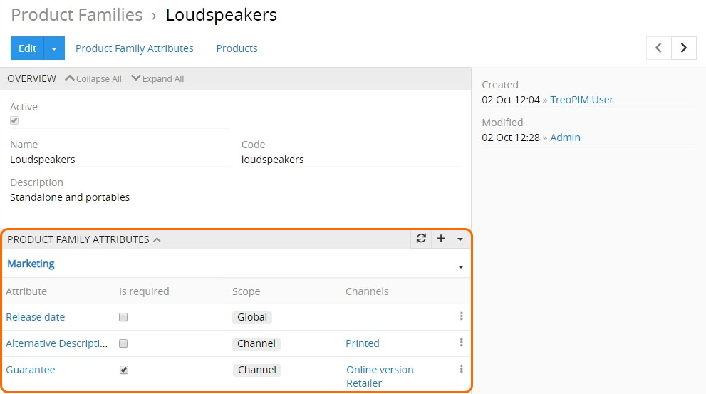

On this panel, you can link attributes to the given product family record by selecting the existing ones or creating new attributes.

To create new attributes to be linked to the currently open product family record, click the `+` button located in the upper right corner of the `PRODUCT FAMILY ATTRIBUTES` panel:

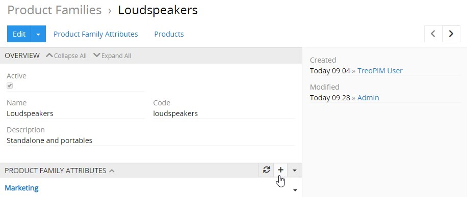

In the product family attribute creation pop-up that appears, click the select action button to open the "Attributes" pop-up and select the attribute from the existing ones by clicking its name or use the `Create Attribute` button to create a new attribute:

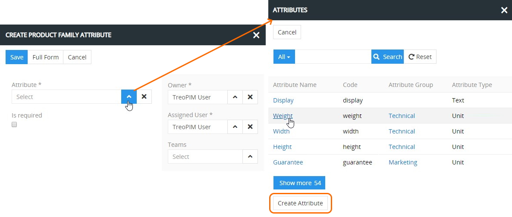

Return to the product family attribute creation pop-up, define the owner and assigned user for the selected attribute and make it required by setting the corresponding checkbox, if needed. By default, the defined attribute has the `Global` scope, but you can change it to `Channel` and select the desired channel (or channels) in the added field:

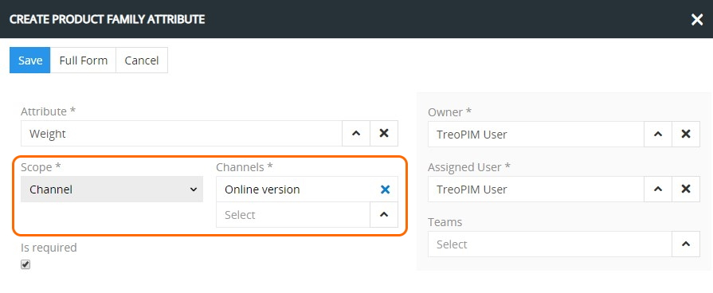

Click the `Save` button to complete the product family attribute creation process or `Cancel` to abort it.

Please, note that you can link the same attribute to the product family record more than once, but with different scopes (`Global` / `Channel`), and same channel can be used only once:

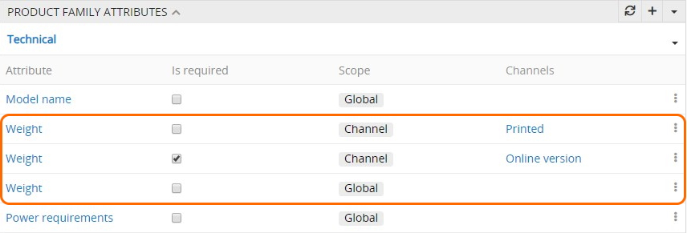

Please, note that when the attribute is linked to the product family record, it is automatically linked to all [products](./products.md) belonging to the given product family. 

When you are trying to link to the product family record the attribute, which is already linked to the product record belonging to the given family, different rules are applied depending on the product attribute scope level: 

1. **`Global`** product attribute becomes `Global` product family attribute. Its value (or values) is preserved in the product record.

2. **`Channel`** product attribute becomes `Channel` product family attribute with the following peculiarities:

    - its values are preserved in the given product record provided that channel names defined for the product family *coincide* with the ones used in the given product record;
    - two `Channel` attribute records appear in the product record, when you select *less channels* to the product family attribute than there are in the product record attribute. The first attribute is created with the same channels as in the product family record, but without the value, and the second attribute is left with the preserved value with the channels that are left, i.e. this attribute remains custom;
    - two `Channel` attribute records appear in the product record, when you select *more channels* to the product family attribute than there are in the product record attribute. The initial custom attribute remains with the preserved value, but without channel name, and the second attribute is created with channel names used in the product family, but without values. 

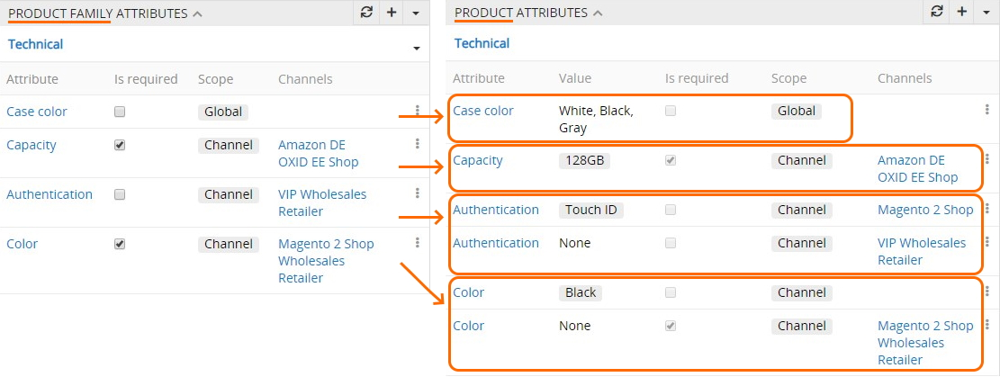

Please, note that attributes, which are added to the product family record, are of higher priority, whereas custom product attributes adapt to the changes made in the product family attributes. <!--The interrelations between product families and product records can be configured and structured even more with the help of the **Advanced Classification** module. For more details, please, visit our [store](https://treopim.com/store). -->  *<!--Unclose this note when the module is described-->*

To assign an existing attribute (or several attributes) to the product family record, use the `Select` option from the actions menu:

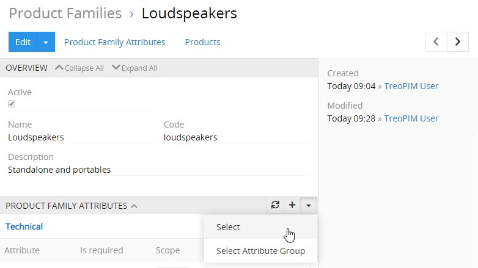

In the "Attributes" pop-up that appears, choose the desired attribute (or attributes) from the list and press the `Select` button to link the item(s) to the product family record. The linked attributes have the `Global` scope by default.

TreoPIM supports linking to product families not only separate attributes, but also [attribute groups](./attribute-groups.md). For this, use the `Select Attribute Group` option from the actions menu, and in the "Attribute Groups" pop-up that appears, select the desired groups from the list of available attribute groups.

Please, note that attributes linked to product families are arranged by attribute groups correspondingly. Their placement depends on the configuration and the sort order value of the attribute group to which they belong. The attribute records that don't belong to any product family, are placed at the bottom of the `PRODUCT FAMILY ATTRIBUTES` panel in `No Group`.

Attributes linked to the given product family record can be viewed, edited, unlinked or removed via the corresponding options from the single record actions menu on the `PRODUCT FAMILY ATTRIBUTES` panel:

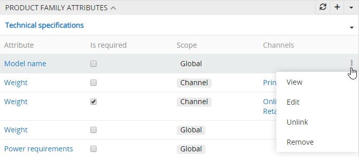

When the attribute is unlinked from the product family record, it still remains in the product record. However, when you unlink the *required* attribute from the family record, the given attribute becomes non-required in the product record.

The attribute record is removed from the product family only after the action is confirmed:

Please, beware that removing the attribute record from the product family leads to removing it from the product record as well.

Additionally, you can unlink attribute groups on the `PRODUCT FAMILY ATTRIBUTES` panel. To do this, use the `Unlink` option from the attribute group actions menu located to the right of the desired attribute group name, and confirm your decision in the pop-up that appears:

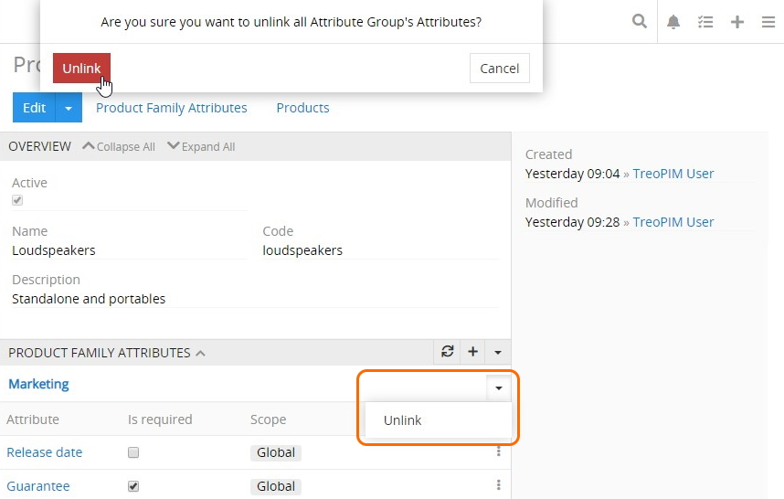

To view the attribute/attribute group record from the `PRODUCT FAMILY ATTRIBUTES` panel, click its name in the attributes list. The [detail view](./views-and-panels.md#detail-view) page of the given attribute/attribute group will open, where you can perform further actions according to your access rights, configured by the administrator. 

### Products

Products that are linked to the product family are displayed on its detail view page on the `PRODUCTS` panel and include the following table columns:
 - Name
 - SKU
 - Type
 - Active

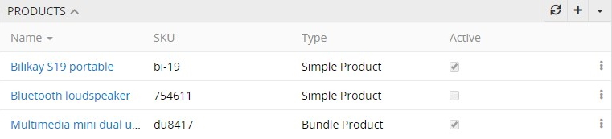

On this panel, you can create new products within the currently open product family record. To do this, click the `+` button and enter the necessary data in the product creation pop-up that appears:

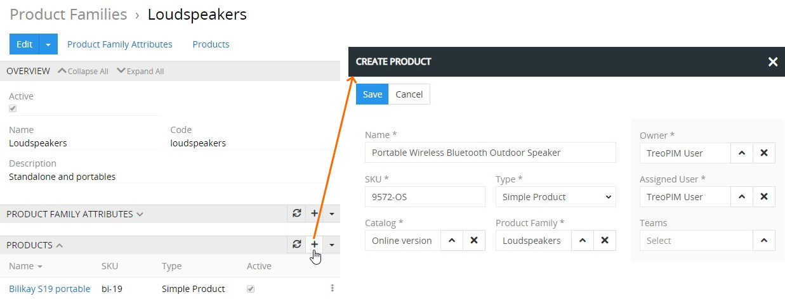

Click the `Save` button to complete the product record creation process or `Cancel` to abort it.

Please, note that once the product record is created within the product family, the given product family cannot be changed for this product record. 

To see all product records linked to the given product family, use the `Show full list` option:

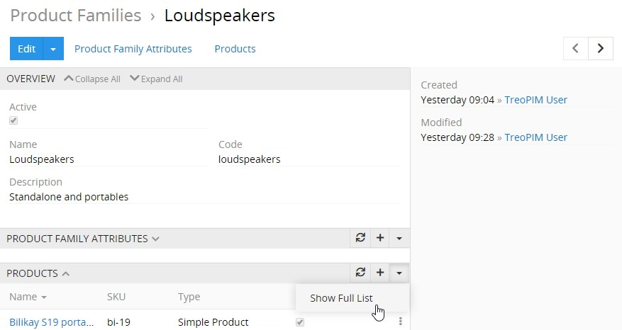

Then the "Products" page opens, where all product records [filtered](./search-and-filtering.md) by the given product family are displayed:

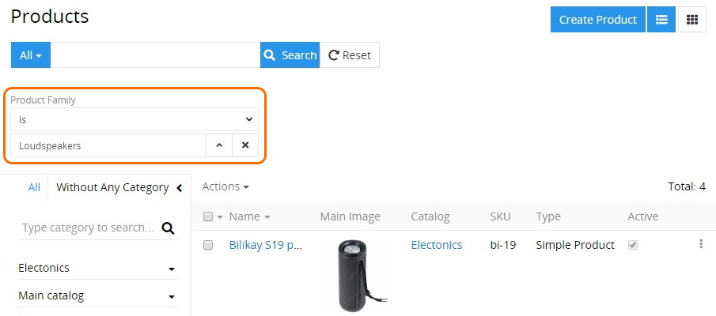

Products linked to the given product family record can be viewed, edited, unlinked or removed via the corresponding options from the single record actions menu on the `PRODUCTS` panel:

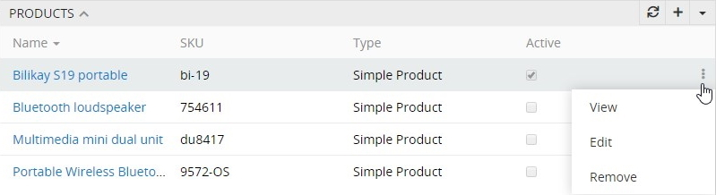

To view the family related product record from the `PRODUCTS` panel, click its name in the products list. The [detail view](./views-and-panels.md#detail-view) page of the given product will open, where you can perform further actions according to your access rights, configured by the administrator. 

