# Products

**Product** – the item in physical, virtual or cyber form as well as a service offered for sale. Every product is made at a cost and sold at a price. 

There are several [types](#product-types) of products in the TreoPIM system, and each product, irregardless of its type, can be assigned to a certain [product family](./product-families.md), which will define the attributes to be set for this product. A product can be assigned to several [categories](./categories.md), be of a certain [brand](./brands.md), described in several languages and be prepared for selling via different [channels](./channels.md). A product can be in [association](./associations.md) of certain type with some other product, and thus within different associations and with different products. It is possible to set different [attribute](./attributes.md) values for different channels and upload product images.

## Product Fields

The product entity comes with the following preconfigured fields; mandatory are marked with *:

| **Field Name**           | **Description**                            |
|--------------------------|--------------------------------------------|
| Name *			       | Product name								|
| SKU *				       | Unique identifier of the product that can be used only once within the same catalog												  |
| Type *			       | Product type that defines the product nature  |
| Catalog *				   | The name of the catalog to which the product belongs        |
| Product family *		   | The name of the product family, within which the product is created				|

If you want to make changes to the product entity, e.g. add new fields, or modify product  views, please, contact your administrator.

## Product Types

The only type of products available in the TreoPIM system by default is **Simple Product** – a standalone physical item or service sold as one piece. 

The list of products may be extended along with the installation of additional modules to your system. To learn more about available modules and their features, please, visit our [store](https://treopim.com/store). 

After the "Product Variants" module is installed to your system, the following product types are added:

- **Configurable Product** – a product with different variants that has multiple options for each variation. Each possible combination of options represents a separate, simple product, which makes it possible to track inventory for each of them. This product type creates for the user endless flexibility in product configuration.

- **Product variant** – basically a product with a complete set of its properties.

*Please, visit our [store](https://treopim.com/store/product-variants) to learn more about the **"Product Variants"** module and its features.*

In order to add custom types of products, please, contact your developer.

## Creating

To create a new product record, click `Products` in the navigation menu to get to the product records [list view](#listing), and then click the `Create Products` button. The creation pop-up will appear:

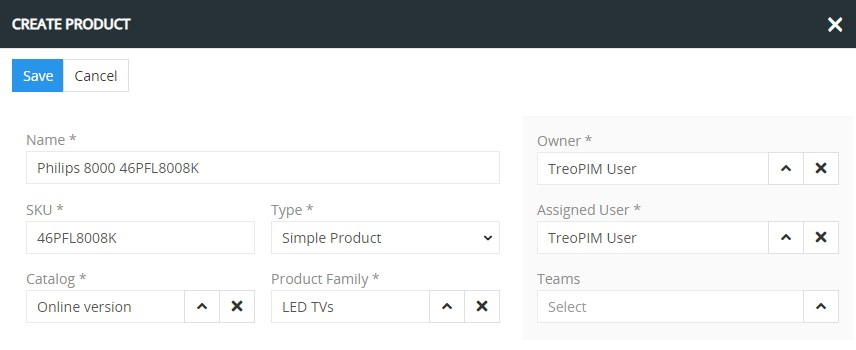

Here enter the desired name and SKU value for the product record being created and define its type via the corresponding drop-down list. Assign the catalog and product family to the given product record, as well as product owner and assigned user via the corresponding select action buttons. Defining the team is an optional parameter.

Click the `Save` button to finish the product record creation and get redirected to the product [editing page](#editing), described below, or `Cancel` to abort the process.

Alternatively, use the [quick create](./user-interface.md#quick-create) button on any TreoPIM page and fill in the required fields in the product creation pop-up that appears or click the `Full Form` button to get to the common creation page:

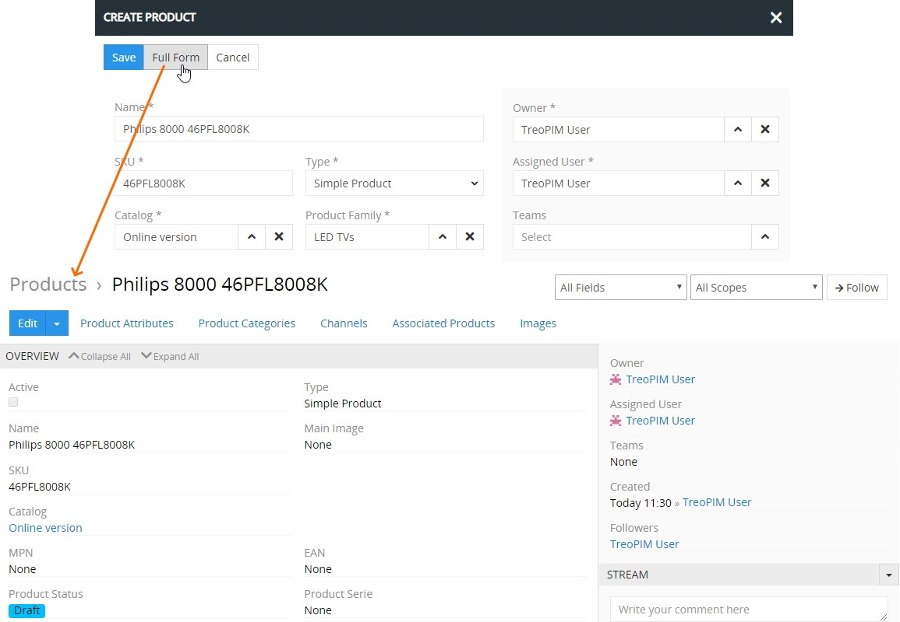

## Listing

To open the list of product records available in the system, click the `Products` option in the navigation menu:

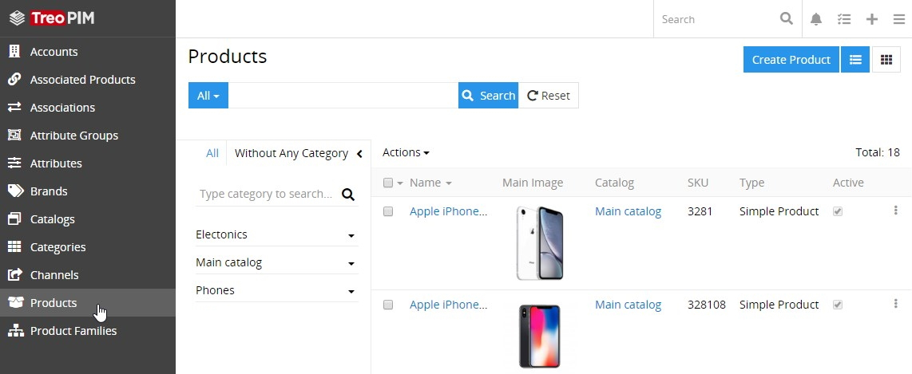

By default, the following fields are displayed on the [list view](./views-and-panels.md#list-view) page for product records:
 - Name
 - Catalog
 - SKU
 - Type
 - Active

To change the product records order in the list, click any sortable column title; this will sort the column either ascending or descending. 

Product records can be displayed not only as table list items, but also as plates. To switch to the [**plate view**](./views-and-panels.md#plate-view), click the plates icon located in the upper right corner of the list view page of product records:

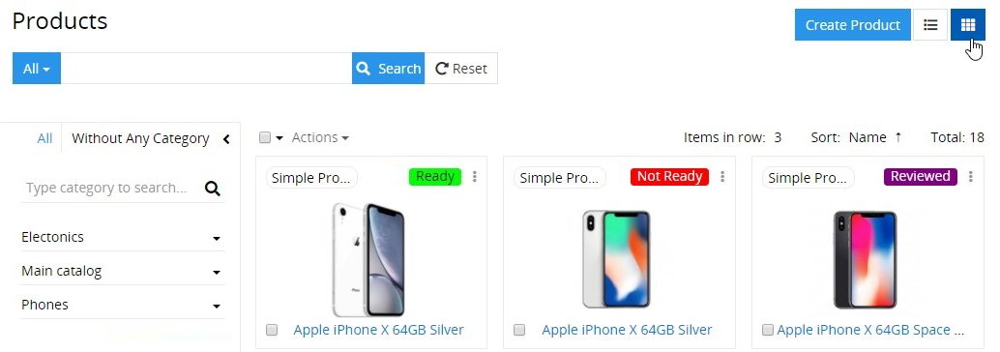

To view some product record details, click the name field value of the corresponding record in the list of products; the [detail view](./views-and-panels.md#detail-view) page will open showing the product records and the records of the related entities. Alternatively, use the `View` option from the single record actions menu to open the [quick detail](./views-and-panels.md#quick-detail-view-small-detail-view) pop-up.

In order to view the main image preview in a separate pop-up, click the desired one in the `Main image` column on the product records list/plate view.

### Mass Actions

The following mass actions are available for product records on the list/plate view page:

- Remove
- Mass update
- Export
- Follow
- Unfollow
- Add relation
- Remove relation

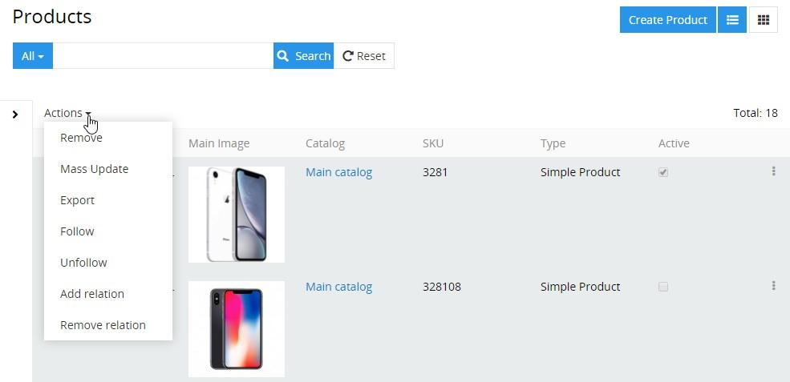

For details on these actions, refer to the [**Mass Actions**](./views-and-panels.md#mass-actions) section of the **Views and Panels** article in this user guide.

### Single Record Actions

The following single record actions are available for product records on the list/plate view page:

- View
- Edit
- Remove

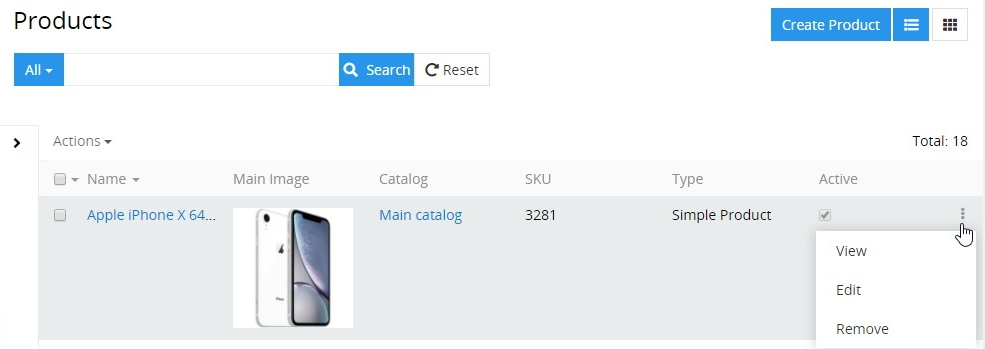

For details on these actions, please, refer to the [**Single Record Actions**](./views-and-panels.md#single-record-actions) section of the **Views and Panels** article in this user guide.

## Search and Filtering Types

Product records can be searched and filtered according to your needs on their list/plate view page. For details on the search and filtering options, refer to the [**Search and Filtering**](./search-and-filtering.md) article in this user guide.

Besides the standard field filtering, two other types – [by attributes](#by-attributes) and [by categories](#by-categories) – are available for product records.

### By Attributes

Filtering by attributes is performed on the basis of attribute values of the attributes that are linked to products:

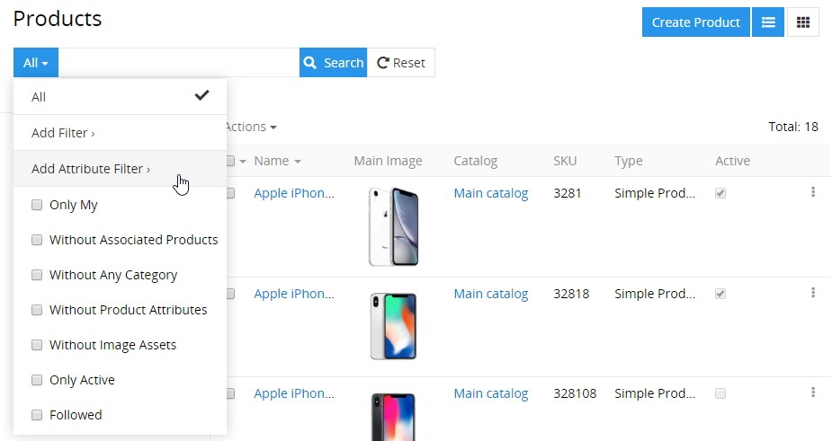

For details on this type of filtering, please, refer to the [**Custom Attribute Filters**](./search-and-filtering.md#custom-attribute-filters) section within the **Search and Filtering** article in this user guide.

### By Categories

To search product records by categories, enter the desired category name into the corresponding search field or use the auto-fill functionality:

As a result, the defined category will be highlighted in the catalog tree, and only products belonging to this category will be displayed in the product records list. 

## Editing

To edit the product, click the `Edit` button on the [detail view](./views-and-panels.md#detail-view) page of the currently open product record; the following editing window will open:

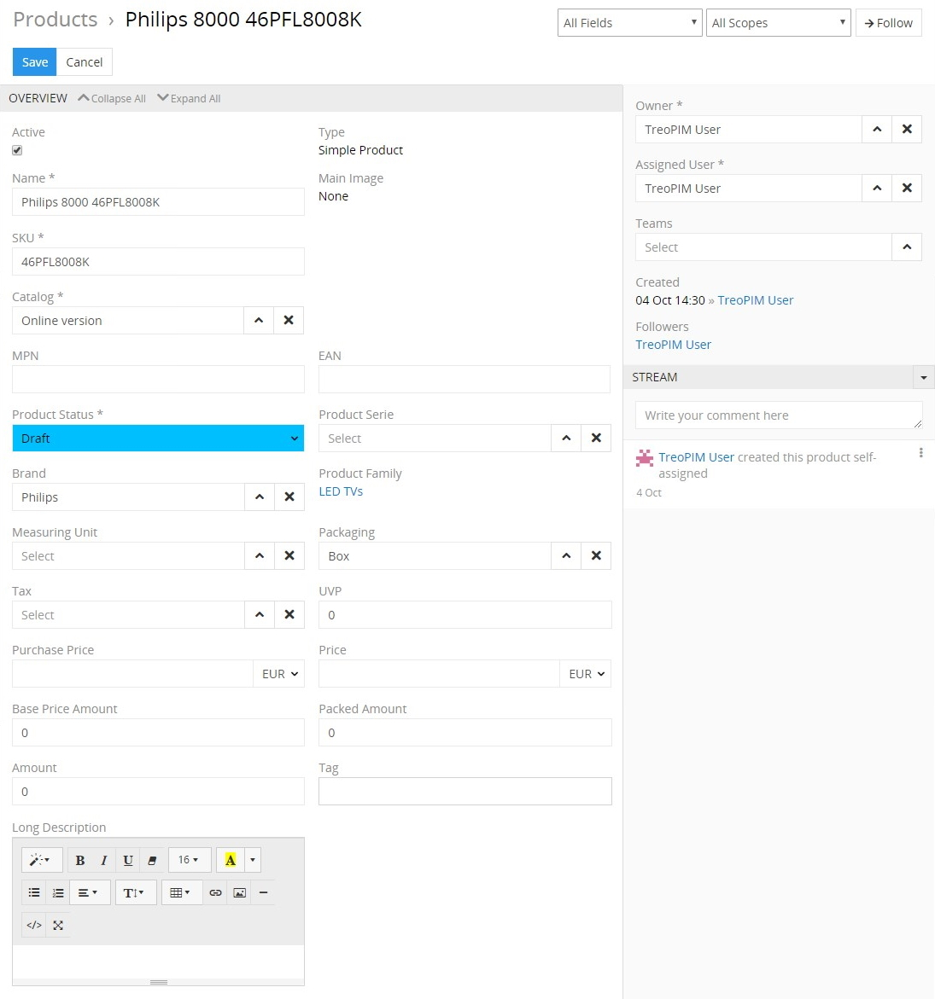

Here edit the desired fields and click the `Save` button to apply your changes.

Please, note that by default, deactivating a product record has no impact on the records of associated products.

Besides, you can make changes in the product record via [in-line editing](./views-and-panels.md#in-line-editing) on its detail view page.

Alternatively, make changes to the desired product record in the [quick edit](./views-and-panels.md#quick-edit-view) pop-up that appears when you select the `Edit` option from the single record actions menu on the products list/plate view page:

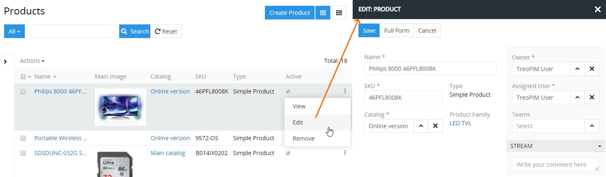

## Removing

To remove the product record, use the `Remove` option from the actions menu on its detail view page

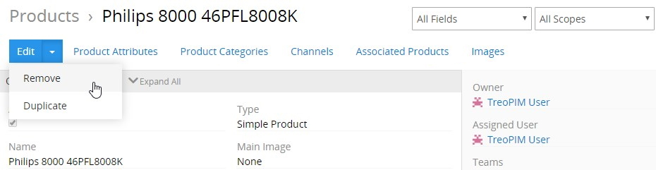

or from the single record actions menu on the products list/plate view page:

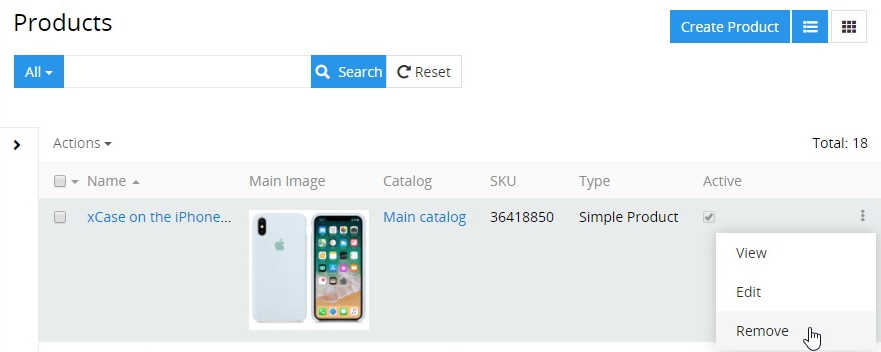

## Duplicating

Use the `Duplicate` option from the actions menu to go to the product creation page and get all the values of the last chosen product record copied in the empty fields of the new product record to be created. Modifying the SKU value is required, as this value has to be unique within the catalog.

## Working With Entities Related to Products

In the TreoPIM system, the following entities are related to products:
- [attributes](#product-attributes);
- [categories](#product-categories);
- [channels](#channels);
- [associated products](#associated-products);
- [images](#images).

They all are displayed on the corresponding panels on the product record [detail view](./views-and-panels.md#detail-view) page. If any panel is missing, please, contact your administrator as to your access rights configuration.

To be able to relate more entities to products, please, contact your administrator.

### Product Attributes

**Product attributes** are characteristics of a certain product that make it distinct from other products, e.g. size, color. Product attributes are to be used as [filters](#by-attributes).

Product attribute values are predefined by the [attributes](./attributes.md) assigned to the [product family](./product-families.md) to which the given product belongs.

Product attribute records are displayed on the `PRODUCT ATTRIBUTES` panel within the product record [detail view](./views-and-panels.md#detail-view) page and are grouped by attribute groups. Product attributes data is shown in the following table columns:
 - Attribute
 - Value
 - Is required
 - Scope
 - Channels

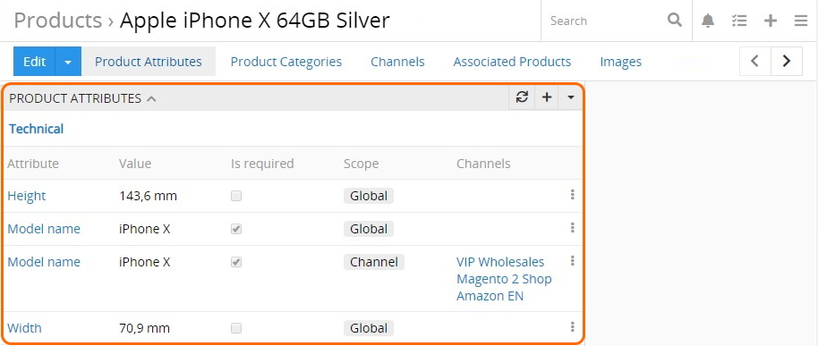

It is possible to add custom attributes to a product record, without previously linking them to the product family of the product by selecting the existing ones or creating new attributes. 

To create new attribute records to be linked to the currently open product, click the `+` button located in the upper right corner of the `PRODUCT ATTRIBUTES` panel:

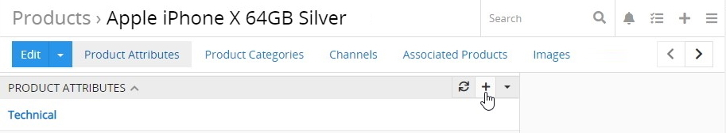

In the attribute value creation pop-up that appears, select the attribute record from the list of the existing ones and configure its parameters. By default, the defined attribute record has the `Global` scope, but you can change it to `Channel` and select the desired channel (or channels) in the added field:

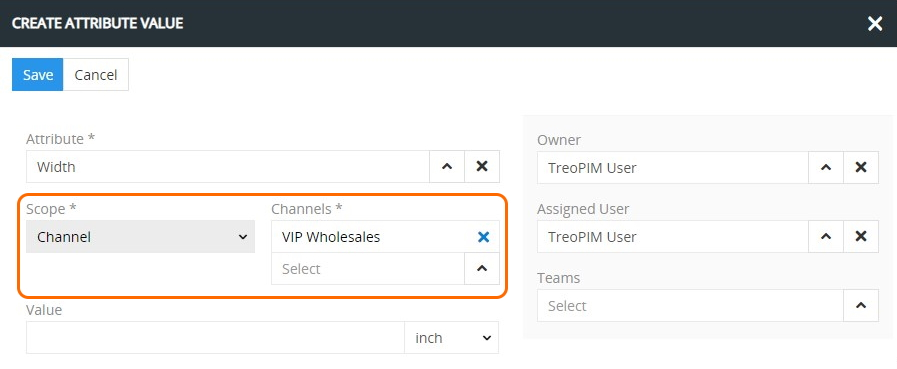

Click the `Save` button to complete the product attribute creation process or `Cancel` to abort it.

Please, note that you can link the same attribute to the product record more than once, but with different scopes (`Global` / `Channel`), and same channel can be used only once:

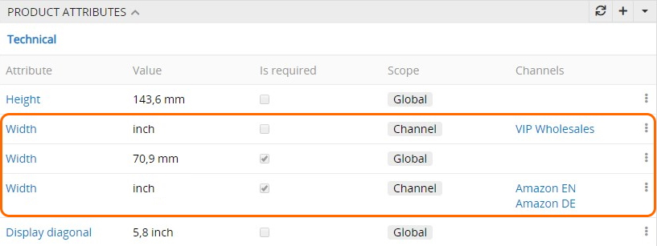

Use the `Select` option from the actions menu located in the upper right corner of the `PRODUCT ATTRIBUTES` panel to link the already existing attributes to the currently open product record:

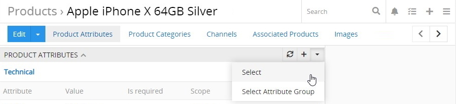

In the "Attributes" pop-up that appears, choose the desired attribute (or attributes) from the list and press the `Select` button to link the item(s) to the product record. The linked attributes have the `Global` scope by default.

TreoPIM supports linking to products not only separate attributes, but also [attribute groups](./attribute-groups.md). For this, use the `Select Attribute Group` option from the actions menu, and in the "Attribute Groups" pop-up that appears, select the desired groups from the list of available attribute group records.

Please, note that attributes linked to products are arranged by attribute groups correspondingly. Their placement depends on the configuration and sort order value of the attribute group to which they belong.

Attribute records linked to the given product can be viewed, edited, or removed via the corresponding options from the single record actions menu on the `PRODUCT ATTRIBUTES` panel:

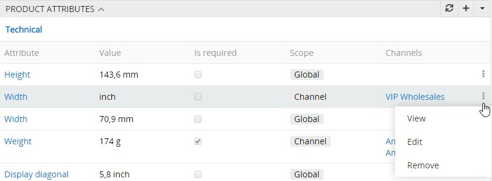

The attribute record is removed from the product only after the action is confirmed:

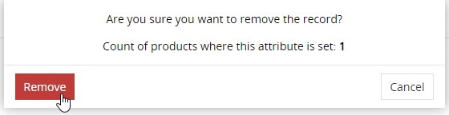

Please, note that only custom attribute records can be removed, but for the ones that are linked to the product via the product family there is no such option in the single record actions menu. 

### Product Categories

[Categories](./categories.md) that are linked to the product record are shown on the `PRODUCT CATEGORIES` panel within the product [detail view](./views-and-panels.md#detail-view) page and include the following table columns:
 - Category
 - Scope
 - Channels

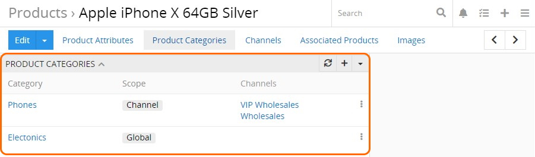

It is possible to link categories to a product by selecting the existing ones or creating new categories. 

To create new categories to be linked to the currently open product, click the `+` button on the `PRODUCT CATEGORIES` panel and enter the necessary data in the category creation pop-up that appears:

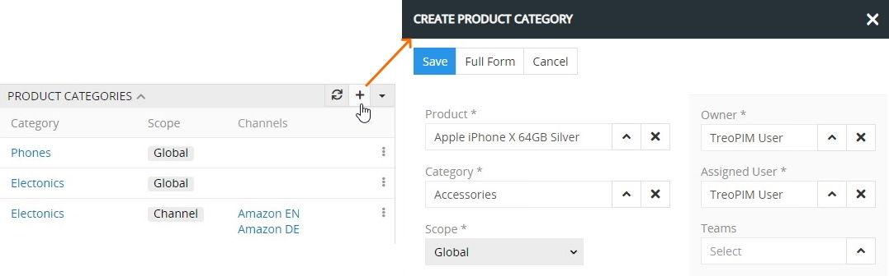

By default, the defined category has the `Global` scope, but you can change it to `Channel` and select the desired channel (or channels) in the added field:

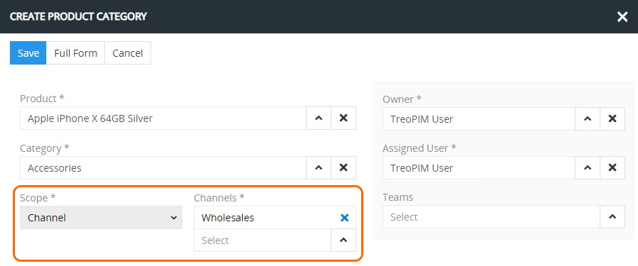

Click the `Save` button to complete the category creation process or `Cancel` to abort it.

Please, note that you can link the same category to the product twice, but with different scopes – `Global` or `Channel`.

To assign a category (or several categories) to the product record, use the `Select` option from the actions menu located in the upper right corner of the `PRODUCT CATEGORIES` panel:

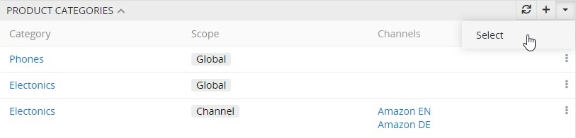

In the "Categories" pop-up that appears, choose the desired category (or categories) from the list and press the `Select` button to link the item(s) to the product.

Please, note that you can link both root and child categories to the product. The only condition is that their root category should be linked to the [catalog](./catalogs.md) to which the given product belongs.

Product categories can be viewed, edited, or removed via the corresponding options from the single record actions menu on the `PRODUCT CATEGORIES` panel:

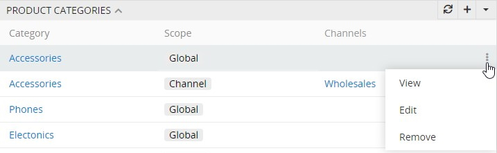

### Channels

[Channels](./channels.md) that are linked to the product are displayed on its [detail view](./views-and-panels.md#detail-view) page on the `CHANNELS` panel and include the following table columns:
- Name
- Code
- Active

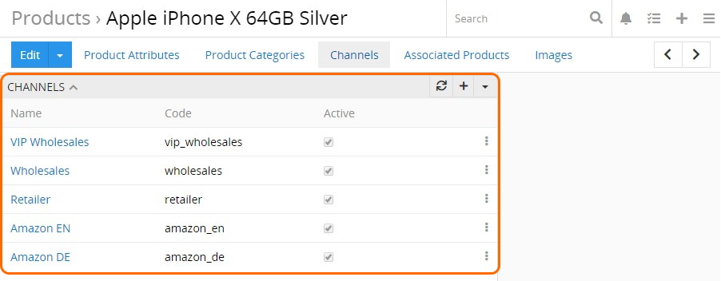

It is possible to link channels to a product record by selecting the existing ones or creating new channels. 

To create new channel records to be linked to the currently open product, click the `+` button on the `CHANNELS` panel and enter the necessary data in the channel creation pop-up that appears:

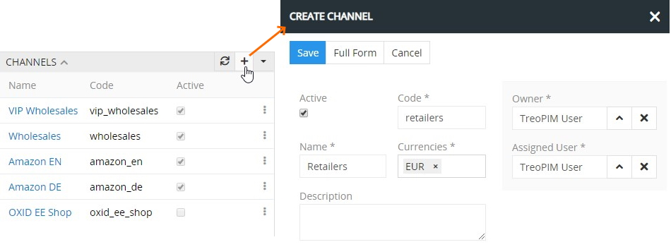

Click the `Save` button to complete the channel record creation process or `Cancel` to abort it.

To assign a channel (or several channels) to the product record, use the `Select` option from the actions menu located in the upper right corner of the `CHANNELS` panel:

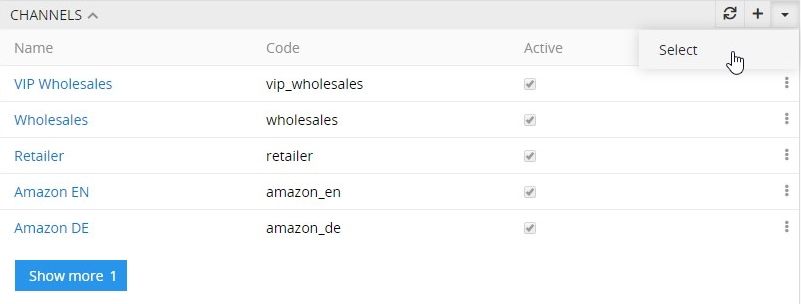

As soon as the channel is linked to the product, it is added to the [filtering](./search-and-filtering.md) by scopes list, located in the upper right corner of the product record [detail view](./views-and-panels.md#detail-view) page:

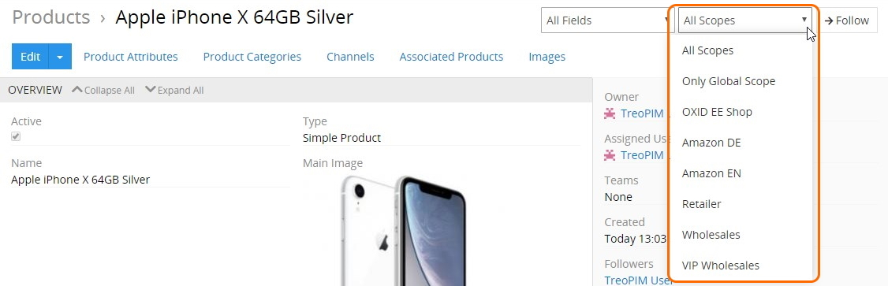

Select the desired channel in this list to filter the product record data display on the `PRODUCT ATTRIBUTES`, `PRODUCT CATEGORIES`, and `IMAGES` panels by the defined channel.

Channels linked to the product record can be viewed, edited, unlinked, or removed via the corresponding options from the single record actions menu on the `CHANNELS` panel:

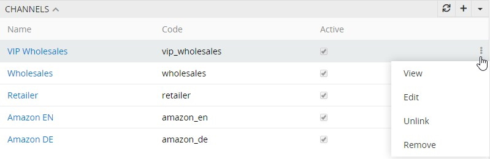

### Associated Products

Products that are linked to the currently open product record through the [association](./associations.md), are displayed on its [detail view](./views-and-panels.md#detail-view) page on the `ASSOCIATED PRODUCTS` panel and include the following table columns:
- Related product image
- Related product
- Association

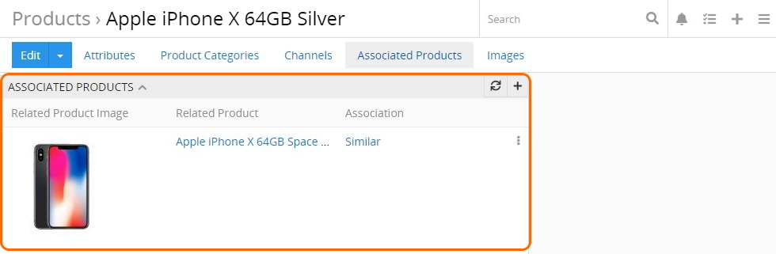

It is possible to link [associated products](./associated-products.md) to a product by creating new associated product records on this panel. To do this for the currently open product record, click the `+` button located in the upper right corner of the `ASSOCIATED PRODUCTS` panel. In the associated product creation pop-up that appears, select the main and related product, define the association for their relation and whether it should be in both directions:

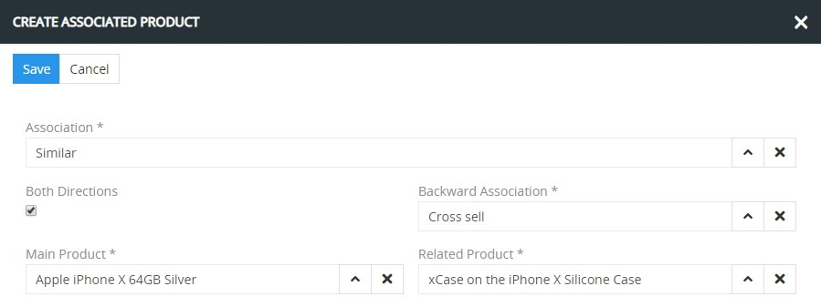

Click the `Save` button to complete the associated product record creation process or `Cancel` to abort it.

Associated product records can be edited or removed via the corresponding options from the single record actions menu on the `ASSOCIATED PRODUCTS` panel:

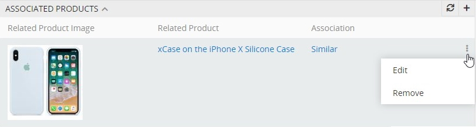

### Images

Images that are linked to the currently open product record are displayed on its [detail view](./views-and-panels.md#detail-view) page on the `IMAGES` panel and include the following table columns:
- Image
- Name
- Scope
- Channels

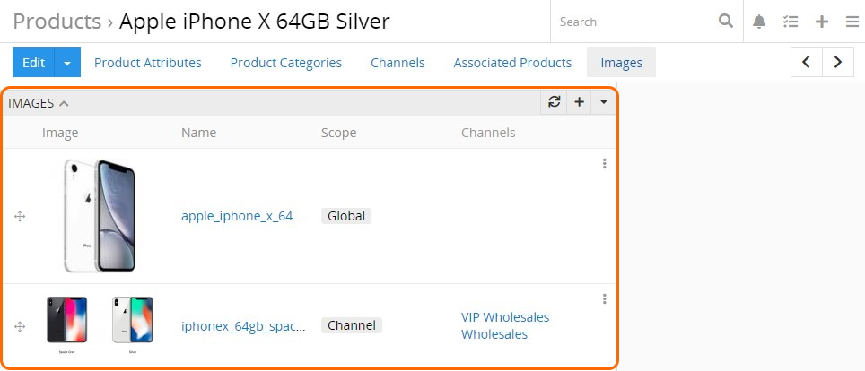

On this panel, you can link images to the given product record by selecting the existing ones or creating new image records.

To create new image records to be linked to the currently open product record, click the `+` button located in the upper right corner of the `IMAGES` panel and enter the necessary data in the image creation pop-up that appears:

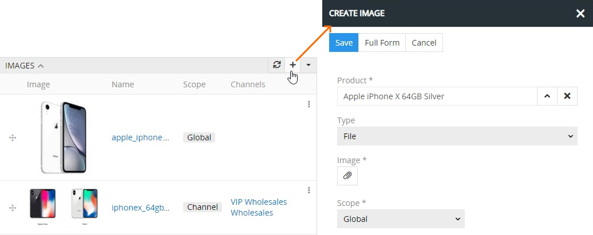

The following *image uploading types* are available in the TreoPIM system by default:
- **File** / **Files** – image files that are stored locally (on your PC or other device). When the `File` type is selected on the image creation step, the desired image file is  uploaded as an attachment. To attach several image files at the same time, the `Files` type is to be defined accordingly.
- **Link** – the URL to the image file, which is stored on the external server. When this type is selected on the image creation step, the image link must be entered in the corresponding field:

	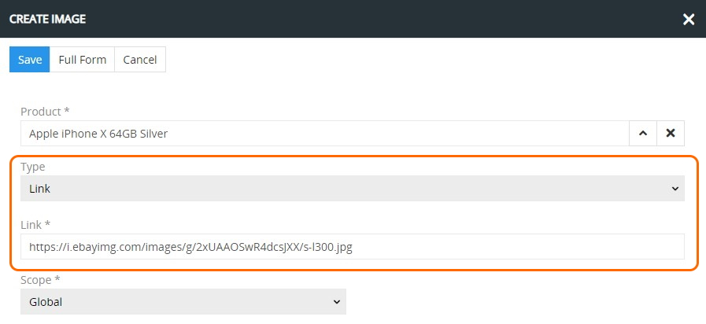

By default, the defined image has the `Global` scope, but you can change it to `Channel` and select the desired channel (or channels) in the added field:

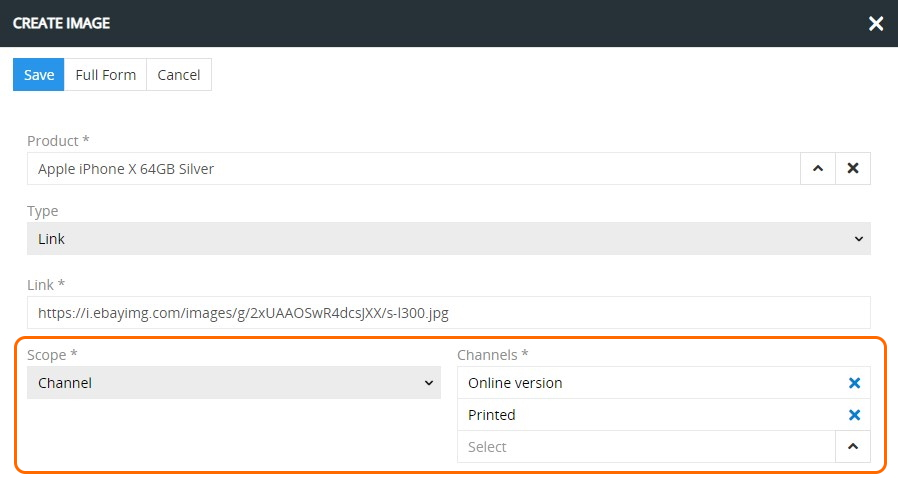

Click the `Save` button to complete the image record creation process or `Cancel` to abort it.

Please, note that once the image record is created within the product, it is displayed on the `IMAGES` panel as a common image file (irregardless of its uploading type). 

To assign an image (or several images) to the product record, use the `Select` option from the actions menu located in the upper right corner of the `IMAGES` panel:

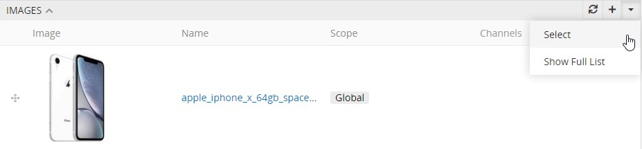

In the "Images" pop-up that appears, choose the desired image (or images) from the list and press the `Select` button to link the item(s) to the product record.

To see all image records linked to the given product, use the `Show full list` option:

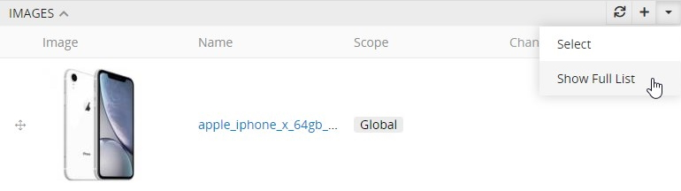

Then the "Images" page opens, where all image records [filtered](./search-and-filtering.md) by the given product are displayed:

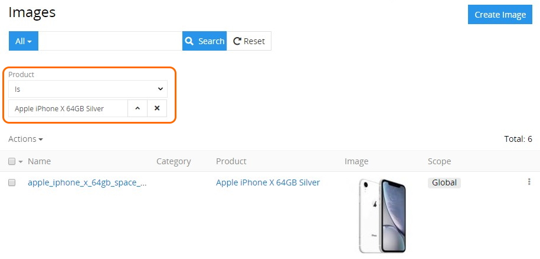

To open the pop-up with the preview of the images that are listed on the `IMAGES` panel, click the desired one in the `Image` column in the image records list.

Images linked to the given product record can be viewed, edited, or removed via the corresponding options from the single record actions menu on the `IMAGES` panel:

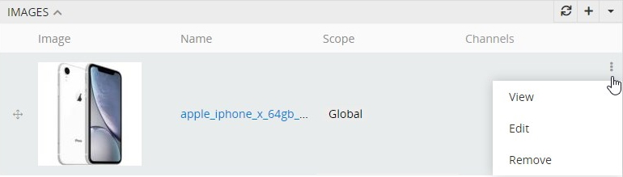

On the `IMAGES` panel you can also define image records order within the given product record via their drag-and-drop:

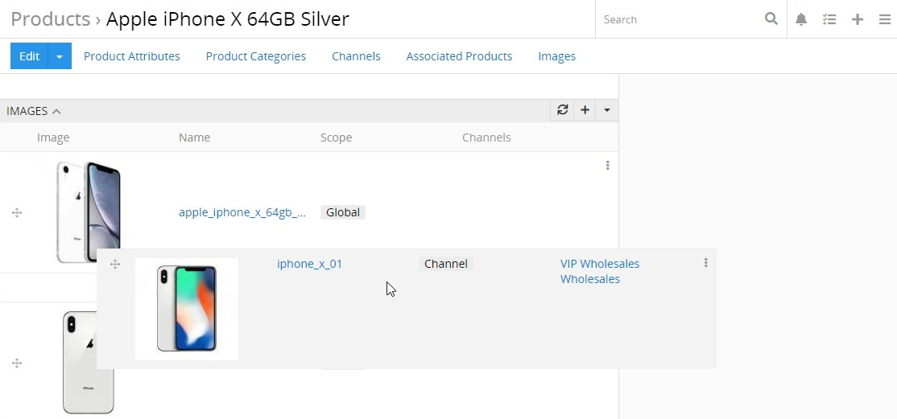

The changes are saved on the fly.

Please, note that the first image record in the list is automatically considered as the main product image.

To view the product related image record from the `IMAGES` panel, click its name in the images list. The [detail view](./views-and-panels.md#detail-view) page of the given image will open, where you can perform further actions according to your access rights, configured by the administrator. 

