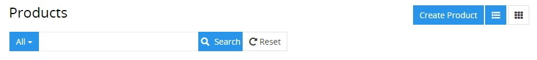
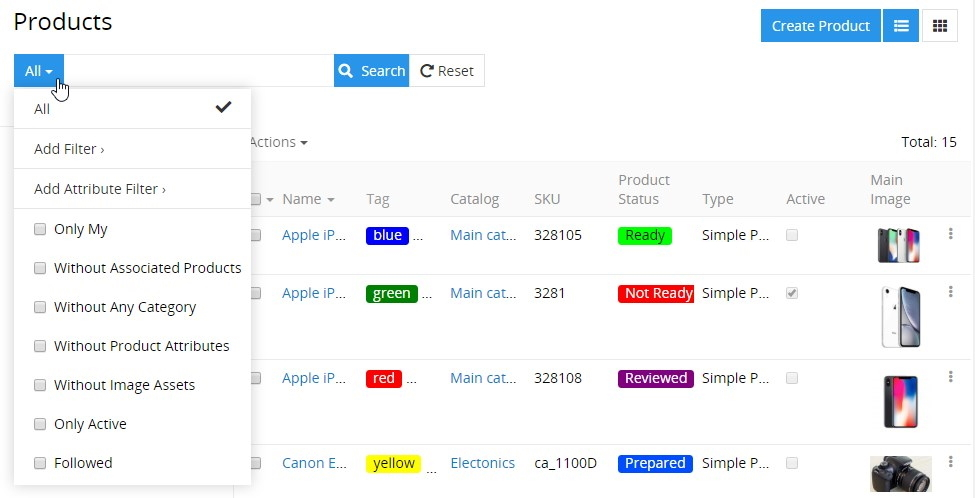
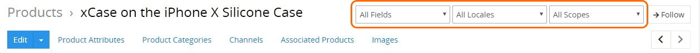
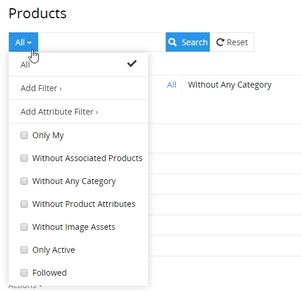
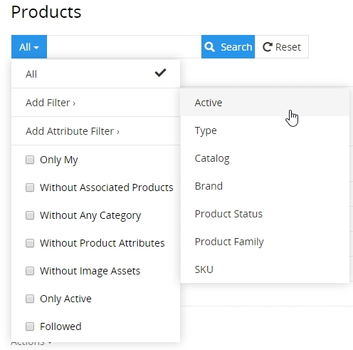
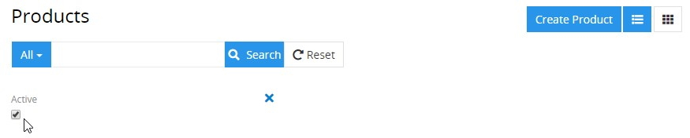
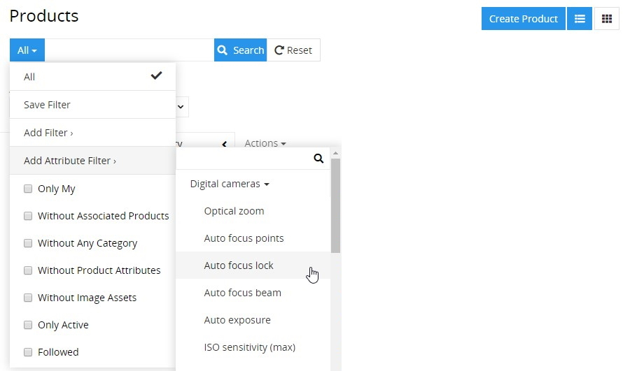
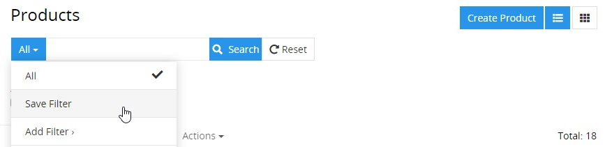
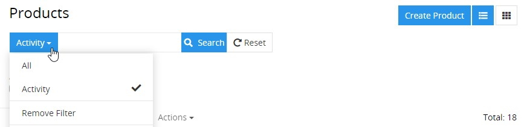

# Search and Filtering

Search and filtering allow you to quickly focus on the records you want to see. These sections are automatically available on each entity [list](./views-and-panels.md#list-view) or [plate](./views-and-panels.md#plate-view) view page:

*Search and filtering on the products list view page*

Searching works on the current entity records, while filtering works also on the related records, which are configured by the administrator.

To perform a search operation, enter your search query into the corresponding field and hit the `Enter` key on your keyboard or click the `Search` button.

To filter your entity records, open the filter drop-down list and set the desired checkbox(es):

To clear all filters, click the `Reset` button, located to the right of the search field.

Use the global search if you wish to search globally across all the entities in the system.
<!-- since search doesn't work properly now and it cannot be checked, I'm hiding this 
By default, search is performed through all the records, which attributes start with the search string. If you want to search for the records, which attributes contain the search string, please, use the `%` symbol before your search string (without space); the use of `%` at the end of the search string is not necessary.
-->
The fields available for searching can be configured by developers in the metadata of the appropriate entity.

On the [products](./products.md) detail view page, there is also the ability to filter the record data display by fields, locales, and scopes in the corresponding drop-down menus:

Keep in mind that the locales filter appears when the "Multi-Languages" module is installed and input language options are configured by your administrator. Go to our [store](https://treopim.com/store/multi-languages) to learn more about the "Multi-Languages" module and its features.

You can have one or more filters based on a certain field for all field types. The exception is field types that can be used as a filter only once (because there is no need for it), which are:
  - Boolean;
  - Array;
  - Multi-enum;
  - Enum;
  - Related entities.

## Logical Operators

The system behavior is different for the OR and AND logical operators:

- Operator AND is automatically applied between filters set up for different fields, e.g. `name` and `brand`.
- Operator OR is automatically applied between filters set up for the same field, e.g. both filters set up for `name`.

Logical operator NOR is directly not available, but can be set by defining specific filter criteria for almost each field type.

## Available Filtering Criteria

Depending of the field type, you can apply the following filtering criteria:

| **Field Type**                              | **Filtering Criteria** | **Input Value**                                            |
| :------------------------------------------ | :--------------------- | :--------------------------------------------------------- |
| *Array, Multi-Enum*                        | –                      | Value list, multiselect                                    |
| *Address*                                   | –                      | Input field                                                |
| *Boolean*                                   | –                      | Checkbox                                                   |
| *Auto-increment, Currency,  Integer, Float* | Is Not Empty           | –                                                          |
|                                             | Is Empty               | –                                                          |
|                                             | Equals                 | Input field                                                |
|                                             | Not Equals             | Input field                                                |
|                                             | Greater Than           | Input field                                                |
|                                             | Less Than              | Input field                                                |
|                                             | Greater Than or Equals | Input field                                                |
|                                             | Less Than or Equals    | Input field                                                |
|                                             | Between                | 2 Input fields                                             |
| *Date, DateTime*                            | Last 7 Days            | –                                                          |
|                                             | Ever                   | –                                                          |
|                                             | Is Empty               | –                                                          |
|                                             | Current Month          | –                                                          |
|                                             | Last Month             | –                                                          |
|                                             | Next Month             | –                                                          |
|                                             | Current Quarter        | –                                                          |
|                                             | Last Quarter           | –                                                          |
|                                             | Current Year           | –                                                          |
|                                             | Last Year              | –                                                          |
|                                             | Today                  | –                                                          |
|                                             | Past                   | –                                                          |
|                                             | Future                 | –                                                          |
|                                             | Last X Days            | Input field                                                |
|                                             | Next X Days            | Input field                                                |
|                                             | Older Than X Days      | Input field                                                |
|                                             | After X Days           | Input field                                                |
|                                             | On                     | Date picker                                                |
|                                             | After                  | Date picker                                                |
|                                             | Before                 | Date picker                                                |
|                                             | Between                | 2 Input fields                                             |
| *Enum*                                      | Any Of                 | Value list, multiselect                                    |
|                                             | None Of                | Value list, multiselect                                    |
|                                             | Is Empty               | –                                                          |
|                                             | Is Not Empty           | –                                                          |
| *Number, Varchar, Text,  URL, Wysiwyg*      | Starts With            | Input field                                                |
|                                             | Contains               | Input field                                                |
|                                             | Equals                 | Input field                                                |
|                                             | End With               | Input field                                                |
|                                             | Is Like (%)            | Input field                                                |
|                                             | Not Contains           | Input field                                                |
|                                             | Not Equals             | Input field                                                |
|                                             | Is Not Like (%)        | Input field                                                |
|                                             | Is Empty               | –                                                          |
|                                             | Is Not Empty           | –                                                          |
| *Related Entity  (as n:1 relation)*         | Is                     | Related entity record, select                              |
|                                             | Is Empty               | –                                                          |
|                                             | Is Not Empty           | –                                                          |
|                                             | Is Not                 | Related entity record, select                              |
|                                             | Any Of                 | Related entity records, multiselect                        |
|                                             | Is Empty               | –                                                          |
|                                             | Is Not Empty           | –                                                          |
|                                             | None Of                | Related entity records, multiselect                        |
| *Related Entity  (as n:m relation)*         | Is                     | Related entity record, select                              |
|                                             | Any Of                 | Related entity records, multiselect                        |
|                                             | Is Empty               |                                                            |
|                                             | Is Not Empty           |                                                            |
|                                             | None Of                | Related entity records, multiselect                        |
| *Image, File, Attachment Multiple*          | –                      | Filtering for these field types is not possible  (for now) |

## Automatic Search Mask Recognition *(in development)*

TreoPIM has automatic search mask recognition. This can be considered as a quick search function, i.e. when you start typing, TreoPIM automatically determines the search mask type of your search string. Automatic search mask recognition is available for the following fields: Text, Number, Date, and Time.

Depending on the search mask type, the system searches through all entity fields of the appropriate field type. A pop-up with auto-suggestions appears with the information about field name and amount of search results for this field, i.e. "Address: 3 results", and the text link(s) to show the results.

If nothing is chosen from the auto-suggesting pop-up, click the magnifier icon to perform normal search (only through the fields listed in the metadata for this entity).

After clicking on the search results, the appropriate filter will be set automatically and the search field will be left empty.

|   **Search Mask Type**  |        **Field Types to Be Searched**        | **Applied Filter Criteria** |
|:-----------------------|:--------------------------------------------|:---------------------------|
| Теxt, e.g. "treo 123"   | Address, Number, Varchar, Text, URL, Wysiwyg | Starts with                 |
| %Text, e.g. "%treo 123" | Address, Number, Varchar, Text, URL, Wysiwyg | Consists                    |
| Numbers, e.g. "123"     | Address, Number, Varchar, Text, URL, Wysiwyg | Starts with                 |
| Numbers, e.g. "123"     | Auto-increment, Currency, Integer, Float     | Is                          |
| Date, e.g. "12.12.2018" | Date, DateTime                               | On                          |

## Predefined Search Filters

Predefined search filters are available in the drop-down menu on the left of the search field on any entity list view page:

To filter the records, select the desired checkbox or several checkboxes. 

To extend the list, please contact your developer.

## Custom Search Filters

To save a custom search filter, select the `Add filter > 'desired filter'` option from the filtering drop-down list:

The selected filter will be added to the current page:

If needed, click the `X` button to remove the added filter.

To extend the list of fields to be used for filtering, please, contact your administrator.

## Custom Attribute Filters

TreoPIM supports the ability to filter [product](./products.md) records not only by field values, but also by [attribute](./attributes.md) values. This type of filtering is performed by values of the attributes that are linked to products. For your convenience, product attributes are grouped by product families and the `All` list contains all product attributes available in the system. 

To add a custom attribute filter, select the `Add attribute filter > 'product family' (or `All`) > 'product attribute'` option from the filtering drop-down list:

To remove the attribute filter, click the `X` button next to it.

Please, note that attribute filters are available for products only.

## Templates

You can create custom search filter templates. To do this, add the desired filters as described above and select the `Save filter` option from the filtering drop-down list:

On the "Save filters" page that appears, enter the name for the filter(s) and click the `Save` button to create the template. As a result, your search filter template will be added to the filtering drop-down list and set as a currently applied filter: 

To remove your custom search filter template, use the `Remove filter` option from the filtering drop-down list:

To complete the action, confirm your decision in the confirmation box that appears on top of the page.

