# Views and Panels

The TreoPIM system comes with a user-friendly configurable [interface](./user-interface.md) that includes a number of views and panels, where **entity records** are displayed and managed. 

Views can be shown in the main or pop-up window. They consist of the panels, which can be configured by the administrator. Usually these are structured in a way to provide you with key information on the record management.

The following actions are available for entity records directly out of the box:

| **Actions**     | **Available on Views**                                       |
| --------------- | ------------------------------------------------------------ |
| View            | [Detail view](#detail-view), [list view](#list-view), [quick detail view (small detail view)](#quick-detail-view-small-detail-view) |
| Create          | [Create view](#create-view), [quick create view](#quick-create-view) |
| Edit            | [Edit view](#edit-view), [quick edit view](#quick-edit-view), [detail view](#detail-view) via [in-line editing](#in-line-editing) |
| Remove          | [List view](#list-view), [detail view](#detail-view)         |
| Duplicate       | [Detail view](#detail-view)                                  |
| Merge           | [List view](#list-view)                                      |
| Mass update     | [List view](#list-view)                                      |
| Export          | [List view](#list-view)                                      |
| Follow          | [List view](#list-view), [detail view](#detail-view), [edit view](#edit-view) |
| Unfollow        | [List view](#list-view), [detail view](#detail-view), [edit view](#edit-view) |
| Add relation    | [List view](#list-view)                                      |
| Remove relation | [List view](#list-view)                                      |

Please, note that for [product](./products.md) records all actions that are available on the list view can also be performed on the [plate view](#plate-view). The latter is supported only for product records.

If you want to make changes to some entity (e.g. add new fields, modify its views or relations), please, contact your administrator.

## List View

The list view is a default view page that appears when any entity is selected in the navigation menu, where the records belonging to this entity are displayed. It has its own layout, which can be configured by the administrator. 

The list view page shows a table of records with main fields configured for each entity and includes:

- *[navigation menu](./user-interface.md#navigation-menu) (1);*
- *[taskbar](./user-interface.md#taskbar) (2);*
- *[breadcrumb navigation](./user-interface.md#breadcrumb-navigation) including the page name (3);*
- *[search and filtering panel](./search-and-filtering.md) (4);*
- *records list (5).* 

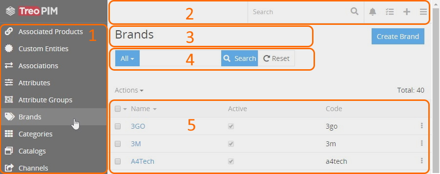

Here you can change entity records order in the list by clicking any sortable column title; this will sort the column either ascending or descending. Please, note that the default order of entity records is predefined in the Entity Manager. To change it, please, contact the administrator.

A total number of entity records may or may not be shown on the list view page:

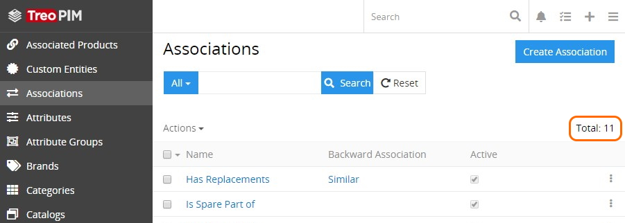

By default, the total number is not displayed. In order to see it, please, contact the administrator.

On the list view page, you can perform actions with separate or multiple entity records at once via the [single record](#single-record-actions) and [mass actions](#mass-actions) menus correspondingly.

### Mass Actions

Mass actions are to be applied to several (or all) selected entity records, i.e. records with set checkboxes. To select all entity records, click the checkbox located on the left of the `Name` column title. If the number of entity records exceeds one page, use the `Select all results` option from the actions menu:

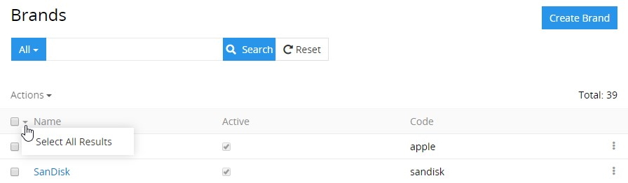

The following mass actions are available in the TreoPIM system: 

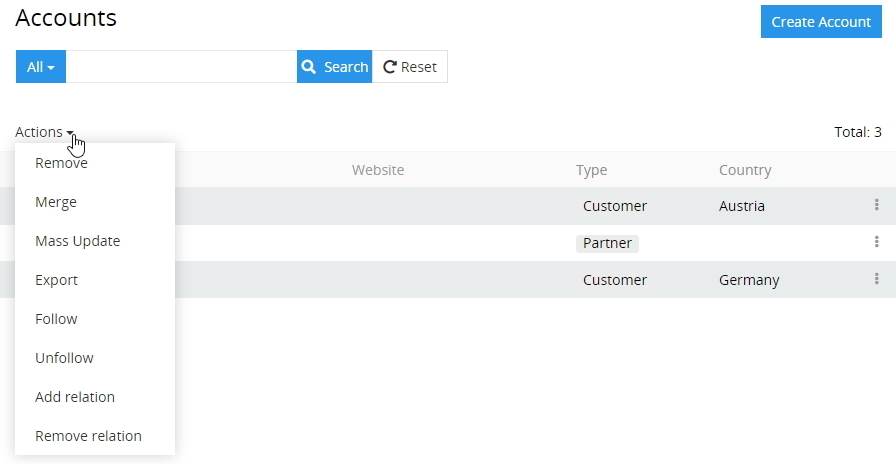

- **Remove** – to remove the selected entity records.
- **Merge** – to merge the selected entity records.
- **Mass update** – to update several selected entity records at once. To have a longer list of fields available for mass updating, please, contact your administrator.
- **Export** – to export the desired data fields of the selected entity records in the XLSX (Excel) or CSV format.
- **Follow** – to enable tracking of the changes for the selected entity records. 
- **Unfollow** – to disable tracking of the changes for the selected entity records.
- **Add relation** – to relate the selected entity records with other entities (or entity).
- **Remove relation** – to remove the relations that have been added to the selected entity records.

To modify the mass actions list, please, contact your administrator.

*For more advanced export features, please, use the **Export Feeds** module. You can find the details on this module in our [store](https://treopim.com/store/export-feeds).*

### Single Record Actions

To see the actions available for the records in the list, click the single record actions menu icon located on the right of the record:

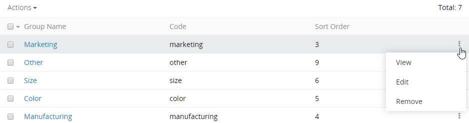

By default, the following actions are available for all entities:
- **View** – to go to the detail view of the record.
- **Edit** – to go to the detail view of the record in the edit mode.
- **Remove** – to remove the selected record.

To modify the single record actions list, please, contact your administrator.

## Plate View

The plate view is a variant of the [list view](#list-view), in which all entity records are displayed as plates:

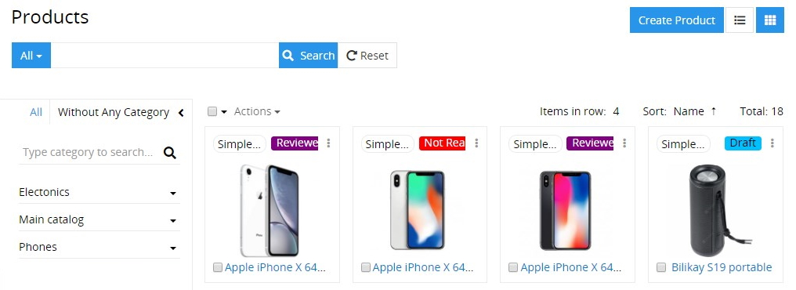

To switch to this view, click the plates icon located in the upper right corner of the list view page of entity records.

The [mass actions](#mass-actions) and [singe record actions](#single-record-actions) are also available here, just like for the list view.

You can configure the plate view layout by selecting the desired item number to be displayed in a row (1–6) and defining the record field to be used for sorting via the corresponding drop-down menus:

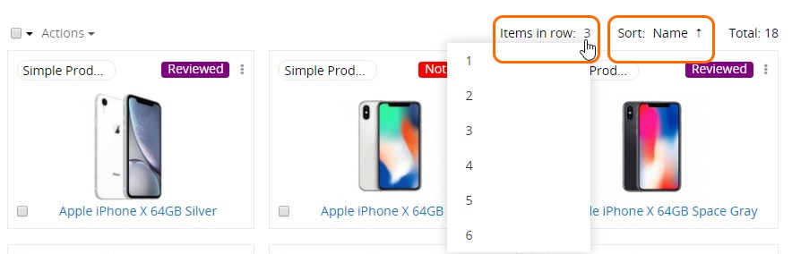

Within the TreoPIM system the plate view is available only for [products](./products.md).

## Small List Views

Small list views are panels and pop-up windows with data on the entities related to the given entity record, shown in the main window always together with the [detail view](#detail-view). Each entity may have as many related entities as needed in accordance with the administrator's configurations. 

The following actions are available for the small list view panels:

- **General actions** – applicable to all records on the related entities panel:
  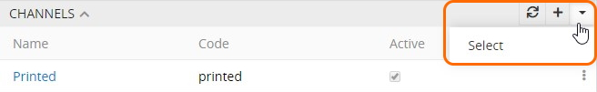
  - *Refresh* – to refresh the related entities list on the panel;
  - *Create* – to create a new record for the related entity;
  - *Select* – to create a relation between the entity record, which is opened in the main window and the entity record, which was chosen in the pop-up window. 

*Please, keep in mind that choosing some record in the pop-up window will reassign it to the entity record, which is opened in the main window. The previous relation will be dropped, if the relation is one-to-many.*

- **Single record actions** – applicable to each record of the related entities separately. The list of actions here is usually the same as on the list view for this entity.
  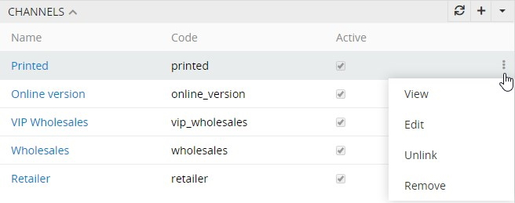

## Detail View

The detail view page appears when the  entity record name is clicked in the corresponding list of records. It has its own layout, which can be configured by the administrator. 

The detail view page shows detailed information about the selected entity record and all its relations and includes:

- *[navigation menu](./user-interface.md#navigation-menu) (1);*
- *[taskbar](./user-interface.md#taskbar) (2);*
- *[breadcrumb navigation](./user-interface.md#breadcrumb-navigation) including the page name (3);*
- *actions and tabs panel (4);*
- *record details, where detailed information about the currently open entity record is displayed (5).* 

The detail view page may also include:

- the `OVERVIEW` panel and some other panels that are either default for a certain entity or configured by the administrator:

  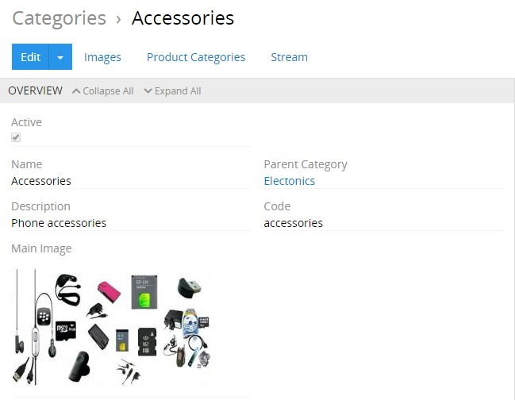

- several *small list views* for the related records, if these were configured by the administrator:
  
  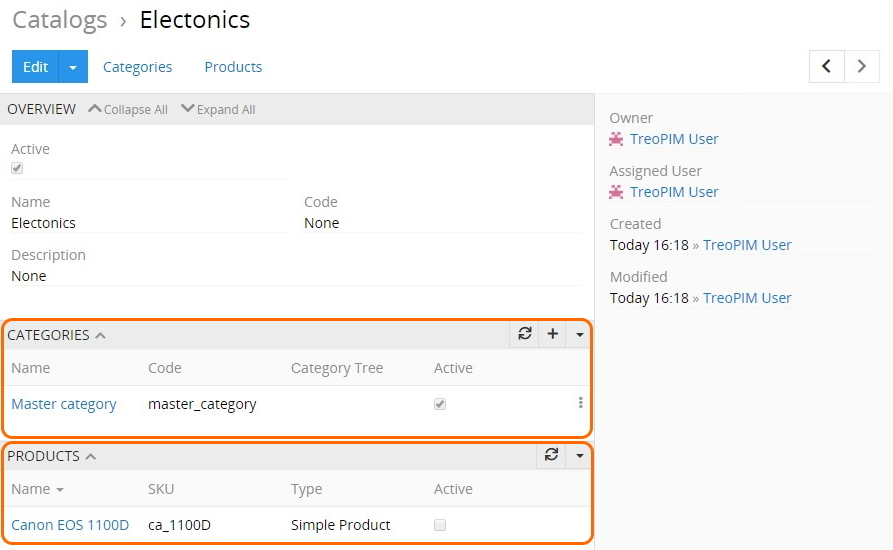

- *side view* with additional information concerning record management and activity stream, if activated for the entity.
  
Views can be shown in the main or pop-up window. They consist of the panels, which can be configured by the administrator. Usually these are structured in a way to provide you with key information through the record management.

You can start following the entity record right on the detail view page. To do this, click the `Follow` button, placed in the upper right corner of your detail view page. It will turn into `Followed`. Click this button again to stop following the entity record.

*This option is available only when the `Stream` checkbox is activated for the given entity by the administrator in the Entity Manager.*

[Filtering](./search-and-filtering.md) the record data display by fields, locales, and scopes is available on the [products](./products.md) detail view page only via the corresponding drop-down menus:

Keep in mind that the locales filter appears when the "Multi-Languages" module is installed and input language options are configured by your administrator. Go to our [store](https://treopim.com/store/multi-languages) to learn more about the "Multi-Languages" module and its features.

Navigation through the existing entity records can be done on the detail view pages using the corresponding buttons: 

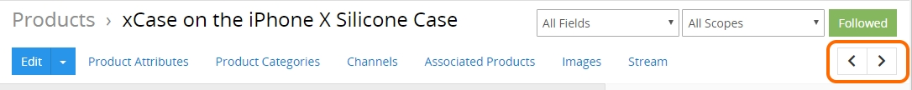

To edit the fields data on the detail view page, use [in-line editing](#in-line-editing).

### Main Actions

The following actions are available for all entity records by default:

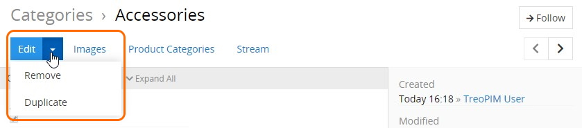

- **Edit** – click the `Edit` button to make changes in the given record.
- **Remove** – select the `Remove` option from the actions menu to remove the given record.
- **Duplicate** – select the `Duplicate` option from the actions menu to go to the record creation page and enter the unique values for the record fields to be used for duplication. 

## Quick Detail View (Small Detail View)

The quick detail view is shown in a pop-up window:

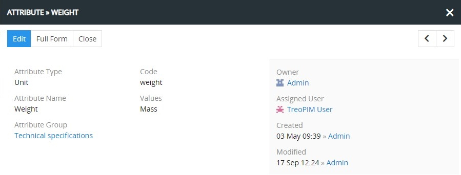

It is usually used to display the record details for some related entity or after using the `View` option from the single record actions menu on the list view page.

In the quick detail pop-up, click the `Full Form` button to open the common [detail view](#detail-view) page.

## Side View

The side view panel is used to show additional information and is shown in the main window always together with the detail (or quick detail) view panels:

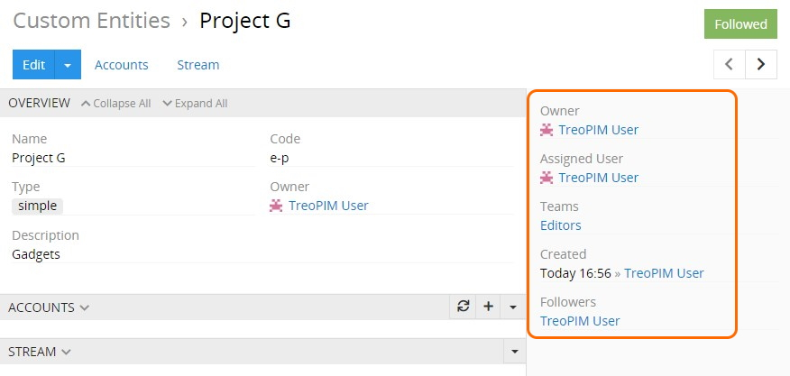

The following information is available by default on the side view panel:

- **Owner** – who is currently responsible for the record; the value is changeable.
- **Assigned User** – who should work on the record; the value is changeable.
- **Teams** – which team(s) can have access to this record; values are changeable.
- **Created** – the date and time of the record creation, as well as its author; not changeable.
- **Modified** – the date and time of the record modification, not changeable.
- **Followers** – who is following the changes in the record.

The `Owner`, `Assigned user`, and `Teams` fields are enabled/disabled by the administrator.

Other modules can add more panels to the side view panel. Please, visit our [store](https://treopim.com/store) to learn more about modules available for you.

## Create View

The create view is the entity record creation page that has its own layout, which can be configured by the administrator. To get to the create view page, click the `Create 'Entity'` button on the entity records [list view](#list-view) page and fill in the record details:

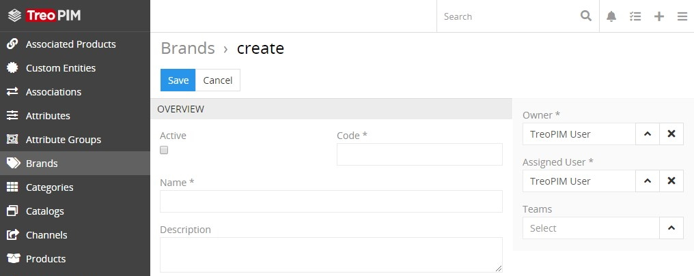

Click the `Save` button to complete the record creation or `Cancel` to abort the operation.

In all other cases, i.e. when the `+` button is used, you will be taken to the [quick create view](#quick-create-view) page that will be opened in a pop-up window.

## Quick Create View

The quick create view is shown in a pop-up window and uses the layout of the [quick detail view](#quick-detail-view-small-detail-view) page. It is usually applicable for creating records for the related entities or appears when the [quick create](./user-interface.md#quick-create) button is used on any TreoPIM page:

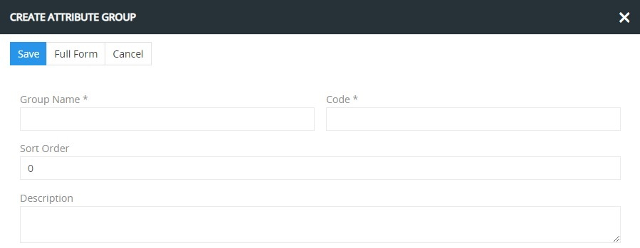

Click the `Full Form` button in the quick create pop-up to get to the [create view](#create-view) page.

## Edit View

The edit view page is shown in the main window and uses the layout of the [detail view](#detail-view) page. To get to it, click the `Edit` button on the detail view page:

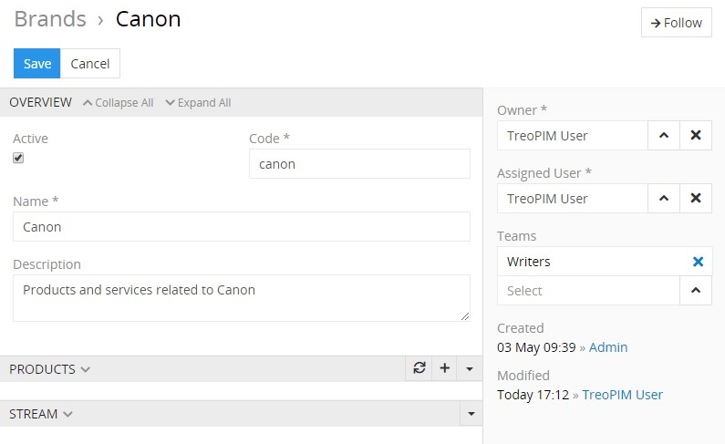

On the `OVERVIEW` panel, you can edit only the fields of the given entity, i.e. no fields of the related entities can be edited here.

If you are on the quick edit view page, click the `Full Form` button to get to the edit view page.

## Quick Edit View

The quick edit view is shown in a pop-up window and uses the layout of the [quick detail view](#quick-detail-view-small-detail-view) page. It is usually used to edit records for the related entities or to edit records via the `Edit` option from the single record actions menu on the [list view](#list-view) page:

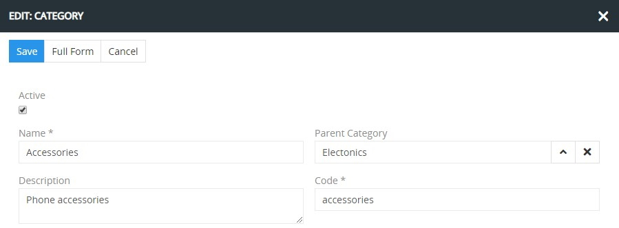

Click the `Full Form` button to get to the [edit view](#edit-view) page.

## In-Line Editing

With in-line editing you can change values *on the fly*. This ensures quick change of field values and reduces the number of clicks to do this.

Currently in-line editing is available on the [detail view](#detail-view) pages only. To edit the record information on these pages using the in-line editing, click the pencil icon located in the upper right corner of the field you want to edit:

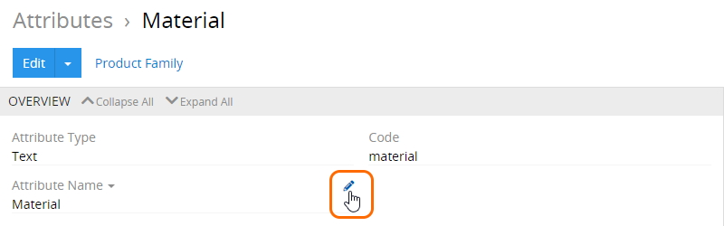

